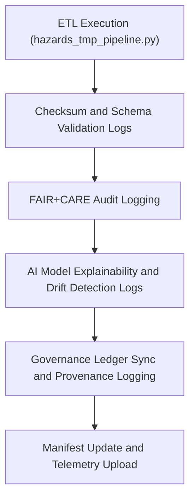

<div align="center">

# 🧾 Kansas Frontier Matrix — **Hazards TMP Logs**
`data/work/tmp/hazards/logs/README.md`

**Purpose:**  
Centralized repository for **ETL, AI, validation, and governance logs** generated within the Temporary Hazards Workspace of the Kansas Frontier Matrix (KFM).  
Ensures **auditability, reproducibility, and ethics compliance** through structured log collection and FAIR+CARE governance integration.

[](../../../../docs/standards/faircare-validation.md)
[](../../../../LICENSE)
[](../../../../docs/architecture/repo-focus.md)

</div>

---

## 📚 Overview

The `data/work/tmp/hazards/logs/` directory provides a **single audit trail for all hazard-related processes** executed in the temporary workspace.  
Logs within this directory record the **execution, validation, governance synchronization, and AI activity** associated with hazard ETL and FAIR+CARE validation workflows.

### Core Functions
- Track pipeline execution for ETL, validation, and AI reasoning.  
- Log checksum generation and governance synchronization events.  
- Store FAIR+CARE validation outcomes for hazard datasets.  
- Maintain metadata and PGP signatures for reproducibility.  

---

## 🗂️ Directory Layout

```plaintext
data/work/tmp/hazards/logs/
├── README.md                                # This file — overview of Hazards TMP logs
│
├── ai/                                      # AI reasoning, drift, and explainability logs
│   ├── focus_ai_inference.log
│   ├── explainability_audit.json
│   └── ai_metrics_summary.json
│
├── etl/                                     # ETL process logs and checksum validations
│   ├── hazards_etl_run.log
│   ├── schema_mapping_trace.log
│   └── checksum_audit.json
│
├── validation/                              # Schema and FAIR+CARE validation logs
│   ├── faircare_validation_report.json
│   ├── stac_validation_output.json
│   └── schema_validation_summary.json
│
├── governance/                              # Governance and ledger synchronization logs
│   ├── governance_sync.log
│   ├── ledger_registration.json
│   └── audit_verification.log
│
├── energy/                                  # Energy-related hazard processing logs
│   ├── grid_risk_analysis.log
│   ├── power_resilience_summary.json
│   └── ai_energy_correlation.json
│
├── manifests/                               # Manifest summaries for hazard processing cycles
│   ├── tmp_manifest_cycle_2025Q4.json
│   ├── ai_audit_manifest.json
│   └── governance_manifest.json
│
└── metadata.json                            # Metadata and provenance for all logging operations
```

---

## ⚙️ Logging Workflow



### Workflow Description
1. **ETL Phase:** Capture runtime logs for transformations and ingestion operations.  
2. **Validation Phase:** Record schema, FAIR+CARE, and STAC validation outcomes.  
3. **AI Phase:** Store explainability results (SHAP, LIME) and performance metrics.  
4. **Governance Phase:** Register ledger updates and synchronization events.  
5. **Telemetry Phase:** Aggregate metrics and upload to `focus-telemetry.json`.

---

## 🧩 Example Log Metadata Record

```json
{
  "id": "hazards_tmp_log_cycle_2025Q4",
  "component": "ETL + AI Validation",
  "logs_collected": 84,
  "records_processed": 24560,
  "checksum_verified": true,
  "fairstatus": "compliant",
  "telemetry_link": "releases/v9.5.0/focus-telemetry.json",
  "ledger_synced": true,
  "created": "2025-11-02T18:00:00Z",
  "validator": "@kfm-hazards",
  "governance_ref": "reports/audit/ai_hazards_ledger.json"
}
```

---

## 🧠 FAIR+CARE Logging Principles

| Principle | Implementation |
|------------|----------------|
| **Findable** | Logs are timestamped, checksum-verified, and indexed by process ID. |
| **Accessible** | Logs stored in open text and JSON formats under FAIR+CARE license. |
| **Interoperable** | Metadata aligned with ISO 19115 and KFM’s governance schemas. |
| **Reusable** | Each log includes provenance and telemetric references. |
| **Collective Benefit** | Ensures transparent and ethical data pipeline operation. |
| **Authority to Control** | FAIR+CARE Council oversees sensitive log disclosure. |
| **Responsibility** | Validators record and maintain pipeline audit histories. |
| **Ethics** | Logs reviewed for sensitive or confidential data before archival. |

All logs registered under:  
`reports/audit/ai_hazards_ledger.json` • `reports/fair/hazards_logs_summary.json`

---

## ⚙️ QA & Audit Artifacts

| File | Description | Format |
|------|--------------|--------|
| `metadata.json` | Provenance of all logging and checksum events. | JSON |
| `governance_sync.log` | Ledger synchronization trace. | Text |
| `ai_metrics_summary.json` | AI reasoning performance metrics. | JSON |
| `etl_run.log` | Full ETL pipeline execution log. | Text |
| `faircare_validation_report.json` | FAIR+CARE validation outcome for hazard cycles. | JSON |

All operations automated via `hazards_logs_sync.yml`.

---

## 🧾 Retention Policy

| Log Category | Retention Duration | Policy |
|---------------|--------------------|--------|
| AI & ETL Logs | 30 days | Archived for provenance audits. |
| FAIR+CARE Reports | 90 days | Retained for ethics and compliance reviews. |
| Governance Logs | 365 days | Stored permanently for reproducibility. |
| Metadata Records | 365 days | Retained under governance documentation. |

Cleanup managed by `hazards_logs_cleanup.yml`.

---

## 🧾 Internal Use Citation

```text
Kansas Frontier Matrix (2025). Hazards TMP Logs (v9.5.0).
Centralized FAIR+CARE and governance-aligned logging framework for hazard ETL, AI, and validation processes.
Provides reproducibility, explainability, and provenance tracking within the Temporary Hazards Workspace.
Restricted to internal data governance and audit workflows.
```

---

## 🧾 Version Notes

| Version | Date | Notes |
|----------|------|--------|
| v9.5.0 | 2025-11-02 | Introduced telemetry schema v2, AI drift and explainability logging integration. |
| v9.3.2 | 2025-10-28 | Added FAIR+CARE audit and governance synchronization manifests. |
| v9.3.0 | 2025-10-26 | Established hazards logging directory and baseline ETL logs. |

---

<div align="center">

**Kansas Frontier Matrix** · *Hazard Governance × FAIR+CARE Ethics × Provenance Logging*  
[🔗 Repository](https://github.com/bartytime4life/Kansas-Frontier-Matrix) • [🧭 Docs Portal](../../../../docs/) • [⚖️ Governance Ledger](../../../../docs/standards/governance/)

</div>
