<div align="center">

# 🧾 Kansas Frontier Matrix — **Hazards TMP Logs**
`data/work/tmp/hazards/logs/README.md`

**Purpose:**  
Central FAIR+CARE-certified logging hub for **ETL, AI, validation, and governance** workflows related to hazard datasets within KFM.  
Captures complete lineage and runtime telemetry for transparency, reproducibility, and ethics validation under MCP-DL v6.3.

[](../../../../../docs/architecture/README.md)
[](../../../../../docs/standards/faircare-validation.md)
[]()
[](../../../../../LICENSE)

</div>

---

## 📘 Overview

The **Hazards TMP Logs** directory is the master repository for automated logging within the temporary hazards workspace.  
It records ETL transactions, AI inference, validation processes, and governance synchronization across meteorological, hydrological, geological, and wildfire/energy domains.

### Core Responsibilities
- Capture ETL stage logs (extract/transform/load/lineage).  
- Document AI explainability and model ethics evaluations.  
- Maintain FAIR+CARE governance sync and validation records.  
- Enable reproducibility and auditability across pipelines.  

---

## 🗂️ Directory Layout

```plaintext
data/work/tmp/hazards/logs/
├── README.md
├── ai/
│   ├── focus_reasoning.log
│   ├── ai_drift_audit.json
│   └── metadata.json
├── etl/
│   ├── extract/
│   ├── transform/
│   ├── load/
│   ├── lineage/
│   └── summaries/
├── manifests/
│   ├── hazard_manifest_2025Q4.json
│   ├── checksum_audit_registry.json
│   └── metadata.json
├── validation/
│   ├── faircare_audit_trace.log
│   ├── schema_validation_summary.json
│   ├── governance_sync.log
│   └── metadata.json
└── metadata.json
```

---

## ⚙️ Logging Workflow

```mermaid
flowchart TD
    A["ETL Pipelines (Extract · Transform · Load)"] --> B["AI Reasoning + Drift Monitoring (Focus Mode)"]
    B --> C["Validation + FAIR + CARE Ethics Review"]
    C --> D["Governance Sync + Provenance Registration"]
    D --> E["Checksum + Manifest Verification"]
```



### Steps
1. **ETL Logging** — Record extraction, transformation, load details.  
2. **AI Logging** — Track interpretability audits + drift detection.  
3. **Validation Logging** — Trace FAIR+CARE compliance + schema audits.  
4. **Governance Logging** — Register events in provenance ledgers.  
5. **Checksum Logging** — Verify integrity of artifacts + manifests.

---

## 🧩 Example Log Metadata Record

```json
{
  "id": "hazards_logs_session_v9.7.0_2025Q4",
  "etl_stages": ["extract", "transform", "load", "lineage"],
  "ai_model": "focus-hazard-v5",
  "events_logged": 728,
  "checksum_verified": true,
  "fairstatus": "certified",
  "governance_registered": true,
  "created": "2025-11-06T23:59:00Z",
  "validator": "@kfm-etl-ops",
  "governance_ref": "data/reports/audit/data_provenance_ledger.json"
}
```

---

## 🧠 FAIR+CARE Governance Matrix

| Principle | Implementation | Oversight |
|-----------|----------------|-----------|
| **Findable** | Logs indexed by ETL stage, domain, governance session ID. | `@kfm-data` |
| **Accessible** | Open JSON/Text formats for council review. | `@kfm-accessibility` |
| **Interoperable** | Conforms to FAIR+CARE, STAC, MCP-DL audit schemas. | `@kfm-architecture` |
| **Reusable** | Traceable via checksum + provenance linkage. | `@kfm-design` |
| **Collective Benefit** | Ensures ethical transparency in hazard processing. | `@faircare-council` |
| **Authority to Control** | Council validates governance synchronization. | `@kfm-governance` |
| **Responsibility** | Operators document AI + ETL results in audit trails. | `@kfm-security` |
| **Ethics** | Redacts sensitive data while preserving accountability. | `@kfm-ethics` |

**Audit refs:**  
`data/reports/fair/data_care_assessment.json` · `data/reports/audit/data_provenance_ledger.json`

---

## ⚙️ Key Log Categories

| Log Type | Description | Format |
|----------|-------------|--------|
| `ai/` | Focus Mode + explainability audits | JSON / Log |
| `etl/` | Extract, transform, load traces | Log |
| `validation/` | Schema + FAIR+CARE audit traces | Log / JSON |
| `manifests/` | Checksum + governance manifests | JSON |
| `metadata.json` | Session governance context | JSON |

**Automation:** `hazards_logs_sync.yml`

---

## ♻️ Retention & Sustainability

| Log Type | Retention | Policy |
|----------|----------:|--------|
| ETL Logs | 90 Days | Archived after quarterly audit. |
| AI & FAIR+CARE Logs | 180 Days | Retained for explainability + ethics verification. |
| Validation Logs | 365 Days | Stored for lineage reproducibility. |
| Governance Manifests | Permanent | Immutable provenance record. |

**Telemetry:** `../../../../../releases/v9.7.0/focus-telemetry.json`

---

## 🌱 Sustainability Metrics

| Metric | Value | Verified By |
|--------|------:|-------------|
| Energy Use (per ETL cycle) | 10.3 Wh | `@kfm-sustainability` |
| Carbon Output | 11.7 gCO₂e | `@kfm-security` |
| Renewable Power | 100% | `@kfm-infrastructure` |
| FAIR+CARE Compliance | 100% | `@faircare-council` |

---

## 🧾 Citation

```text
Kansas Frontier Matrix (2025). Hazards TMP Logs (v9.7.0).
FAIR+CARE-certified logging repository for ETL, AI, validation, and governance processes—driving transparent, reproducible, and ethically auditable hazard data workflows.
```

---

<div align="center">

**Kansas Frontier Matrix**  
*Hazard Transparency × FAIR+CARE Ethics × Provenance Verification*  
© 2025 Kansas Frontier Matrix — Internal Governance Layer · Diamond⁹ Ω / Crown∞Ω Ultimate Certified  

[Back to Hazards TMP](../README.md) · [Governance Charter](../../../../../docs/standards/governance/DATA-GOVERNANCE.md)

</div>