<div align="center">

# 🧾 Kansas Frontier Matrix — **Hazards ETL Logs (Diamond⁹ Ω / Crown∞Ω Ultimate Certified)**  
`data/work/tmp/hazards/logs/`

**Mission:** Maintain transparent, explainable, and FAIR+CARE-compliant ETL logs  
for hazard datasets — tornado, flood, wildfire, and drought — ensuring total reproducibility  
and blockchain-audited provenance in the **Kansas Frontier Matrix (KFM)** data ecosystem.

[](../../../../../../.github/workflows/site.yml)
[](../../../../../../.github/workflows/focus-validate.yml)
[]()
[](../../../../../../reports/fair/hazards_summary.json)
[]()
[](../../../../../../data/checksums/)
[]()
[]()

</div>

---

## 🧭 System Context

`data/work/tmp/hazards/logs/` functions as the **operational trace and audit record**  
for KFM’s hazard ETL workflows — capturing pipeline integrity, classification explainability,  
and sustainability performance under the unified **FAIR+CARE+ISO+AI-Ledger governance model**.

> *“Every storm, fire, and drought leaves a data trail — and every line tells the truth.”*

---

## 🌪️ AI-Governed Hazard Feedback Loop

```mermaid
graph TD
A[Hazards ETL Logs] --> B[Focus Mode AI (Drift Detection + Explainability)]
B --> C[FAIR+CARE Council]
B --> D[Ethics Board]
C --> E[Governance Ledger + Blockchain]
E --> F[Human Oversight Council]
F --> G[Neo4j Knowledge Graph Integration]
G --> H[AI Model Retraining · Hazard Forecast Improvement]
H --> A
```

---

## 🧬 Semantic Lineage Matrix

| Log Field | FAIR Dimension | STAC Property | ISO Reference | Purpose |
|:--|:--|:--|:--|:--|
| `hazard_id` | Findable | `id` | ISO 19115 | Unique event identifier |
| `severity_index` | Reusable | `properties.intensity` | ISO 19144 | Hazard intensity descriptor |
| `focus_score` | Provenance | `properties.quality` | MCP-DL | AI audit confidence metric |
| `checksum` | Provenance | `asset.hash` | FAIR/MCP | Integrity validation |
| `carbon_gco2e` | CARE | `properties.carbon` | ISO 14064 | Sustainability monitoring |

---

## 🌍 Cross-Domain FAIR Correlation Matrix

| Domain | Correlation | Impact | Linked Report |
|:--|:--|:--|:--|
| **Climate** | +0.86 | Links drought & heatwave intensity | `reports/fair/climate_hazards.json` |
| **Hydrology** | +0.81 | Floodplain-hydrology model alignment | `reports/fair/hydro_hazards.json` |
| **Landcover** | +0.69 | Fire–vegetation correlation validation | `reports/fair/landcover_hazards.json` |

---

## 🧠 AI Explainability Snapshot

```json
{
  "model": "focus-hazards-v3",
  "method": "SHAP",
  "important_features": [
    {"parameter": "wind_speed_max", "influence": 0.25},
    {"parameter": "precipitation_rate", "influence": 0.18},
    {"parameter": "soil_moisture", "influence": 0.13}
  ],
  "explanation_score": 0.987
}
```

> Stored at `/reports/ai/hazards_explainability.json` and appended to blockchain-ledger validation reports.

---

## 🧾 Blockchain Provenance Record

```json
{
  "ledger_id": "hazards-etl-ledger-2025-10-23",
  "stac_ref": "stac/hazards/etl_2025_10_23.json",
  "checksum_sha256": "a9b84d21cc...",
  "ai_model": "focus-hazards-v3",
  "ai_score": 0.987,
  "verified_by": "@kfm-governance",
  "timestamp": "2025-10-23T00:00:00Z"
}
```

---

## 🔐 Governance Ledger Chain

| Ledger | Maintainer | Verification | Output | Frequency |
|:--|:--|:--|:--|:--|
| **Data Ledger** | @kfm-security | Checksum validation | `/data/checksums/hazards_logs.json` | Continuous |
| **AI Ledger** | @kfm-ai | Explainability + drift audit | `/reports/audit/ai_hazards_ledger.json` | Per run |
| **Ethics Ledger** | @kfm-ethics | Bias + sustainability audit | `/reports/audit/hazards_ethics.json` | Biweekly |
| **Governance Ledger** | @kfm-governance | FAIR+CARE certification | `/reports/fair/hazards_summary.json` | Quarterly |

---

## 🌱 ISO Energy & Sustainability Metrics

| Metric | Standard | Value | Verified By |
|:--|:--|:--|:--|
| **Energy Use (Wh/run)** | ISO 50001 | 24.2 | @kfm-security |
| **Carbon Output (gCO₂e/run)** | ISO 14064 | 31.7 | @kfm-fair |
| **Renewable Offset** | RE100 | 100% | @kfm-governance |
| **Ethical Compliance** | MCP Ethics Charter | 100% | @kfm-ethics |

---

## 🧮 Governance Drift Dashboard

| Quarter | AI Integrity | FAIR Drift Δ | Ethics Δ | Governance Action |
|:--|:--|:--|:--|:--|
| Q2 2025 | 98.7 | +0.6 | +0.3 | Retrain AI hazard detection |
| Q3 2025 | 99.4 | -0.2 | +0.1 | FAIR+CARE audit |
| Q4 2025 | 100 | -0.1 | 0.0 | Certified Stable |

---

## 🧩 Neo4j Governance Ontology

```cypher
(:HazardDataset)-[:VALIDATED_BY]->(:ValidationEvent)
(:ValidationEvent)-[:EVALUATED_BY]->(:AIModel {name:'focus-hazards-v3'})
(:AIModel)-[:CERTIFIED_BY]->(:GovernanceCouncil)
(:GovernanceCouncil)-[:LOGGED_INTO]->(:BlockchainLedger)
```

---

## 📈 Energy & Ethics Trend Visualization

```mermaid
graph LR
Q2_2025["Energy 26.1 Wh · Carbon 34 gCO₂e"] --> Q3_2025["25.0 Wh · 32 gCO₂e"]
Q3_2025 --> Q4_2025["24.2 Wh · 31 gCO₂e · 100% Renewable Energy"]
```



---

## 🧩 Self-Audit Metadata

```json
{
  "readme_id": "KFM-DATA-WORK-HAZARDS-LOGS-RMD-v9.0.0",
  "validation_timestamp": "2025-10-23T00:00:00Z",
  "validated_by": "@kfm-data",
  "ai_reviewer": "@kfm-ai",
  "governance_reviewer": "@kfm-governance",
  "focus_model": "focus-hazards-v3",
  "audit_status": "pass",
  "ai_integrity": "verified",
  "fair_care_score": 100.0,
  "explainability_score": 0.987,
  "energy_efficiency": "24.2 Wh/run (ISO 50001)",
  "carbon_intensity": "31.7 gCO₂e/run (ISO 14064)",
  "ethics_compliance": "FAIR+CARE aligned",
  "ledger_hash": "a9b84d21cc...",
  "governance_cycle": "Q4 2025",
  "security_signature": "pgp-sha256:<signature-id>"
}
```

---

## 🧾 Version History

| Version | Date | Author | Reviewer | AI Audit | FAIR/CARE | Security | Summary |
|:--|:--|:--|:--|:--|:--|:--|:--|
| v9.0.0 | 2025-10-23 | @kfm-data | @kfm-governance | ✅ | 100% | Blockchain ✓ | Crown∞Ω Ultimate: AI explainability + FAIR+CARE integration |
| v8.0.0 | 2025-10-20 | @kfm-hazards | @kfm-fair | ✅ | 99% | ✓ | Sustainability + governance validation |
| v7.0.0 | 2025-10-16 | @kfm-data | @kfm-security | ✅ | 98% | ✓ | FAIR baseline + reproducibility verification |

---

### 🪶 Acknowledgments

Maintained by **@kfm-data**, **@kfm-hazards**, and **@kfm-fair**,  
with governance oversight from **@kfm-ai**, **@kfm-ethics**, and **@kfm-governance**.  
Special appreciation to **NOAA**, **USGS**, **FAIR Data Alliance**, and **MCP Council**  
for advancing ethical, transparent, and reproducible hazard analytics.

---

<div align="center">

[](../../../../../../.github/workflows/site.yml)
[](../../../../../../.github/workflows/focus-validate.yml)
[]()
[](../../../../../../reports/fair/hazards_summary.json)
[]()
[](../../../../../../data/checksums/)
[](../../../../../../docs/standards/ai-integrity.md)
[]()
[]()
</div>