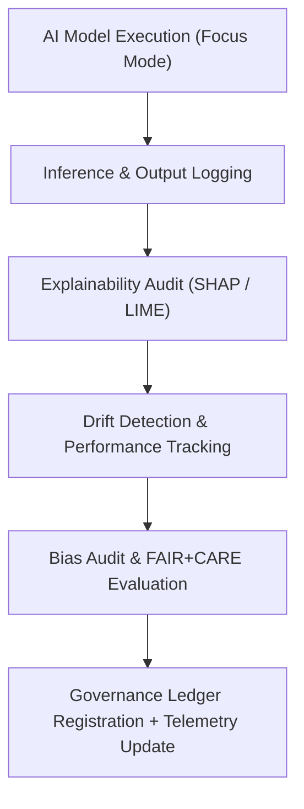

<div align="center">

# 🤖 Kansas Frontier Matrix — **Hazards AI Logs**
`data/work/tmp/hazards/logs/ai/README.md`

**Purpose:**  
Dedicated repository for all **AI reasoning, drift detection, model explainability, and bias audit logs** generated during hazards data processing within the Kansas Frontier Matrix (KFM).  
Provides transparency, reproducibility, and accountability for **Focus Mode AI** hazard intelligence pipelines.

[](../../../../../../docs/standards/faircare-validation.md)
[](../../../../../../LICENSE)
[](../../../../../../docs/architecture/repo-focus.md)

</div>

---

## 📚 Overview

The `data/work/tmp/hazards/logs/ai/` directory captures **AI-driven reasoning, validation, and governance audit logs** for hazard datasets processed in the KFM.  
It ensures that all AI model predictions, drift evaluations, and explainability outputs are **traceable, auditable, and FAIR+CARE-governed**.

### Core Responsibilities
- Record Focus Mode AI inference, correlation analysis, and explainability outputs.  
- Monitor AI drift, accuracy, and bias across hazard categories.  
- Log ethics and governance metadata for transparency and accountability.  
- Integrate explainability summaries into the AI Governance Ledger.  

---

## 🗂️ Directory Layout

```plaintext
data/work/tmp/hazards/logs/ai/
├── README.md                                 # This file — AI log documentation
│
├── focus_ai_inference.log                    # Focus Mode hazard AI reasoning log
├── explainability_audit.json                 # SHAP/LIME explainability analysis output
├── ai_drift_monitor.json                     # AI model drift detection and performance tracking
├── ai_metrics_summary.json                   # Summary of AI model validation metrics
├── ai_bias_audit.json                        # Bias and ethics compliance review log
└── metadata.json                             # Governance and provenance record for AI audit cycle
```

---

## ⚙️ AI Logging Workflow



### Workflow Description
1. **Inference Logging:** Records Focus Mode AI predictions, correlations, and confidence scores.  
2. **Explainability Audit:** Captures SHAP/LIME feature impact data for transparency.  
3. **Drift Detection:** Identifies data or concept drift using temporal performance metrics.  
4. **Bias Audit:** Validates model fairness, data representativeness, and ethical consistency.  
5. **Governance Sync:** Logs entries to `ai_hazards_ledger.json` and updates telemetry dashboards.

---

## 🧩 Example AI Log Record

```json
{
  "id": "ai_log_focus_hazards_v9.5.0",
  "model_name": "focus-hazards-v6",
  "domain": "hazards",
  "events_analyzed": 45000,
  "ai_explainability_score": 0.987,
  "drift_detected": false,
  "bias_audit_passed": true,
  "top_features": ["tornado_path_density", "flood_extent_overlap", "drought_index_score"],
  "checksum": "sha256:cb47a1b3d9f4a7f1b1239de8f1bfc998bd1c66ea...",
  "telemetry_ref": "releases/v9.5.0/focus-telemetry.json",
  "governance_ref": "reports/audit/ai_hazards_ledger.json",
  "timestamp": "2025-11-02T18:10:00Z"
}
```

---

## 🧠 FAIR+CARE AI Governance Integration

| Principle | Implementation |
|------------|----------------|
| **Findable** | AI logs indexed by model name, timestamp, and checksum in governance ledger. |
| **Accessible** | Stored as open JSON or text under FAIR+CARE licensing. |
| **Interoperable** | Structured using KFM AI Governance Schema (STAC + DCAT integrated). |
| **Reusable** | AI audit logs include provenance, ethics score, and validation metadata. |
| **Collective Benefit** | Encourages ethical, explainable AI use in hazard prediction. |
| **Authority to Control** | FAIR+CARE Council reviews AI explainability results. |
| **Responsibility** | Validators record AI governance decisions and bias mitigation outcomes. |
| **Ethics** | AI model performance reviewed for cultural and regional fairness. |

Governance outcomes documented in:  
`reports/audit/ai_hazards_ledger.json` • `reports/fair/hazards_ai_logs_summary.json`

---

## ⚙️ QA & Explainability Artifacts

| File | Description | Format |
|------|--------------|--------|
| `explainability_audit.json` | SHAP and LIME interpretability audit results. | JSON |
| `ai_drift_monitor.json` | Temporal model performance and drift metrics. | JSON |
| `ai_bias_audit.json` | Bias and fairness evaluation log. | JSON |
| `ai_metrics_summary.json` | Consolidated AI performance metrics (accuracy, F1, recall). | JSON |
| `metadata.json` | Provenance and FAIR+CARE AI governance metadata. | JSON |

All operations automated through `hazards_ai_log_sync.yml`.

---

## 🧾 Retention Policy

| Log Type | Retention Duration | Policy |
|-----------|--------------------|--------|
| AI Inference Logs | 30 days | Archived after governance review. |
| Explainability Audits | 90 days | Retained for ethics and provenance documentation. |
| Drift Monitoring Data | 180 days | Used for AI retraining cycles. |
| Metadata Records | 365 days | Stored permanently for transparency. |

Cleanup controlled by `hazards_ai_log_cleanup.yml`.

---

## 🧾 Internal Use Citation

```text
Kansas Frontier Matrix (2025). Hazards AI Logs (v9.5.0).
Centralized explainability, drift, and bias audit logging workspace for AI-driven hazard analysis.
FAIR+CARE-certified, ISO-aligned, and blockchain-governed for transparency and accountability.
Restricted to internal Focus Mode and governance workflows.
```

---

## 🧾 Version Notes

| Version | Date | Notes |
|----------|------|--------|
| v9.5.0 | 2025-11-02 | Added AI bias audit and telemetry v2 schema integration. |
| v9.3.2 | 2025-10-28 | Expanded explainability auditing and governance trace logging. |
| v9.3.0 | 2025-10-26 | Established AI log directory for Focus Mode hazard processing. |

---

<div align="center">

**Kansas Frontier Matrix** · *Explainable AI × FAIR+CARE Governance × Provenance Transparency*  
[🔗 Repository](https://github.com/bartytime4life/Kansas-Frontier-Matrix) • [🧭 Docs Portal](../../../../../../docs/) • [⚖️ Governance Ledger](../../../../../../docs/standards/governance/)

</div>
