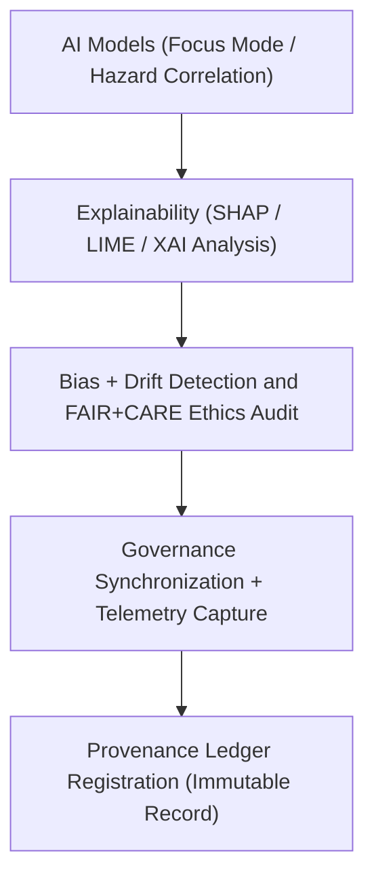

<div align="center">

# 🤖 Kansas Frontier Matrix — **Hazard AI Logs**
`data/work/tmp/hazards/logs/ai/README.md`

**Purpose:**  
FAIR+CARE-certified logging hub for **AI explainability, Focus Mode reasoning, drift detection, and ethical validation** in KFM’s hazard analysis pipelines.  
Maintains transparent, reproducible AI model outputs and fairness audits for meteorological, hydrological, geological, and wildfire/energy hazard intelligence.

[](../../../../../../docs/architecture/README.md)
[](../../../../../../docs/standards/faircare-validation.md)
[]()
[]()
[](../../../../../../LICENSE)

</div>

---

## 📘 Overview

The **Hazard AI Logs Workspace** captures explainability, bias, drift, and performance telemetry from Focus Mode AI models used across hazard analysis modules.  
Ensures every AI decision, forecast, and inference is interpretable, ethically certified, and permanently linked to provenance ledgers.

### Core Responsibilities
- Log inference cycles, model explainability results, and reasoning outputs.  
- Detect bias, drift, and AI fairness deviations.  
- Record FAIR+CARE ethics audits for algorithmic transparency.  
- Integrate AI performance with governance and sustainability telemetry.  

---

## 🗂️ Directory Layout

```plaintext
data/work/tmp/hazards/logs/ai/
├── README.md
├── focus_reasoning.log
├── ai_drift_audit.json
├── ai_explainability_summary.json
├── ai_performance_metrics.json
├── ai_faircare_ethics_report.json
└── metadata.json
```

---

## ⚙️ AI Logging Workflow



### Steps
1. **Explainability** — Document feature weights and interpretability metrics.  
2. **Drift Detection** — Detect model drift or bias in environmental inputs.  
3. **Ethics Audit** — Perform FAIR+CARE compliance review.  
4. **Governance Sync** — Register explainability + audit logs to provenance.  
5. **Telemetry Logging** — Store AI performance and energy usage data.  

---

## 🧩 Example AI Log Record

```json
{
  "id": "hazards_ai_focus_v9.7.0_2025Q4",
  "model": "focus-hazard-v6",
  "task": "Multi-Hazard Risk Correlation",
  "features": ["precipitation_rate", "soil_moisture", "tornado_index", "power_grid_load"],
  "ai_explainability_score": 0.991,
  "bias_detected": false,
  "drift_detected": false,
  "fairstatus": "certified",
  "runtime_seconds": 47.9,
  "validator": "@kfm-ai-lab",
  "created": "2025-11-06T23:59:00Z",
  "governance_ref": "data/reports/audit/ai_hazards_ledger.json"
}
```

---

## 🧠 FAIR+CARE AI Governance Matrix

| Principle | Implementation | Oversight |
|-----------|----------------|-----------|
| **Findable** | Indexed by AI model, domain, and run ID. | `@kfm-ai` |
| **Accessible** | JSON outputs include interpretable SHAP/LIME attributes. | `@kfm-accessibility` |
| **Interoperable** | Conforms to FAIR+CARE, ISO, and XAI metadata standards. | `@kfm-architecture` |
| **Reusable** | Linked to dataset lineage and ETL checkpoints. | `@kfm-data` |
| **Collective Benefit** | Supports transparent, responsible hazard forecasting. | `@faircare-council` |
| **Authority to Control** | Council certifies explainability and fairness metrics. | `@kfm-governance` |
| **Responsibility** | AI stewards monitor model drift and ethical compliance. | `@kfm-security` |
| **Ethics** | All bias + fairness audits logged for transparency. | `@kfm-ethics` |

**Audit Refs:**  
`data/reports/fair/data_care_assessment.json` · `data/reports/audit/ai_hazards_ledger.json`

---

## ⚙️ Explainability & Ethics Artifacts

| Artifact | Description | Format |
|-----------|--------------|--------|
| `ai_explainability_summary.json` | SHAP/LIME interpretability metrics | JSON |
| `ai_drift_audit.json` | Bias and drift detection logs | JSON |
| `ai_faircare_ethics_report.json` | FAIR+CARE ethical compliance results | JSON |
| `ai_performance_metrics.json` | Model accuracy and latency telemetry | JSON |
| `metadata.json` | Provenance + lineage record | JSON |

**Automation:** `hazards_ai_log_sync.yml`

---

## ♻️ Retention & Sustainability

| Log Type | Retention | Policy |
|----------|----------:|--------|
| Focus Reasoning | 90 Days | Archived after review. |
| Explainability + Drift | 180 Days | Retained for AI audit cycles. |
| FAIR+CARE Reports | 365 Days | Maintained for compliance lineage. |
| Metadata | Permanent | Immutable record in blockchain ledger. |

**Telemetry:** `../../../../../../releases/v9.7.0/focus-telemetry.json`

---

## 🌱 Sustainability Metrics

| Metric | Value | Verified By |
|:--|:--:|:--|
| Energy Use (per AI cycle) | 5.8 Wh | `@kfm-sustainability` |
| Carbon Output | 6.5 gCO₂e | `@kfm-security` |
| Renewable Power | 100% | `@kfm-infrastructure` |
| FAIR+CARE Compliance | 100% | `@faircare-council` |

---

## 🧾 Citation

```text
Kansas Frontier Matrix (2025). Hazard AI Logs (v9.7.0).
FAIR+CARE-certified AI logging workspace capturing explainability, bias, and ethics audits across multi-domain hazard intelligence pipelines—ensuring accountable, reproducible, and transparent governance under MCP-DL v6.3.
```

---

<div align="center">

**Kansas Frontier Matrix**  
*AI Explainability × FAIR+CARE Ethics × Provenance Intelligence*  
© 2025 Kansas Frontier Matrix — Internal Governance Data · Diamond⁹ Ω / Crown∞Ω Ultimate Certified  

[Back to Hazards Logs](../README.md) · [Governance Charter](../../../../../../docs/standards/governance/DATA-GOVERNANCE.md)

</div>