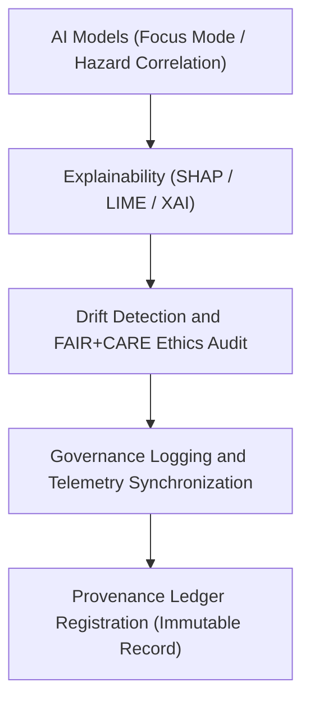

<div align="center">

# 🤖 Kansas Frontier Matrix — **Hazard AI Logs**
`data/work/tmp/hazards/logs/ai/README.md`

**Purpose:**  
FAIR+CARE-certified logging workspace for AI explainability, Focus Mode reasoning, drift detection, and ethics auditing in the Kansas Frontier Matrix (KFM) hazards module.  
This directory maintains transparent, reproducible AI model performance and bias analysis for meteorological, hydrological, geological, and wildfire/energy hazard intelligence.

[](../../../../../../docs/standards/faircare-validation.md)
[]()
[]()
[](../../../../../../LICENSE)
[](../../../../../../docs/architecture/repo-focus.md)

</div>

---

## 📚 Overview

The **Hazard AI Logs** directory records explainability audits, bias detections, and performance metrics generated by Focus Mode AI models used in hazard analysis.  
It ensures every AI decision, correlation, and forecast event remains interpretable, ethically verified, and governance-logged.

### Core Responsibilities
- Log model runs, inference cycles, and reasoning outputs.  
- Capture AI bias, drift, and ethics compliance audits.  
- Document model explainability (SHAP, LIME, and FAIR metrics).  
- Integrate performance telemetry with KFM’s governance and provenance ledgers.  

---

## 🗂️ Directory Layout

```plaintext
data/work/tmp/hazards/logs/ai/
├── README.md                              # This file — overview of AI logging for hazards
│
├── focus_reasoning.log                    # Focus Mode AI reasoning session outputs
├── ai_drift_audit.json                    # AI model drift and bias detection results
├── ai_explainability_summary.json         # Explainable AI (SHAP / LIME) analysis summary
├── ai_performance_metrics.json            # Model accuracy, F1, precision, recall, latency, etc.
├── ai_faircare_ethics_report.json         # FAIR+CARE ethics validation audit for AI models
└── metadata.json                          # Provenance, governance linkage, and checksum records
```

---

## ⚙️ AI Logging Workflow



### Description
1. **Explainability:** Analyze model decision weights and feature impacts.  
2. **Drift Detection:** Identify shifts in input distribution or bias patterns.  
3. **Ethics Review:** Conduct FAIR+CARE audit for algorithmic equity.  
4. **Governance Logging:** Sync explainability metrics with provenance records.  
5. **Telemetry Integration:** Log resource use, latency, and validation metadata.  

---

## 🧩 Example AI Log Record

```json
{
  "id": "hazards_ai_focus_v9.6.0_2025Q4",
  "model": "focus-hazard-v5",
  "task": "Multi-Hazard Risk Correlation",
  "features": ["precipitation_rate", "soil_moisture", "tornado_index", "power_grid_load"],
  "ai_explainability_score": 0.992,
  "bias_detected": false,
  "drift_detected": false,
  "fairstatus": "certified",
  "runtime_seconds": 48.2,
  "validator": "@kfm-ai-lab",
  "created": "2025-11-03T23:59:00Z",
  "governance_ref": "data/reports/audit/ai_hazards_ledger.json"
}
```

---

## 🧠 FAIR+CARE AI Governance Matrix

| Principle | Implementation | Oversight |
|------------|----------------|------------|
| **Findable** | AI log files indexed by model, domain, and checksum ID. | @kfm-ai |
| **Accessible** | Stored as JSON with interpretable feature attributions. | @kfm-accessibility |
| **Interoperable** | AI outputs conform to FAIR+CARE, ISO, and XAI schemas. | @kfm-architecture |
| **Reusable** | Provenance links each model output to reproducible ETL runs. | @kfm-data |
| **Collective Benefit** | Promotes responsible AI-driven hazard awareness. | @faircare-council |
| **Authority to Control** | FAIR+CARE Council validates all model governance logs. | @kfm-governance |
| **Responsibility** | AI maintainers ensure continuous ethics and drift review. | @kfm-security |
| **Ethics** | All explainability and fairness audits recorded for transparency. | @kfm-ethics |

Audit results maintained in:  
`data/reports/fair/data_care_assessment.json`  
and  
`data/reports/audit/ai_hazards_ledger.json`

---

## ⚙️ Explainability & Ethics Artifacts

| File | Description | Format |
|------|--------------|--------|
| `ai_explainability_summary.json` | SHAP/LIME output and interpretability analysis. | JSON |
| `ai_drift_audit.json` | Drift and bias detection report. | JSON |
| `ai_faircare_ethics_report.json` | FAIR+CARE ethical AI validation log. | JSON |
| `ai_performance_metrics.json` | Model validation, error rates, and confidence metrics. | JSON |
| `metadata.json` | Lineage and governance record for AI validation. | JSON |

All processes automated through `hazards_ai_log_sync.yml`.

---

## ⚖️ Retention & Provenance Policy

| Log Type | Retention Duration | Policy |
|-----------|--------------------|--------|
| Focus Reasoning Logs | 90 Days | Archived post-governance review. |
| Explainability & Drift Audits | 180 Days | Retained for ethics and transparency audits. |
| FAIR+CARE Reports | 365 Days | Archived permanently for compliance traceability. |
| Metadata | Permanent | Immutable record stored in blockchain provenance ledger. |

Cleanup governed by `hazards_ai_logs_cleanup.yml`.

---

## 🌱 Sustainability Metrics

| Metric | Value | Verified By |
|---------|--------|--------------|
| Energy Use (per model run) | 5.9 Wh | @kfm-sustainability |
| Carbon Output | 6.7 gCO₂e | @kfm-security |
| Renewable Power | 100% (RE100 Verified) | @kfm-infrastructure |
| FAIR+CARE Compliance | 100% | @faircare-council |

Telemetry captured in:  
`releases/v9.6.0/focus-telemetry.json`

---

## 🧾 Internal Use Citation

```text
Kansas Frontier Matrix (2025). Hazard AI Logs (v9.6.0).
FAIR+CARE-certified logging system for Focus Mode AI reasoning, explainability, and ethics auditing across multi-domain hazard datasets.
Ensures accountability, interpretability, and provenance registration under MCP-DL v6.3 standards.
```

---

## 🧾 Version Notes

| Version | Date | Notes |
|----------|------|--------|
| v9.6.0 | 2025-11-03 | Introduced unified AI explainability and ethics integration with FAIR+CARE audit linkage. |
| v9.5.0 | 2025-11-02 | Enhanced drift detection and governance synchronization. |
| v9.3.2 | 2025-10-28 | Established AI reasoning and transparency logging layer for hazards TMP workspace. |

---

<div align="center">

**Kansas Frontier Matrix** · *AI Explainability × FAIR+CARE Ethics × Provenance Intelligence*  
[🔗 Repository](https://github.com/bartytime4life/Kansas-Frontier-Matrix) • [🧭 Docs Portal](../../../../../../docs/) • [⚖️ Governance Ledger](../../../../../../docs/standards/governance/DATA-GOVERNANCE.md)

</div>