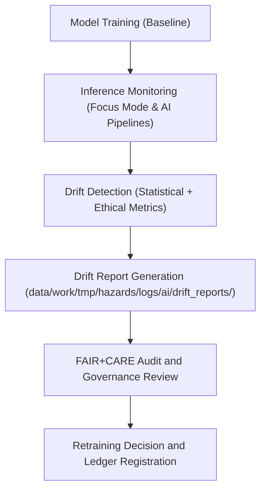

<div align="center">

# 🤖 Kansas Frontier Matrix — **AI Drift Reports**
`data/work/tmp/hazards/logs/ai/drift_reports/README.md`

**Purpose:** Repository for AI drift detection, monitoring, and audit logs generated during hazard model inference and retraining cycles within the Kansas Frontier Matrix (KFM).  
These reports provide quantitative and ethical validation of model stability, ensuring transparency and compliance with FAIR+CARE and AI governance standards.

[](../../../../../../../docs/standards/faircare-validation.md)
[](../../../../../../../LICENSE)
[](../../../../../../../docs/architecture/repo-focus.md)

</div>

---

## 📚 Overview

The `data/work/tmp/hazards/logs/ai/drift_reports/` directory captures **AI model drift diagnostics** for hazard prediction and risk assessment pipelines.  
It tracks model performance over time, detecting feature distribution changes, ethical bias variations, and retraining events under governance supervision.

### Core Functions:
- Quantify data or concept drift between training and inference datasets.  
- Record model performance degradation and fairness metrics.  
- Generate governance-ready audit reports for AI revalidation workflows.  
- Support FAIR+CARE Council oversight of ethical AI operations.  

All reports are retained for lineage tracking, retraining justification, and AI audit trail verification.

---

## 🗂️ Directory Layout

```plaintext
data/work/tmp/hazards/logs/ai/drift_reports/
├── README.md                               # This file — overview of AI drift reporting
│
├── model_drift_summary.json                # Aggregate drift statistics across model versions
├── feature_distribution_shift.json         # Feature-level KL divergence, PSI, and mean drift scores
├── bias_drift_analysis.json                # Fairness audit for demographic or geographic bias changes
├── retraining_trigger_report.json          # Governance report documenting drift threshold exceedance
└── metadata.json                           # Provenance, checksum, and governance linkage
```

---

## ⚙️ AI Drift Monitoring Workflow



### Workflow Steps:
1. **Baseline Establishment:** Store model parameters and feature distributions from certified model runs.  
2. **Inference Monitoring:** Continuously compare live input/output statistics against baselines.  
3. **Drift Analysis:** Compute statistical (KL, PSI) and fairness drift scores.  
4. **Governance Audit:** Log drift metrics, ethical deviations, and retraining recommendations.  
5. **Ledger Update:** Register drift findings in `data/reports/audit/ai_hazards_ledger.json`.

---

## 🧩 Example Drift Metadata Record

```json
{
  "id": "ai_drift_report_hazard_model_v9.3.2",
  "model_name": "hazards_risk_forecaster_v3",
  "baseline_version": "2025.04.1",
  "inference_window": "2025-Q3",
  "features_monitored": 42,
  "drift_detected": true,
  "max_psi": 0.31,
  "bias_shift_score": 0.12,
  "retraining_recommended": true,
  "validator": "@kfm-ai-gov",
  "created": "2025-10-28T15:20:00Z",
  "checksum": "sha256:b2b5d92d8a3e63b64c9dbecc58a44b84f92cb2d7...",
  "governance_ref": "data/reports/audit/ai_hazards_ledger.json"
}
```

---

## 🧠 FAIR+CARE AI Governance Summary

| Principle | Implementation |
|------------|----------------|
| **Findable** | All drift reports indexed with model ID, version, and timestamp. |
| **Accessible** | Reports accessible internally for governance and ethics review. |
| **Interoperable** | JSON-structured outputs aligned with AI model monitoring schema. |
| **Reusable** | Contains metadata for retraining, audit replication, and long-term analytics. |
| **Collective Benefit** | Supports transparent and accountable hazard AI operations. |
| **Authority to Control** | FAIR+CARE Council and AI Governance Board oversee drift thresholds. |
| **Responsibility** | AI teams record drift detection methods and validation sources. |
| **Ethics** | Monitors for bias and ethical deviations, not just performance metrics. |

FAIR+CARE audit results and retraining logs linked to:  
`data/reports/audit/ai_hazards_ledger.json`  
and `data/reports/fair/data_care_assessment.json`.

---

## ⚙️ Drift Detection & QA Metrics

| Metric | Description | Threshold |
|---------|--------------|------------|
| **Population Stability Index (PSI)** | Measures feature distribution changes between training and inference. | > 0.2 indicates significant drift |
| **KL Divergence** | Quantifies deviation in probability distributions. | > 0.15 signals concept drift |
| **Bias Shift Score** | Detects demographic/geographic fairness deviations. | > 0.1 requires ethics review |
| **Prediction Stability** | Compares output consistency between versions. | ±5% change triggers retraining review |

Drift monitoring automated via `ai_drift_monitor.yml`.

---

## ⚖️ Governance & Provenance Integration

| Record | Description |
|---------|-------------|
| `metadata.json` | Tracks drift report creation, version, and governance linkage. |
| `data/reports/audit/ai_hazards_ledger.json` | Central ledger logging drift, retraining, and ethical outcomes. |
| `data/reports/fair/data_care_assessment.json` | Tracks FAIR+CARE compliance metrics for AI systems. |
| `releases/v9.3.2/manifest.zip` | Contains checksum records for drift report reproducibility. |

All drift detection and audit synchronization managed by AI governance automation pipelines.

---

## 🧾 Retention & Audit Policy

| Report Type | Retention | Policy |
|--------------|------------|--------|
| Drift Reports | 365 days | Retained for model reproducibility and retraining reference. |
| Governance Logs | Permanent | Archived for compliance and ethics audits. |
| Bias Reports | 365 days | Retained for FAIR+CARE Council revalidation. |
| Metadata | Permanent | Stored in provenance ledger for lineage traceability. |

Automated retention handled via `ai_drift_cleanup.yml`.

---

## 🧾 Internal Use Citation

```text
Kansas Frontier Matrix (2025). AI Drift Reports for Hazard Models (v9.3.2).
Governance-audited drift detection and ethics validation logs for AI-driven hazard prediction systems.
Restricted to internal FAIR+CARE governance and retraining workflows.
```

---

## 🧾 Version Notes

| Version | Date | Notes |
|----------|------|--------|
| v9.3.2 | 2025-10-28 | Added bias shift detection and FAIR+CARE drift certification workflow. |
| v9.2.0 | 2024-07-15 | Introduced PSI-based statistical drift reports and retraining triggers. |
| v9.0.0 | 2023-01-10 | Established AI drift reporting architecture for hazard AI models. |

---

<div align="center">

**Kansas Frontier Matrix** · *AI Transparency × FAIR+CARE Governance × Ethical Model Stewardship*  
[🔗 Repository](https://github.com/bartytime4life/Kansas-Frontier-Matrix) • [🧭 Docs Portal](../../../../../../../docs/) • [⚖️ AI Governance Ledger](../../../../../../../docs/standards/governance/AI-GOVERNANCE.md)

</div>