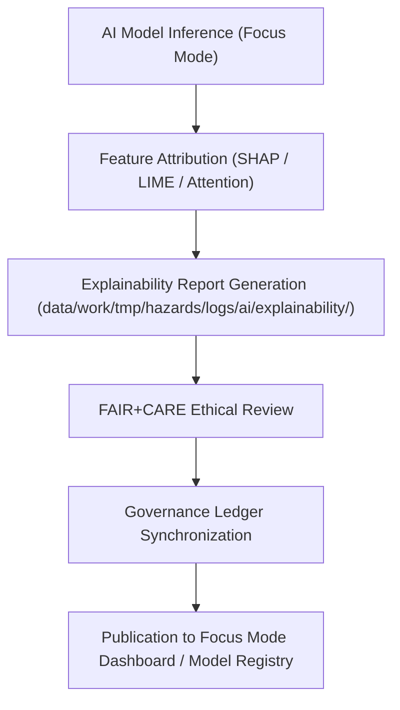

<div align="center">

# 🧠 Kansas Frontier Matrix — **AI Explainability Reports**
`data/work/tmp/hazards/logs/ai/explainability/README.md`

**Purpose:** Repository for AI model explainability artifacts, feature importance analyses, and ethics validation reports generated during hazard model inference in the Kansas Frontier Matrix (KFM).  
This workspace documents *why* AI models make predictions—ensuring interpretability, fairness, and compliance under FAIR+CARE and AI governance protocols.

[](../../../../../../../docs/standards/faircare-validation.md)
[](../../../../../../../LICENSE)
[](../../../../../../../docs/architecture/repo-focus.md)

</div>

---

## 📚 Overview

The `data/work/tmp/hazards/logs/ai/explainability/` directory captures **AI model interpretability and transparency artifacts** for hazard-focused machine learning systems within KFM.  
These reports quantify feature contributions, local and global explanations, and ethical model reasoning diagnostics aligned with FAIR+CARE’s *Explainability & Accountability* principles.

### Core Functions:
- Document model interpretability using SHAP, LIME, and attention-weight analyses.  
- Visualize feature importance distributions across hazard events (e.g., floods, tornadoes).  
- Record local explanation summaries for Focus Mode hazard queries.  
- Provide governance-traceable explainability and ethics validation reports.  

All explainability data is reviewed by the FAIR+CARE Council and AI Governance Board to ensure ethical transparency.

---

## 🗂️ Directory Layout

```plaintext
data/work/tmp/hazards/logs/ai/explainability/
├── README.md                              # This file — overview of AI explainability workspace
│
├── shap_global_summary.json               # Global feature importance distribution across the model
├── shap_local_explanations.json           # Localized SHAP values for specific hazard instances
├── lime_explanation_examples.json         # Instance-level explanations from LIME framework
├── attention_weights_analysis.json        # Attention mapping for deep-learning hazard prediction layers
├── ethics_explainability_audit.json       # FAIR+CARE ethics validation for interpretability compliance
└── metadata.json                          # Model reference, checksum, and governance record
```

---

## ⚙️ AI Explainability Workflow



### Workflow Description:
1. **Model Execution:** AI hazard models (e.g., flood-risk predictors) perform inference and log outputs.  
2. **Attribution Analysis:** SHAP and LIME generate global and local feature attributions.  
3. **Explainability Generation:** Reports summarize interpretability metrics, highlighting key input drivers.  
4. **Ethics Review:** FAIR+CARE auditors verify model transparency and human-comprehensible results.  
5. **Governance Sync:** Reports registered within `data/reports/audit/ai_hazards_ledger.json` for reproducibility.

---

## 🧩 Example Metadata Record

```json
{
  "id": "ai_explainability_hazard_model_v9.3.2",
  "model_name": "hazards_risk_forecaster_v3",
  "explainability_frameworks": ["SHAP", "LIME", "Attention"],
  "global_features_analyzed": 32,
  "local_explanations_generated": 120,
  "attention_layers_reviewed": 3,
  "validator": "@kfm-ai-gov",
  "created": "2025-10-28T15:50:00Z",
  "checksum": "sha256:6a9fbc92c11a4e557e77c984ddf1a81f91b7a9e2...",
  "fairstatus": "certified",
  "governance_ref": "data/reports/audit/ai_hazards_ledger.json"
}
```

---

## 🧠 FAIR+CARE AI Governance Alignment

| Principle | Implementation |
|------------|----------------|
| **Findable** | Explainability reports cataloged by model ID, run time, and checksum. |
| **Accessible** | Reports stored in JSON format for audit and visualization tools. |
| **Interoperable** | Compatible with SHAP, LIME, and PyTorch interpretability libraries. |
| **Reusable** | Contains sufficient metadata for reanalysis and model auditing. |
| **Collective Benefit** | Promotes understanding of AI decisions affecting public hazard insights. |
| **Authority to Control** | FAIR+CARE Council oversees interpretability verification and ethics reviews. |
| **Responsibility** | AI engineers and validators document feature attribution accuracy. |
| **Ethics** | Ensures transparency in model reasoning to prevent bias or opacity. |

All audit results are recorded in:  
`data/reports/audit/ai_hazards_ledger.json`  
and `data/reports/fair/data_care_assessment.json`.

---

## ⚙️ Explainability Artifacts

| File | Description | Framework |
|------|--------------|------------|
| `shap_global_summary.json` | Global SHAP importance for all features. | SHAP |
| `shap_local_explanations.json` | Instance-level hazard prediction explanations. | SHAP |
| `lime_explanation_examples.json` | Example-wise feature weights for interpretability testing. | LIME |
| `attention_weights_analysis.json` | Attention layer visualization and feature significance heatmap. | Deep Learning |
| `ethics_explainability_audit.json` | FAIR+CARE review confirming model interpretability compliance. | FAIR+CARE Council |

Explainability workflows managed by `ai_explainability_sync.yml`.

---

## ⚖️ Governance & Provenance Integration

| Record | Description |
|---------|-------------|
| `metadata.json` | Contains model, explainability method, and audit linkage. |
| `data/reports/audit/ai_hazards_ledger.json` | Logs explainability, validation, and ethical compliance. |
| `data/reports/fair/data_care_assessment.json` | Records FAIR+CARE compliance for model interpretability. |
| `releases/v9.3.2/manifest.zip` | Includes checksums for explainability artifact verification. |

All governance synchronization automated via AI audit pipelines.

---

## 🧾 Retention & Ethics Policy

| Artifact Type | Retention | Policy |
|----------------|------------|--------|
| Explainability Reports | 365 days | Retained for reproducibility and model audit. |
| FAIR+CARE Ethics Audits | Permanent | Archived as certification records. |
| Model Metadata | Permanent | Retained for provenance continuity. |
| Visualizations | 180 days | Stored for retraining and dashboard visualization review. |

Automated retention managed via `ai_explainability_cleanup.yml`.

---

## 🧾 Internal Use Citation

```text
Kansas Frontier Matrix (2025). AI Explainability Reports (v9.3.2).
Comprehensive record of AI model interpretability analyses, including SHAP, LIME, and attention-based explanations for hazard prediction systems.
Restricted to internal FAIR+CARE governance and AI ethics review.
```

---

## 🧾 Version Notes

| Version | Date | Notes |
|----------|------|--------|
| v9.3.2 | 2025-10-28 | Added SHAP and LIME explainability pipelines and FAIR+CARE ethics audit integration. |
| v9.2.0 | 2024-07-15 | Introduced attention-based deep model interpretability tracking. |
| v9.0.0 | 2023-01-10 | Established explainability logging structure for hazard AI governance. |

---

<div align="center">

**Kansas Frontier Matrix** · *AI Interpretability × FAIR+CARE Governance × Ethical Transparency*  
[🔗 Repository](https://github.com/bartytime4life/Kansas-Frontier-Matrix) • [🧭 Docs Portal](../../../../../../../docs/) • [⚖️ AI Governance Ledger](../../../../../../../docs/standards/governance/AI-GOVERNANCE.md)

</div>