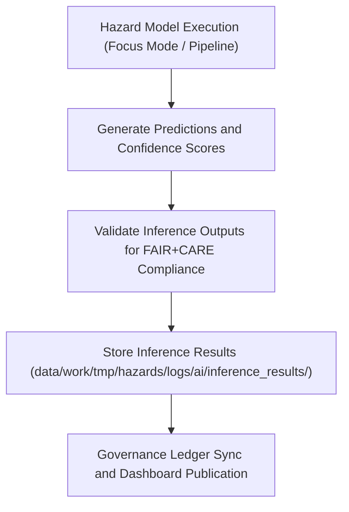

<div align="center">

# 📈 Kansas Frontier Matrix — **AI Inference Results**
`data/work/tmp/hazards/logs/ai/inference_results/README.md`

**Purpose:** Repository for AI inference outputs and prediction logs generated by hazard risk models in the Kansas Frontier Matrix (KFM).  
This layer tracks model predictions, spatial probabilities, and governance-linked evaluation metrics for FAIR+CARE-compliant hazard forecasting.

[](../../../../../../../docs/standards/faircare-validation.md)
[](../../../../../../../LICENSE)
[](../../../../../../../docs/architecture/repo-focus.md)

</div>

---

## 📚 Overview

The `data/work/tmp/hazards/logs/ai/inference_results/` directory contains **AI inference output artifacts** for hazard prediction models.  
Each file records model results, spatial risk estimates, and uncertainty scores generated by machine learning pipelines.  
All outputs are monitored, validated, and logged under FAIR+CARE and AI ethics frameworks for accountability and reproducibility.

### Core Functions:
- Store AI hazard predictions for floods, tornadoes, droughts, and other natural risks.  
- Log model confidence, spatial coverage, and ethics metrics for FAIR+CARE validation.  
- Provide traceable inference records for governance ledger synchronization.  
- Support retraining, performance monitoring, and transparency dashboards.  

All inference results in this directory are temporary and automatically promoted or archived after verification.

---

## 🗂️ Directory Layout

```plaintext
data/work/tmp/hazards/logs/ai/inference_results/
├── README.md                               # This file — overview of inference result logs
│
├── hazard_inference_predictions.csv        # Model predictions and spatial risk outputs
├── hazard_confidence_scores.json           # Probability distributions and uncertainty metrics
├── spatial_risk_heatmap.geojson            # Geospatial risk visualization outputs
├── model_performance_metrics.json          # Accuracy, recall, F1, and calibration metrics
└── metadata.json                           # Provenance, checksum, and governance linkage
```

---

## ⚙️ AI Inference Workflow



### Workflow Description:
1. **Model Execution:** AI models generate hazard predictions using current environmental data.  
2. **Result Validation:** Inference outputs reviewed for schema compliance and ethical fairness.  
3. **Metadata Recording:** Model version, run ID, and performance logs captured in governance metadata.  
4. **Governance Sync:** Inference metadata and predictions registered in AI governance ledger.  
5. **Dashboard Integration:** Outputs linked to Focus Mode visualization layers for interpretability.

---

## 🧩 Example Metadata Record

```json
{
  "id": "ai_inference_hazard_forecaster_v9.3.2",
  "model_name": "hazards_risk_forecaster_v3",
  "model_version": "2025.09.1",
  "inference_batch_id": "hazards_infer_2025Q4",
  "records_processed": 34872,
  "hazard_types": ["flood", "tornado", "drought"],
  "spatial_extent": [-102.05, 36.99, -94.61, 40.00],
  "mean_confidence": 0.89,
  "f1_score": 0.94,
  "drift_status": "nominal",
  "validator": "@kfm-ai-gov",
  "created": "2025-10-28T16:10:00Z",
  "checksum": "sha256:9f02b4a6b5b41e93e5d9935a4f9dbf3e2b7f67e9...",
  "governance_ref": "data/reports/audit/ai_hazards_ledger.json"
}
```

---

## 🧠 FAIR+CARE AI Governance Summary

| Principle | Implementation |
|------------|----------------|
| **Findable** | Each inference record logged with model version, checksum, and run ID. |
| **Accessible** | Stored in open CSV, JSON, and GeoJSON formats for transparency. |
| **Interoperable** | Compatible with KFM schemas, AI dashboards, and STAC/DCAT catalogs. |
| **Reusable** | Contains lineage, checksum, and validation reports for reproducibility. |
| **Collective Benefit** | Supports transparent, equitable AI use in hazard forecasting. |
| **Authority to Control** | FAIR+CARE Council and AI Governance Board review inference outputs. |
| **Responsibility** | Validators ensure predictions meet performance and ethics standards. |
| **Ethics** | Bias and model drift reviewed to prevent unethical or misleading outcomes. |

All audit and governance logs registered in:  
`data/reports/audit/ai_hazards_ledger.json` and  
`data/reports/fair/data_care_assessment.json`.

---

## ⚙️ Inference Metrics and QA Checks

| Metric | Description | Threshold |
|---------|--------------|------------|
| **F1 Score** | Measures model prediction accuracy. | ≥ 0.90 for production models |
| **Mean Confidence** | Average model confidence across predictions. | ≥ 0.85 |
| **Calibration Error** | Evaluates model probability reliability. | ≤ 0.05 |
| **Bias Index** | Detects fairness issues in geographic predictions. | ≤ 0.1 |
| **Data Drift Status** | Detects deviation from training distributions. | Must be "nominal" or "minor" |

Validation and metrics checks automated via `ai_inference_monitor.yml`.

---

## ⚖️ Governance & Provenance Integration

| Record | Description |
|---------|-------------|
| `metadata.json` | Contains inference session metadata, performance, and checksum details. |
| `data/reports/audit/ai_hazards_ledger.json` | Logs inference lineage, governance certification, and retraining notes. |
| `data/reports/fair/data_care_assessment.json` | Stores FAIR+CARE compliance audits for AI operations. |
| `releases/v9.3.2/manifest.zip` | Central checksum registry for reproducible inference records. |

All inference result synchronization automated through AI pipeline workflows.

---

## 🧾 Retention & Ethics Policy

| Data Type | Retention Duration | Policy |
|------------|--------------------|--------|
| Inference Results | 90 days | Retained until next model retraining cycle. |
| Governance Logs | Permanent | Archived for AI audit trail and FAIR+CARE verification. |
| Performance Reports | 180 days | Retained for model monitoring and reproducibility. |
| Metadata | Permanent | Stored for lineage and traceability under governance policy. |

Retention tasks managed by `ai_inference_cleanup.yml`.

---

## 🧾 Internal Use Citation

```text
Kansas Frontier Matrix (2025). AI Inference Results (v9.3.2).
Governance-certified AI inference outputs for hazard prediction models within the Kansas Frontier Matrix.
Restricted to FAIR+CARE validation, monitoring, and transparency operations.
```

---

## 🧾 Version Notes

| Version | Date | Notes |
|----------|------|--------|
| v9.3.2 | 2025-10-28 | Introduced expanded inference metrics, bias audit logging, and governance synchronization. |
| v9.2.0 | 2024-07-15 | Added spatial heatmap outputs and confidence calibration logs. |
| v9.0.0 | 2023-01-10 | Established inference result repository for AI hazard forecasting models. |

---

<div align="center">

**Kansas Frontier Matrix** · *AI Forecasting × FAIR+CARE Ethics × Transparent Governance*  
[🔗 Repository](https://github.com/bartytime4life/Kansas-Frontier-Matrix) • [🧭 Docs Portal](../../../../../../../docs/) • [⚖️ AI Governance Ledger](../../../../../../../docs/standards/governance/AI-GOVERNANCE.md)

</div>