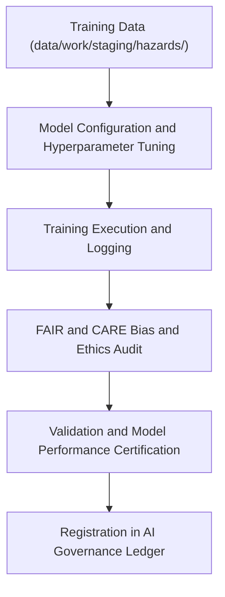

<div align="center">

# 🧩 Kansas Frontier Matrix — **AI Model Training Logs**
`data/work/tmp/hazards/logs/ai/model_training/README.md`

**Purpose:** Repository for machine learning model training artifacts, metrics, and governance-linked validation reports used in hazard forecasting pipelines within the Kansas Frontier Matrix (KFM).  
This workspace provides transparent documentation of training runs, hyperparameter configurations, FAIR+CARE ethical checks, and lineage certification for all AI models.

[](../../../../../../../docs/standards/faircare-validation.md)
[](../../../../../../../LICENSE)
[](../../../../../../../docs/architecture/repo-focus.md)

</div>

---

## 📚 Overview

The `data/work/tmp/hazards/logs/ai/model_training/` directory stores **AI model training logs, metadata, and validation reports** produced by hazard analytics pipelines.  
All training sessions are version-controlled, FAIR+CARE audited, and registered in KFM’s AI Governance Ledger for transparency and reproducibility.

### Core Functions:
- Record hyperparameter configurations and training environment metadata.  
- Track model performance metrics, bias detection, and ethical compliance.  
- Generate explainability-ready model snapshots for governance review.  
- Maintain lineage between raw training data, model checkpoints, and validation runs.  

Every model trained within this workspace passes through automatic validation and ethical review before deployment.

---

## 🗂️ Directory Layout

```plaintext
data/work/tmp/hazards/logs/ai/model_training/
├── README.md                               # This file — overview of AI model training workspace
│
├── training_summary.json                   # Key metrics and metadata for the latest training run
├── hyperparameter_config.json              # Hyperparameter grid and configuration details
├── model_performance_validation.json       # Performance metrics (accuracy, precision, recall, F1)
├── fairness_bias_audit.json                # FAIR+CARE bias and ethics validation report
├── loss_curve.csv                          # Epoch-level loss and accuracy log
├── training_environment.json               # Hardware, software, and dependency registry
└── metadata.json                           # Governance, checksum, and model lineage record
```

---

## ⚙️ AI Training Workflow



### Workflow Description:
1. **Configuration:** Define hyperparameters, model architecture, and random seeds.  
2. **Training Execution:** Run model training sessions with real-time metric logging.  
3. **Validation:** Generate evaluation metrics and verify schema integrity.  
4. **FAIR+CARE Audit:** Conduct bias and fairness assessments for ethical compliance.  
5. **Governance Sync:** Register model details and checksums in `data/reports/audit/ai_hazards_ledger.json`.

---

## 🧩 Example Metadata Record

```json
{
  "id": "ai_model_training_hazards_forecaster_v9.3.2",
  "model_name": "hazards_risk_forecaster_v3",
  "architecture": "XGBoost + Spatial Attention Layer",
  "epochs": 150,
  "batch_size": 256,
  "learning_rate": 0.001,
  "f1_score": 0.93,
  "bias_index": 0.08,
  "training_duration_minutes": 142,
  "training_data_source": "data/work/staging/hazards/",
  "validator": "@kfm-ai-lab",
  "created": "2025-10-28T16:22:00Z",
  "checksum": "sha256:a42d93c6b9818ec94485a92d2d56af95f3912b9e...",
  "fairstatus": "certified",
  "governance_ref": "data/reports/audit/ai_hazards_ledger.json"
}
```

---

## 🧠 FAIR+CARE Governance Summary

| Principle | Implementation |
|------------|----------------|
| **Findable** | Each model training session logged with unique ID and model name. |
| **Accessible** | All metadata stored in open JSON format for reproducibility. |
| **Interoperable** | Compatible with MLFlow, TensorBoard, and KFM AI schema. |
| **Reusable** | Includes hyperparameters, dataset lineage, and validation outcomes. |
| **Collective Benefit** | Promotes ethical AI model transparency in hazard forecasting. |
| **Authority to Control** | FAIR+CARE Council oversees model training certification. |
| **Responsibility** | AI teams ensure proper documentation of bias and performance audits. |
| **Ethics** | Models evaluated for fairness, accountability, and explainability. |

Certification reports stored in:  
`data/reports/audit/ai_hazards_ledger.json`  
and `data/reports/fair/data_care_assessment.json`.

---

## ⚙️ Training Metrics & Validation Reports

| File | Description | Output |
|------|--------------|---------|
| `training_summary.json` | Overall training metrics (accuracy, F1, recall, AUC). | JSON |
| `hyperparameter_config.json` | Model configuration and parameter details. | JSON |
| `fairness_bias_audit.json` | FAIR+CARE ethics and bias audit report. | JSON |
| `loss_curve.csv` | Epoch-level loss and accuracy trace. | CSV |
| `model_performance_validation.json` | Validation summary of post-training performance metrics. | JSON |

All model training events tracked via `ai_model_training_sync.yml`.

---

## ⚖️ Governance & Provenance Integration

| Record | Description |
|---------|-------------|
| `metadata.json` | Captures training lineage, hyperparameters, and governance linkage. |
| `data/reports/audit/ai_hazards_ledger.json` | Logs AI model training events and FAIR+CARE compliance results. |
| `data/reports/fair/data_care_assessment.json` | FAIR+CARE certification summary for ethical AI validation. |
| `releases/v9.3.2/manifest.zip` | Global checksum registry for all AI model artifacts. |

All governance synchronization managed via automated FAIR+CARE AI workflows.

---

## 🧾 Retention & Certification Policy

| Data Type | Retention Duration | Policy |
|------------|--------------------|--------|
| Training Logs | 365 days | Retained for reproducibility and retraining verification. |
| FAIR+CARE Reports | Permanent | Stored indefinitely for ethical governance tracking. |
| Model Metadata | Permanent | Archived for lineage continuity and audit reference. |
| Performance Metrics | 180 days | Retained for quality control and benchmark reporting. |

Cleanup and archival managed via `ai_training_cleanup.yml`.

---

## 🧾 Internal Use Citation

```text
Kansas Frontier Matrix (2025). AI Model Training Logs (v9.3.2).
Governance-certified record of AI model training, validation, and ethics audits for hazard prediction models.
Restricted to FAIR+CARE governance and AI reproducibility workflows.
```

---

## 🧾 Version Notes

| Version | Date | Notes |
|----------|------|--------|
| v9.3.2 | 2025-10-28 | Added bias index validation and FAIR+CARE certification integration. |
| v9.2.0 | 2024-07-15 | Enhanced hyperparameter tracking and ethics report synchronization. |
| v9.0.0 | 2023-01-10 | Established AI training log architecture for hazard forecasting models. |

---

<div align="center">

**Kansas Frontier Matrix** · *AI Integrity × FAIR+CARE Ethics × Transparent Governance*  
[🔗 Repository](https://github.com/bartytime4life/Kansas-Frontier-Matrix) • [🧭 Docs Portal](../../../../../../../docs/) • [⚖️ AI Governance Ledger](../../../../../../../docs/standards/governance/AI-GOVERNANCE.md)

</div>