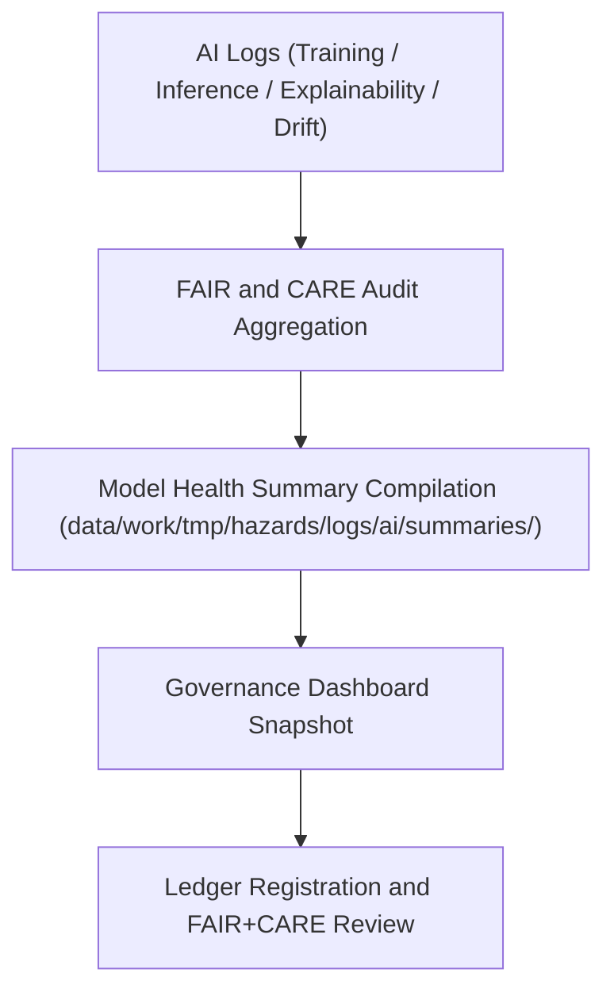

<div align="center">

# 🧾 Kansas Frontier Matrix — **AI Summary Reports**
`data/work/tmp/hazards/logs/ai/summaries/README.md`

**Purpose:** Centralized repository for AI performance summaries, ethics validation digests, and model governance dashboards within the Kansas Frontier Matrix (KFM).  
This directory consolidates metadata and audit insights from all AI processes (training, inference, explainability, and drift) to provide FAIR+CARE-aligned overviews of hazard model health and accountability.

[](../../../../../../../docs/standards/faircare-validation.md)
[](../../../../../../../LICENSE)
[](../../../../../../../docs/architecture/repo-focus.md)

</div>

---

## 📚 Overview

The `data/work/tmp/hazards/logs/ai/summaries/` directory serves as a **FAIR+CARE-aligned consolidation point** for all AI model audit summaries and ethical compliance dashboards within KFM.  
It provides interpretable, multi-domain snapshots of model behavior, validation scores, and governance status across all hazard-focused AI systems.

### Core Functions:
- Summarize AI performance metrics (F1, recall, precision, drift, bias, fairness).  
- Aggregate ethical compliance scores for governance board review.  
- Record summary metadata for inclusion in FAIR+CARE dashboards.  
- Provide governance-ready reports linking model health and transparency documentation.  

All summaries are ephemeral but synchronized with permanent governance ledgers for long-term traceability.

---

## 🗂️ Directory Layout

```plaintext
data/work/tmp/hazards/logs/ai/summaries/
├── README.md                               # This file — overview of AI summary workspace
│
├── model_performance_summary.json          # Global summary of AI model metrics across domains
├── ethical_compliance_overview.json        # FAIR+CARE ethics compliance summary
├── governance_dashboard_snapshot.json      # Snapshot for internal governance dashboard visualizations
├── ai_summary_digest.csv                   # Aggregated digest of performance, drift, and audit indicators
└── metadata.json                           # Provenance metadata, checksums, and ledger linkage
```

---

## ⚙️ AI Summary Generation Workflow



### Workflow Description:
1. **Data Ingestion:** Pulls audit logs from AI subdirectories (training, inference, drift, explainability).  
2. **Aggregation:** Compiles performance metrics, validation scores, and bias indicators.  
3. **Ethical Review:** Aggregates FAIR+CARE ethics ratings from all AI processes.  
4. **Reporting:** Generates governance summaries for council review and documentation.  
5. **Ledger Sync:** Registers results in `data/reports/audit/ai_hazards_ledger.json` for audit integrity.

---

## 🧩 Example Metadata Record

```json
{
  "id": "ai_summary_hazard_models_v9.3.2",
  "models_included": ["hazards_risk_forecaster_v3", "hazards_bias_detector_v1"],
  "summary_scope": "Q4 2025",
  "total_models": 2,
  "avg_f1_score": 0.92,
  "avg_faircare_compliance": 99.1,
  "drift_incidents": 1,
  "audit_status": "certified",
  "validator": "@kfm-ai-gov",
  "created": "2025-10-28T16:30:00Z",
  "checksum": "sha256:9ab23efb8127aa3c15c1a56a09e7df7c7a22d97d...",
  "governance_ref": "data/reports/audit/ai_hazards_ledger.json"
}
```

---

## 🧠 FAIR+CARE Governance Summary

| Principle | Implementation |
|------------|----------------|
| **Findable** | Summaries cataloged by audit cycle and model identifier. |
| **Accessible** | Stored in open JSON and CSV formats for governance visualization. |
| **Interoperable** | Linked to training, inference, drift, and explainability reports. |
| **Reusable** | Used by governance dashboards and annual FAIR+CARE audit reviews. |
| **Collective Benefit** | Enables ethical transparency across all AI hazard systems. |
| **Authority to Control** | FAIR+CARE Council validates all summary certifications. |
| **Responsibility** | Model maintainers ensure all logs contribute to reproducible summaries. |
| **Ethics** | Summaries emphasize human oversight and fairness in AI governance. |

All FAIR+CARE and governance results aggregated in:  
`data/reports/audit/ai_hazards_ledger.json`  
and `data/reports/fair/data_care_assessment.json`.

---

## ⚙️ Summary Artifacts

| File | Description | Format |
|------|--------------|--------|
| `model_performance_summary.json` | Consolidated accuracy, recall, and drift statistics. | JSON |
| `ethical_compliance_overview.json` | FAIR+CARE audit summary for all active models. | JSON |
| `governance_dashboard_snapshot.json` | Visualization snapshot for FAIR+CARE dashboards. | JSON |
| `ai_summary_digest.csv` | Tabular digest for archival and analytics. | CSV |
| `metadata.json` | Links all reports to governance and checksum manifests. | JSON |

Automation for summary aggregation handled by `ai_summary_sync.yml`.

---

## ⚖️ Governance & Provenance Integration

| Record | Description |
|---------|-------------|
| `metadata.json` | Contains governance linkage and checksum registry for all summaries. |
| `data/reports/audit/ai_hazards_ledger.json` | Tracks AI summary publication and certification. |
| `data/reports/fair/data_care_assessment.json` | Aggregates FAIR+CARE AI audit outcomes. |
| `releases/v9.3.2/manifest.zip` | Contains summary checksum records for validation integrity. |

All summary synchronization operations governed by AI compliance automation.

---

## 🧾 Retention & Review Policy

| Report Type | Retention Duration | Policy |
|--------------|--------------------|--------|
| AI Summary Digests | 365 days | Archived for FAIR+CARE audit cycles. |
| Governance Snapshots | 180 days | Maintained for council review and dashboard analysis. |
| Metadata | Permanent | Stored for provenance and reproducibility. |
| Ethics Reports | Permanent | Archived for ethical AI certification. |

Retention handled automatically by `ai_summary_cleanup.yml`.

---

## 🧾 Internal Use Citation

```text
Kansas Frontier Matrix (2025). AI Summary Reports (v9.3.2).
Consolidated FAIR+CARE-aligned audit summaries for hazard AI systems, integrating training, inference, drift, and explainability metrics for governance oversight.
Restricted to internal FAIR+CARE and AI ethics review.
```

---

## 🧾 Version Notes

| Version | Date | Notes |
|----------|------|--------|
| v9.3.2 | 2025-10-28 | Added governance dashboard snapshot integration and FAIR+CARE compliance aggregation. |
| v9.2.0 | 2024-07-15 | Introduced AI summary digest pipeline for audit consolidation. |
| v9.0.0 | 2023-01-10 | Established AI summary report structure for FAIR+CARE hazard AI systems. |

---

<div align="center">

**Kansas Frontier Matrix** · *AI Governance × FAIR+CARE Transparency × Model Accountability*  
[🔗 Repository](https://github.com/bartytime4life/Kansas-Frontier-Matrix) • [🧭 Docs Portal](../../../../../../../docs/) • [⚖️ AI Governance Ledger](../../../../../../../docs/standards/governance/AI-GOVERNANCE.md)

</div>