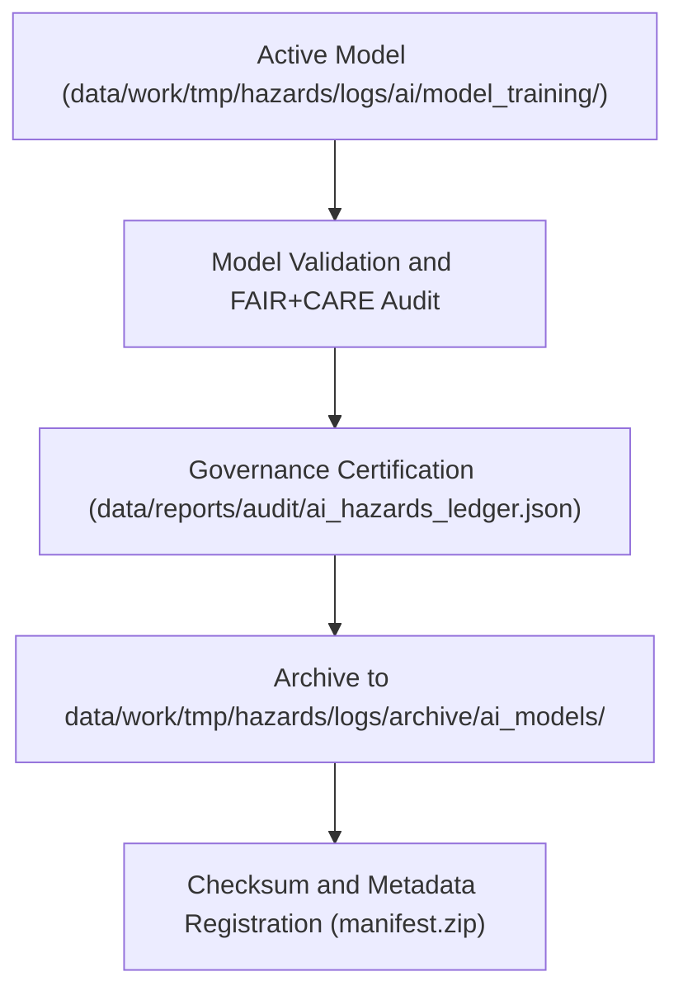

<div align="center">

# 📦 Kansas Frontier Matrix — **Archived AI Models**
`data/work/tmp/hazards/logs/archive/ai_models/README.md`

**Purpose:** Repository for archived AI model binaries, configurations, and metadata associated with hazard prediction pipelines in the Kansas Frontier Matrix (KFM).  
This directory preserves decommissioned or superseded models for FAIR+CARE governance audits, reproducibility studies, and ethics review purposes.

[](../../../../../../../docs/standards/faircare-validation.md)
[](../../../../../../../LICENSE)
[](../../../../../../../docs/architecture/repo-focus.md)

</div>

---

## 📚 Overview

The `data/work/tmp/hazards/logs/archive/ai_models/` directory contains **archived versions of AI hazard prediction models** and their governance-linked metadata.  
Each archived model is retained for lineage tracking, retraining provenance, and FAIR+CARE ethics certification continuity.

### Core Functions:
- Store legacy AI model artifacts for reproducibility and governance validation.  
- Preserve associated configuration files, training parameters, and ethics audit results.  
- Provide reference material for retraining, benchmarking, or model rollback procedures.  
- Ensure model lifecycle transparency under FAIR+CARE and AI governance policies.  

All archived models are immutable, digitally signed, and checksum-verified.

---

## 🗂️ Directory Layout

```plaintext
data/work/tmp/hazards/logs/archive/ai_models/
├── README.md                                # This file — overview of archived AI model repository
│
├── hazards_risk_forecaster_v2.pkl           # Serialized model object for previous production version
├── hazards_risk_forecaster_v2_metadata.json # Model configuration, schema, and governance information
├── hazards_forecast_xgb_v1.5.pkl            # XGBoost-based model used for 2024-Q1 pilot
├── hazards_forecast_xgb_v1.5_audit.json     # FAIR+CARE certification and bias audit for legacy model
└── archive_manifest.json                    # Index of all archived models and associated metadata
```

---

## ⚙️ Model Archiving Workflow



### Workflow Description:
1. **Certification:** Completed models undergo validation and FAIR+CARE audits before archiving.  
2. **Governance Sync:** Lineage, ethics, and training metadata stored in provenance ledgers.  
3. **Archiving:** Certified models compressed, hashed, and archived with metadata.  
4. **Access Control:** Only read access permitted; models are immutable and protected.  
5. **Publication:** Archive entries indexed in AI Governance Ledger for historical reference.

---

## 🧩 Example Model Metadata Record

```json
{
  "id": "hazards_risk_forecaster_v2",
  "model_type": "XGBoost Classifier",
  "training_date": "2024-05-12",
  "decommissioned": "2025-02-01",
  "f1_score": 0.91,
  "bias_index": 0.07,
  "replaced_by": "hazards_risk_forecaster_v3",
  "fairstatus": "certified",
  "archived": "2025-02-15T13:40:00Z",
  "checksum": "sha256:8f3ab491f3a3e4dc4a22f934ac3f96ff22aa1bc1...",
  "governance_ref": "data/reports/audit/ai_hazards_ledger.json"
}
```

---

## 🧠 FAIR+CARE AI Governance Summary

| Principle | Implementation |
|------------|----------------|
| **Findable** | All archived models indexed in `archive_manifest.json` and governance ledgers. |
| **Accessible** | Models stored in protected, read-only directories for governance access. |
| **Interoperable** | Model binaries stored in open serialization standards (Pickle, ONNX). |
| **Reusable** | Metadata includes configuration, checksum, and FAIR+CARE certification. |
| **Collective Benefit** | Enables ethical oversight and transparent model lifecycle tracking. |
| **Authority to Control** | FAIR+CARE Council and AI Governance