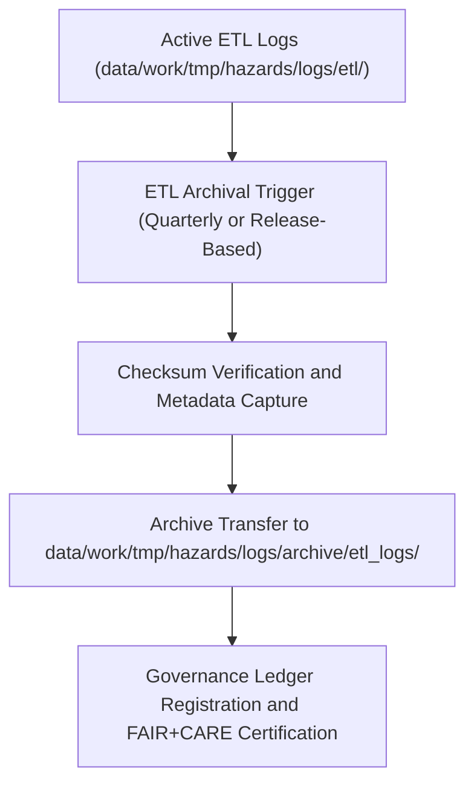

<div align="center">

# 🧾 Kansas Frontier Matrix — **Hazard ETL Log Archives**
`data/work/tmp/hazards/logs/archive/etl_logs/README.md`

**Purpose:** Centralized repository of archived ETL (Extract-Transform-Load) process logs related to hazard data pipelines in the Kansas Frontier Matrix (KFM).  
These archives preserve historical ETL execution details, provenance, and governance lineage for auditability and FAIR+CARE compliance.

[](../../../../../../../docs/standards/faircare-validation.md)
[](../../../../../../../LICENSE)
[](../../../../../../../docs/architecture/repo-focus.md)

</div>

---

## 📚 Overview

The `data/work/tmp/hazards/logs/archive/etl_logs/` directory stores **archived ETL operation records** from KFM’s hazard processing pipelines.  
These logs document every extraction, transformation, validation, and load event executed during past workflow cycles, providing historical traceability for data governance and reproducibility studies.

### Core Functions:
- Preserve ETL execution summaries and validation outputs for hazard datasets.  
- Maintain checksum and provenance integrity for archived ETL sessions.  
- Support FAIR+CARE audit investigations and reproducibility validations.  
- Provide lineage continuity between historical and current hazard ETL operations.  

All logs in this workspace are immutable once archived and linked to their corresponding manifest entries and provenance ledger records.

---

## 🗂️ Directory Layout

```plaintext
data/work/tmp/hazards/logs/archive/etl_logs/
├── README.md                              # This file — overview of ETL log archive
│
├── etl_run_archive_2024Q4.log             # Archived ETL execution trace (Q4 2024)
├── etl_validation_archive_2024Q4.json     # Archived schema validation output from same run
├── etl_manifest_snapshot_2024Q4.json      # Immutable manifest snapshot for archived datasets
├── governance_sync_ledger_2024Q4.log      # Provenance ledger update log during archival
└── metadata.json                          # Governance linkage and checksum registry
```

---

## ⚙️ ETL Archival Workflow



### Workflow Description:
1. **Extraction:** Active ETL logs verified for completeness and accuracy.  
2. **Checksum Verification:** Each file hashed and stored in manifest for reproducibility.  
3. **Archival Transfer:** Logs moved to archive directory with contextual metadata.  
4. **Governance Registration:** Archival recorded in provenance ledger for traceability.  
5. **Certification:** FAIR+CARE validation ensures ethical, transparent data stewardship.

---

## 🧩 Example Metadata Record

```json
{
  "id": "etl_archive_hazards_v9.3.2_2024Q4",
  "etl_cycle": "Q4 2024",
  "source_pipeline": "src/pipelines/etl/hazards_etl_pipeline.py",
  "records_processed": 24567,
  "checksums_verified": true,
  "archived_by": "@kfm-etl-ops",
  "archival_date": "2025-10-28T15:55:00Z",
  "fairstatus": "certified",
  "governance_ref": "data/reports/audit/data_provenance_ledger.json"
}
```

---

## 🧠 FAIR+CARE Governance Alignment

| Principle | Implementation |
|------------|----------------|
| **Findable** | Archived logs indexed by ETL cycle and release ID. |
| **Accessible** | Stored in open formats (TXT, JSON) with metadata linkage. |
| **Interoperable** | Aligned with KFM schema standards and manifest registry. |
| **Reusable** | Includes checksum and provenance references for reproducibility. |
| **Collective Benefit** | Ensures transparent data transformation accountability. |
| **Authority to Control** | FAIR+CARE Council governs archival and deletion permissions. |
| **Responsibility** | ETL operators maintain archival documentation. |
| **Ethics** | Logs exclude any sensitive operational or personal identifiers. |

Governance and validation records stored in:  
`data/reports/audit/data_provenance_ledger.json`  
and `data/reports/fair/data_care_assessment.json`.

---

## ⚙️ Validation & QA Reports

| Report | Description | Output |
|---------|-------------|---------|
| `etl_validation_archive_*.json` | Records results of schema and contract validation. | JSON |
| `etl_manifest_snapshot_*.json` | Manifests listing datasets included in the ETL cycle. | JSON |
| `governance_sync_ledger_*.log` | Audit trail for ledger synchronization events. | Text |
| `metadata.json` | Summarizes checksums, file lineage, and governance linkage. | JSON |

Archival validation and synchronization automated via `etl_archive_sync.yml`.

---

## ⚖️ Governance & Provenance Integration

| Record | Description |
|---------|-------------|
| `metadata.json` | Captures runtime metadata and FAIR+CARE certification for archived logs. |
| `data/reports/audit/data_provenance_ledger.json` | Logs archival lineage and FAIR+CARE certification. |
| `releases/v9.3.2/manifest.zip` | Registry of checksum and manifest data for archival validation. |

All governance operations are automatically handled through GitHub Actions archival workflows.

---

## 🧾 Retention & Integrity Policy

| Log Type | Retention | Policy |
|-----------|------------|--------|
| ETL Execution Logs | Permanent | Archived for long-term audit and reproducibility. |
| Validation Reports | 365 days | Retained for FAIR+CARE re-audit cycles. |
| Governance Sync Logs | Permanent | Immutable governance records. |
| Metadata Files | Permanent | Stored for provenance verification. |

Lifecycle and retention automation governed by `etl_archive_cleanup.yml`.

---

## 🧾 Internal Use Citation

```text
Kansas Frontier Matrix (2025). Hazard ETL Log Archives (v9.3.2).
Historical archive of ETL process logs, validation reports, and provenance metadata for hazard data pipelines.
Maintained under FAIR+CARE and MCP-DL v6.3 data governance protocols.
```

---

## 🧾 Version Notes

| Version | Date | Notes |
|----------|------|--------|
| v9.3.2 | 2025-10-28 | Added governance sync integration and checksum manifest tracking. |
| v9.2.0 | 2024-07-15 | Introduced quarterly ETL archival automation workflow. |
| v9.0.0 | 2023-01-10 | Established ETL log archival directory for hazard pipelines. |

---

<div align="center">

**Kansas Frontier Matrix** · *Data Integrity × FAIR+CARE Ethics × Provenance Continuity*  
[🔗 Repository](https://github.com/bartytime4life/Kansas-Frontier-Matrix) • [🧭 Docs Portal](../../../../../../../docs/) • [⚖️ Governance Ledger](../../../../../../../docs/standards/governance/)

</div>