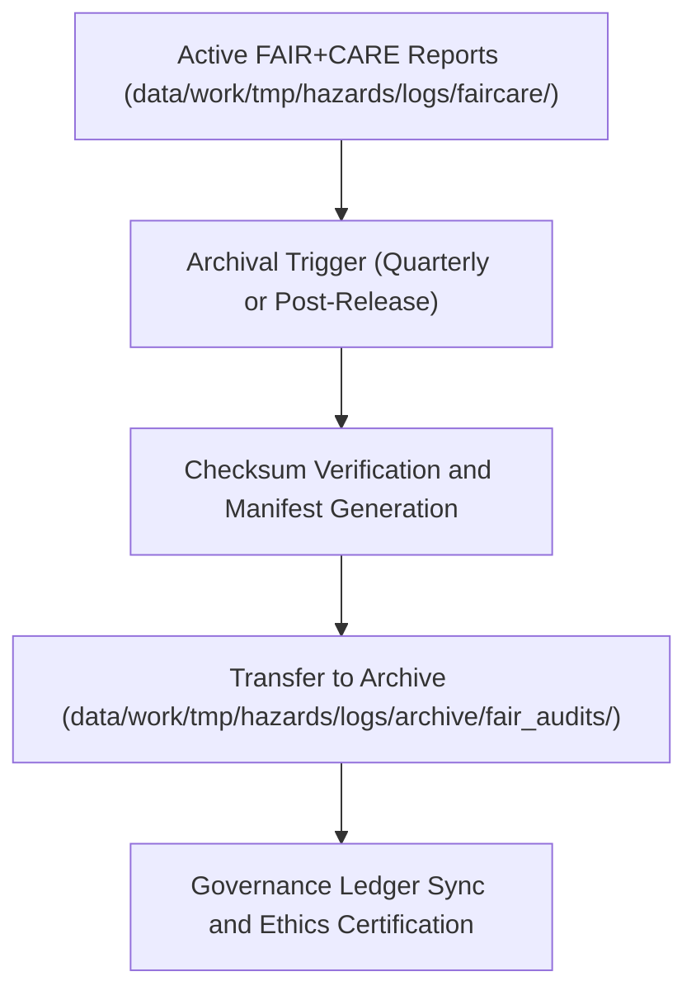

<div align="center">

# 🧮 Kansas Frontier Matrix — **Hazard FAIR+CARE Audit Archives**
`data/work/tmp/hazards/logs/archive/fair_audits/README.md`

**Purpose:** Long-term archival repository for FAIR+CARE audit logs, ethical compliance reviews, and governance certifications related to hazard data pipelines in the Kansas Frontier Matrix (KFM).  
These reports provide historical documentation of ethics validations, data accessibility evaluations, and compliance certifications under FAIR+CARE and MCP-DL v6.3 governance.

[](../../../../../../../docs/standards/faircare-validation.md)
[](../../../../../../../LICENSE)
[](../../../../../../../docs/architecture/repo-focus.md)

</div>

---

## 📚 Overview

The `data/work/tmp/hazards/logs/archive/fair_audits/` directory stores **archived FAIR+CARE ethical audit results** from hazard ETL, validation, and governance workflows.  
Each audit file documents data compliance across FAIR (Findable, Accessible, Interoperable, Reusable) and CARE (Collective Benefit, Authority to Control, Responsibility, Ethics) principles for hazard datasets.

### Core Functions:
- Preserve FAIR+CARE compliance reports for hazard datasets.  
- Maintain historical ethics validation results and governance certifications.  
- Support transparent auditing and reproducible data ethics governance.  
- Link archival records to provenance and audit ledgers for accountability.  

All files in this directory are immutable and digitally signed to maintain provenance continuity and ethical certification integrity.

---

## 🗂️ Directory Layout

```plaintext
data/work/tmp/hazards/logs/archive/fair_audits/
├── README.md                               # This file — overview of FAIR+CARE audit archive
│
├── faircare_audit_archive_2024Q4.json      # Archived FAIR+CARE validation report for Q4 2024
├── faircare_governance_log_2024Q4.log      # Ethics governance synchronization and certification record
├── faircare_summary_report_2024Q4.md       # Human-readable summary of FAIR+CARE compliance and findings
├── audit_findings_matrix_2024Q4.csv        # Summary of dataset-level FAIR+CARE scoring and metrics
└── metadata.json                           # Provenance, checksum, and ledger linkage metadata
```

---

## ⚙️ FAIR+CARE Audit Archival Workflow



### Workflow Description:
1. **Audit Validation:** FAIR+CARE reports verified for integrity and completeness.  
2. **Checksum & Manifest:** Hashes generated to ensure authenticity and traceability.  
3. **Archival Transfer:** Reports moved to archive directory with certification metadata.  
4. **Governance Registration:** Entries recorded in provenance ledger.  
5. **Certification:** FAIR+CARE Council confirms final compliance for each audit period.

---

## 🧩 Example Metadata Record

```json
{
  "id": "fair_audit_archive_hazards_v9.3.2_2024Q4",
  "etl_cycle": "Q4 2024",
  "datasets_reviewed": 24,
  "compliance_score_fair": 98.7,
  "compliance_score_care": 99.3,
  "audited_by": "@kfm-ethics-board",
  "archival_date": "2025-10-28T15:55:00Z",
  "fairstatus": "certified",
  "checksums_verified": true,
  "governance_ref": "data/reports/audit/data_provenance_ledger.json"
}
```

---

## 🧠 FAIR+CARE Governance Summary

| Principle | Implementation |
|------------|----------------|
| **Findable** | Archived audits cataloged by ETL cycle and dataset identifier. |
| **Accessible** | FAIR+CARE records stored in open JSON, CSV, and Markdown formats. |
| **Interoperable** | Schema aligned with KFM FAIR+CARE audit templates and STAC/DCAT metadata. |
| **Reusable** | Provenance and checksum metadata ensure reproducibility. |
| **Collective Benefit** | Promotes equitable, open, and ethical hazard data governance. |
| **Authority to Control** | FAIR+CARE Council oversees all ethics certifications. |
| **Responsibility** | Audit maintainers ensure transparency and accountability. |
| **Ethics** | Records ensure ethical, human-centered data management practices. |

All governance validations referenced in:  
`data/reports/audit/data_provenance_ledger.json` and  
`data/reports/fair/data_care_assessment.json`.

---

## ⚙️ Audit Artifacts

| File | Description | Format |
|------|--------------|--------|
| `faircare_audit_archive_*.json` | FAIR+CARE audit results for hazard datasets. | JSON |
| `faircare_governance_log_*.log` | Synchronization log with governance ledger entries. | Text |
| `faircare_summary_report_*.md` | Human-readable audit summary. | Markdown |
| `audit_findings_matrix_*.csv` | FAIR+CARE compliance scoring matrix. | CSV |
| `metadata.json` | Captures provenance, version, and checksum data. | JSON |

Archival automation managed by `fair_audit_archive_sync.yml`.

---

## ⚖️ Governance & Provenance Integration

| Record | Description |
|---------|-------------|
| `metadata.json` | Captures archival lineage, checksums, and certification linkage. |
| `data/reports/audit/data_provenance_ledger.json` | Records ethics audit lineage and certification metadata. |
| `data/reports/fair/data_care_assessment.json` | FAIR+CARE Council review and compliance report log. |
| `releases/v9.3.2/manifest.zip` | Stores checksum registry for reproducibility validation. |

Governance synchronization automatically handled through KFM CI/CD pipelines.

---

## 🧾 Retention & Certification Policy

| Audit Type | Retention Duration | Policy |
|-------------|--------------------|--------|
| FAIR+CARE Reports | Permanent | Retained indefinitely for ethics traceability. |
| Governance Logs | Permanent | Immutable, registered in provenance ledger. |
| Audit Summaries | 365 days | Archived for FAIR+CARE re-audit reviews. |
| Metadata | Permanent | Retained for reproducibility and validation tracking. |

Lifecycle automation governed by `fair_audit_archive_cleanup.yml`.

---

## 🧾 Internal Use Citation

```text
Kansas Frontier Matrix (2025). Hazard FAIR+CARE Audit Archives (v9.3.2).
Comprehensive archive of FAIR+CARE compliance reports, ethics validations, and governance certifications for hazard datasets.
Maintained under MCP-DL v6.3 and FAIR+CARE ethical data stewardship standards.
```

---

## 🧾 Version Notes

| Version | Date | Notes |
|----------|------|--------|
| v9.3.2 | 2025-10-28 | Integrated checksum manifest tracking and FAIR+CARE certification lineage. |
| v9.2.0 | 2024-07-15 | Added FAIR+CARE compliance scoring matrix for hazard datasets. |
| v9.0.0 | 2023-01-10 | Established FAIR+CARE audit archive directory for hazard governance records. |

---

<div align="center">

**Kansas Frontier Matrix** · *Ethical Data Stewardship × FAIR+CARE Compliance × Provenance Assurance*  
[🔗 Repository](https://github.com/bartytime4life/Kansas-Frontier-Matrix) • [🧭 Docs Portal](../../../../../../../docs/) • [⚖️ Governance Ledger](../../../../../../../docs/standards/governance/)

</div>