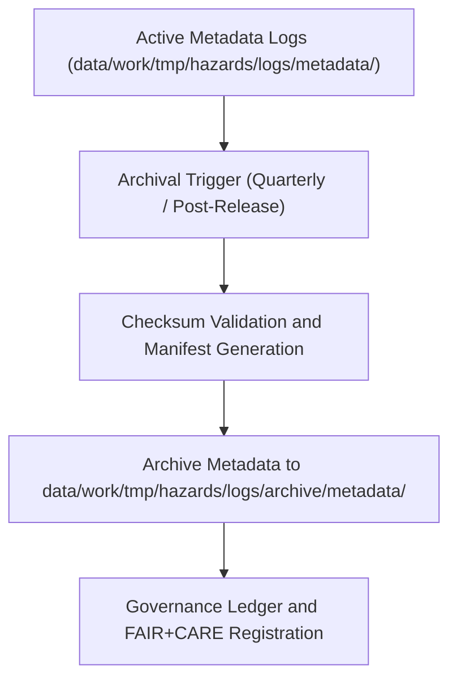

<div align="center">

# 📜 Kansas Frontier Matrix — **Hazard Metadata Log Archives**
`data/work/tmp/hazards/logs/archive/metadata/README.md`

**Purpose:** Repository for archived metadata validation, harmonization, and governance synchronization logs associated with hazard datasets in the Kansas Frontier Matrix (KFM).  
This layer preserves metadata lineage and FAIR+CARE certification details for long-term reproducibility and audit reference.

[](../../../../../../../docs/standards/faircare-validation.md)
[](../../../../../../../LICENSE)
[](../../../../../../../docs/architecture/repo-focus.md)

</div>

---

## 📚 Overview

The `data/work/tmp/hazards/logs/archive/metadata/` directory stores **archived metadata logs and governance validation reports** generated during KFM’s hazard data workflows.  
These records document every stage of metadata harmonization, schema validation, and FAIR+CARE compliance verification from prior pipeline cycles.

### Core Functions:
- Preserve metadata harmonization results and schema validation histories.  
- Archive FAIR+CARE ethics and accessibility audits for hazard datasets.  
- Maintain lineage between metadata staging, validation, and processed certification.  
- Support reproducibility, provenance auditing, and governance traceability.  

All files in this workspace are immutable archival records referenced by governance ledgers and audit registries.

---

## 🗂️ Directory Layout

```plaintext
data/work/tmp/hazards/logs/archive/metadata/
├── README.md                              # This file — documentation of metadata log archives
│
├── metadata_validation_archive_2024Q4.json    # Archived schema validation report for hazard metadata
├── faircare_audit_archive_2024Q4.json          # Archived FAIR+CARE ethics validation report
├── governance_sync_ledger_2024Q4.log           # Log of metadata governance synchronization
├── metadata_harmonization_diff_2024Q4.json     # Record of schema field changes and harmonization events
└── metadata.json                               # Provenance and checksum reference for archived metadata logs
```

---

## ⚙️ Metadata Archival Workflow



### Workflow Description:
1. **Validation:** Active metadata logs verified for completeness and governance linkage.  
2. **Checksum Verification:** Hashes generated for metadata integrity tracking.  
3. **Archival:** Metadata files moved into archive directory for preservation.  
4. **Governance Sync:** Archival recorded in governance ledger for lineage continuity.  
5. **Certification:** FAIR+CARE validation ensures reproducible metadata stewardship.

---

## 🧩 Example Metadata Record

```json
{
  "id": "metadata_archive_hazards_v9.3.2_2024Q4",
  "etl_cycle": "Q4 2024",
  "source_pipeline": "src/pipelines/metadata/hazards_metadata_pipeline.py",
  "records_validated": 162,
  "schema_changes_detected": 3,
  "archived_by": "@kfm-metadata-lab",
  "archival_date": "2025-10-28T15:48:00Z",
  "fairstatus": "certified",
  "checksums_verified": true,
  "governance_ref": "data/reports/audit/data_provenance_ledger.json"
}
```

---

## 🧠 FAIR+CARE Governance Alignment

| Principle | Implementation |
|------------|----------------|
| **Findable** | Metadata archives indexed by ETL cycle, dataset, and schema version. |
| **Accessible** | Archived logs stored in open JSON and text formats for governance audits. |
| **Interoperable** | Metadata aligned with STAC, DCAT, and CIDOC-CRM schemas. |
| **Reusable** | Each archive includes provenance and checksum metadata. |
| **Collective Benefit** | Supports ethical, transparent, and traceable metadata governance. |
| **Authority to Control** | FAIR+CARE Council authorizes metadata archival and certification. |
| **Responsibility** | Validators maintain archive integrity and schema evolution records. |
| **Ethics** | Ensures ethical transparency and reproducibility across metadata updates. |

Governance validation results referenced in:  
`data/reports/audit/data_provenance_ledger.json`  
and `data/reports/fair/data_care_assessment.json`.

---

## ⚙️ Validation & Audit Reports

| File | Description | Output |
|------|--------------|--------|
| `metadata_validation_archive_*.json` | Archived field-level schema validation results. | JSON |
| `faircare_audit_archive_*.json` | FAIR+CARE ethics compliance records. | JSON |
| `governance_sync_ledger_*.log` | Synchronization logs for governance ledger registration. | Text |
| `metadata_harmonization_diff_*.json` | Historical schema and metadata structure changes. | JSON |
| `metadata.json` | Master file recording provenance and checksum references. | JSON |

Archival validation automated through `metadata_archive_sync.yml`.

---

## ⚖️ Governance & Provenance Integration

| Record | Description |
|---------|-------------|
| `metadata.json` | Captures governance linkage, checksums, and archival lineage. |
| `data/reports/audit/data_provenance_ledger.json` | Logs all metadata archival and FAIR+CARE validations. |
| `releases/v9.3.2/manifest.zip` | Registry of checksum and metadata hashes for archived records. |

Governance synchronization managed by `metadata_archive_governance.yml`.

---

## 🧾 Retention & Integrity Policy

| Metadata Type | Retention Duration | Policy |
|----------------|--------------------|--------|
| Validation Reports | 365 days | Retained for FAIR+CARE revalidation. |
| FAIR+CARE Audits | Permanent | Stored for ethical certification traceability. |
| Governance Logs | Permanent | Immutable and retained indefinitely. |
| Metadata Checksums | Permanent | Archived for provenance verification. |

Automated archival cleanup handled via `metadata_archive_cleanup.yml`.

---

## 🧾 Internal Use Citation

```text
Kansas Frontier Matrix (2025). Hazard Metadata Log Archives (v9.3.2).
Archival repository of hazard metadata validation, FAIR+CARE ethics audits, and schema harmonization logs.
Maintained under MCP-DL v6.3 and FAIR+CARE ethical governance standards for full provenance traceability.
```

---

## 🧾 Version Notes

| Version | Date | Notes |
|----------|------|--------|
| v9.3.2 | 2025-10-28 | Added checksum manifest integration and FAIR+CARE certification linkage. |
| v9.2.0 | 2024-07-15 | Introduced harmonization diff tracking and ledger synchronization. |
| v9.0.0 | 2023-01-10 | Established metadata archival directory for hazard governance logs. |

---

<div align="center">

**Kansas Frontier Matrix** · *Metadata Integrity × FAIR+CARE Governance × Provenance Assurance*  
[🔗 Repository](https://github.com/bartytime4life/Kansas-Frontier-Matrix) • [🧭 Docs Portal](../../../../../../../docs/) • [⚖️ Governance Ledger](../../../../../../../docs/standards/governance/)

</div>