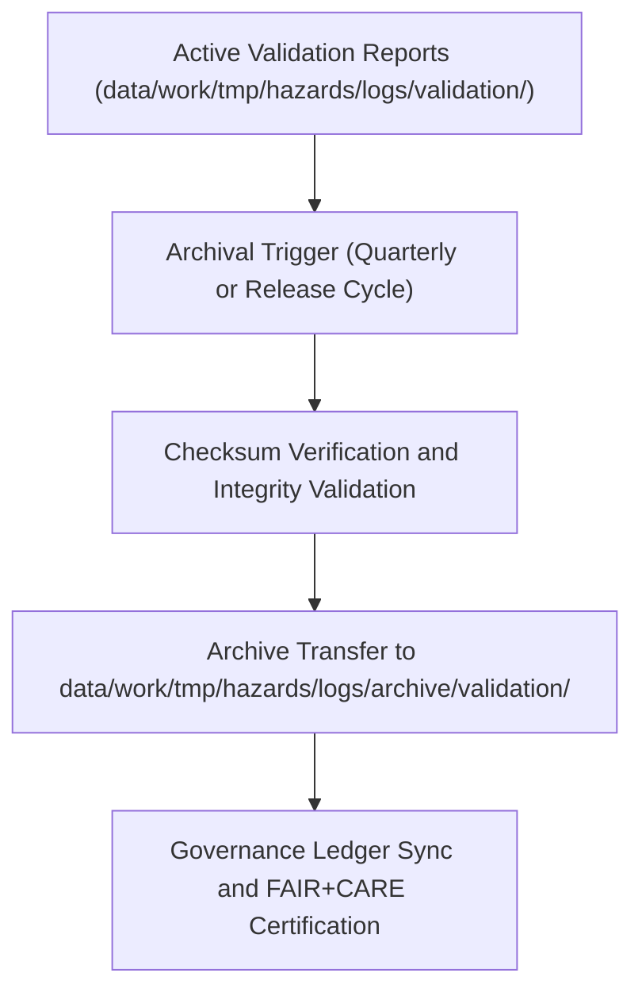

<div align="center">

# ✅ Kansas Frontier Matrix — **Hazard Validation Log Archives**
`data/work/tmp/hazards/logs/archive/validation/README.md`

**Purpose:** Archival workspace for historical validation logs, schema conformance reports, and FAIR+CARE ethics audits generated during hazard data processing in the Kansas Frontier Matrix (KFM).  
These archives preserve full lineage of quality assurance operations, validation results, and certification events for reproducibility and governance compliance.

[](../../../../../../../docs/standards/faircare-validation.md)
[](../../../../../../../LICENSE)
[](../../../../../../../docs/architecture/repo-focus.md)

</div>

---

## 📚 Overview

The `data/work/tmp/hazards/logs/archive/validation/` directory maintains **archived validation reports and quality assurance artifacts** from KFM’s hazard data transformation pipelines.  
These immutable records support transparency in data lifecycle management and provide audit-ready documentation for FAIR+CARE compliance.

### Core Functions:
- Preserve validation summaries and schema QA reports for hazard datasets.  
- Maintain FAIR+CARE ethics validation outcomes and governance linkage.  
- Provide reproducible validation history for longitudinal data integrity checks.  
- Support external audits, re-certifications, and provenance verification.  

All validation archives are checksum-verified, version-stamped, and permanently linked to the KFM Governance Ledger.

---

## 🗂️ Directory Layout

```plaintext
data/work/tmp/hazards/logs/archive/validation/
├── README.md                               # This file — overview of hazard validation log archives
│
├── schema_validation_archive_2024Q4.json   # Archived schema validation output for Q4 2024
├── faircare_validation_archive_2024Q4.json # Archived FAIR+CARE ethics validation results
├── qa_summary_archive_2024Q4.md            # Archived human-readable validation and QA summary
├── governance_sync_ledger_2024Q4.log       # Log of validation governance registration
└── metadata.json                           # Checksum, lineage, and archival provenance record
```

---

## ⚙️ Validation Archival Workflow



### Workflow Description:
1. **Integrity Validation:** Active validation reports undergo checksum comparison.  
2. **Archival Transfer:** Logs and reports migrated into immutable archival storage.  
3. **Governance Registration:** Metadata recorded in the KFM Governance Ledger.  
4. **Certification:** FAIR+CARE verification confirms transparency and ethical compliance.  
5. **Retention:** Archives maintained indefinitely for audit and provenance continuity.

---

## 🧩 Example Metadata Record

```json
{
  "id": "validation_archive_hazards_v9.3.2_2024Q4",
  "etl_cycle": "Q4 2024",
  "validation_scope": ["schema", "FAIR+CARE", "QA"],
  "records_validated": 18920,
  "checksum_verified": true,
  "archived_by": "@kfm-validation-lab",
  "archival_date": "2025-10-28T16:00:00Z",
  "fairstatus": "certified",
  "governance_ref": "data/reports/audit/data_provenance_ledger.json"
}
```

---

## 🧠 FAIR+CARE Governance Alignment

| Principle | Implementation |
|------------|----------------|
| **Findable** | Validation archives indexed by ETL cycle and validation scope. |
| **Accessible** | Open JSON and Markdown formats for internal FAIR+CARE audit. |
| **Interoperable** | Schema-aligned with KFM validation and STAC metadata structures. |
| **Reusable** | Immutable logs and reports retain full validation context. |
| **Collective Benefit** | Ensures trustworthy, transparent hazard data lifecycle governance. |
| **Authority to Control** | FAIR+CARE Council oversees certification and archival retention. |
| **Responsibility** | Validators maintain audit readiness and ethical compliance. |
| **Ethics** | Ensures no exclusionary bias or non-transparent validation processes. |

All governance references stored in:  
`data/reports/audit/data_provenance_ledger.json`  
and `data/reports/fair/data_care_assessment.json`.

---

## ⚙️ Validation & QA Artifacts

| File | Description | Format |
|------|--------------|--------|
| `schema_validation_archive_*.json` | Records schema validation outcomes. | JSON |
| `faircare_validation_archive_*.json` | FAIR+CARE ethics validation summaries. | JSON |
| `qa_summary_archive_*.md` | Human-readable validation and ethics digest. | Markdown |
| `governance_sync_ledger_*.log` | Governance synchronization event logs. | Text |
| `metadata.json` | Captures checksums, schema references, and archival lineage. | JSON |

Archival synchronization handled by `validation_archive_sync.yml`.

---

## ⚖️ Governance & Provenance Integration

| Record | Description |
|---------|-------------|
| `metadata.json` | Tracks validation lineage, checksums, and governance linkage. |
| `data/reports/audit/data_provenance_ledger.json` | Logs archival lineage and FAIR+CARE certification. |
| `data/reports/fair/data_care_assessment.json` | Records FAIR+CARE ethics assessment for validation processes. |
| `releases/v9.3.2/manifest.zip` | Includes validation archive hashes for reproducibility. |

Governance synchronization executed by CI/CD via automated archival workflows.

---

## 🧾 Retention & Integrity Policy

| Validation Type | Retention Duration | Policy |
|------------------|--------------------|--------|
| Schema Validation | Permanent | Retained for long-term data integrity verification. |
| FAIR+CARE Validation | Permanent | Stored indefinitely for ethical traceability. |
| QA Summaries | 365 days | Archived for re-audit cycles and council review. |
| Metadata & Logs | Permanent | Preserved for provenance chain verification. |

Retention and cleanup automated by `validation_archive_cleanup.yml`.

---

## 🧾 Internal Use Citation

```text
Kansas Frontier Matrix (2025). Hazard Validation Log Archives (v9.3.2).
Immutable archive of schema validation, FAIR+CARE ethics audits, and governance synchronization logs for hazard datasets.
Maintained under MCP-DL v6.3 and FAIR+CARE certification for reproducibility and provenance assurance.
```

---

## 🧾 Version Notes

| Version | Date | Notes |
|----------|------|--------|
| v9.3.2 | 2025-10-28 | Added checksum verification and FAIR+CARE audit linkage. |
| v9.2.0 | 2024-07-15 | Introduced harmonized archival validation cycle. |
| v9.0.0 | 2023-01-10 | Established validation log archival directory for hazard pipelines. |

---

<div align="center">

**Kansas Frontier Matrix** · *Validation Integrity × FAIR+CARE Governance × Provenance Continuity*  
[🔗 Repository](https://github.com/bartytime4life/Kansas-Frontier-Matrix) • [🧭 Docs Portal](../../../../../../../docs/) • [⚖️ Governance Ledger](../../../../../../../docs/standards/governance/)

</div>