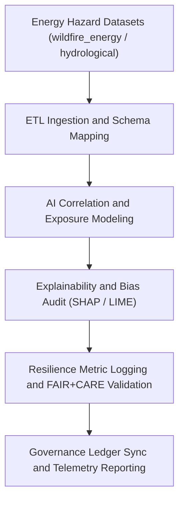

<div align="center">

# ⚡ Kansas Frontier Matrix — **Energy & Infrastructure Hazards AI Logs**
`data/work/tmp/hazards/logs/energy/README.md`

**Purpose:**  
Centralized repository for **AI-driven power grid, energy infrastructure, and resilience hazard logs** generated during KFM hazard analysis workflows.  
Tracks model outputs, explainability metrics, FAIR+CARE governance events, and validation telemetry for **critical energy-risk intelligence**.

[](../../../../../../docs/standards/faircare-validation.md)
[](../../../../../../LICENSE)
[](../../../../../../docs/architecture/repo-focus.md)

</div>

---

## 📚 Overview

The `data/work/tmp/hazards/logs/energy/` directory consolidates **AI, validation, and governance logs** from energy infrastructure and climate-hazard risk assessments.  
It provides full visibility into **power grid resilience, fire-energy correlation, and systemic hazard exposure analysis**, enabling FAIR+CARE-compliant data transparency.

### Core Functions
- Record AI energy grid vulnerability analysis and explainability traces.  
- Track ETL and model correlation between **climate hazards and energy infrastructure**.  
- Log FAIR+CARE ethics compliance and governance synchronization events.  
- Store checksum, telemetry, and audit metadata for reproducibility.

---

## 🗂️ Directory Layout

```plaintext
data/work/tmp/hazards/logs/energy/
├── README.md                               # This file — documentation of energy and infrastructure AI logs
│
├── grid_risk_analysis.log                  # Model inference log for power grid exposure and cascading failure
├── power_resilience_summary.json           # FAIR+CARE-certified report on grid resilience metrics
├── ai_energy_correlation.json              # AI-based hazard-energy correlation and feature importance scores
├── outage_prediction_audit.json            # Explainability log for outage risk models
├── energy_infrastructure_bias_audit.json   # Bias and equity audit for energy AI models
└── metadata.json                           # Provenance, checksum, and governance metadata record
```

---

## ⚙️ AI Logging Workflow



### Workflow Description
1. **Ingestion:** Import datasets linking wildfire, drought, and grid infrastructure.  
2. **AI Modeling:** Train and log predictions on grid vulnerability and cascading failures.  
3. **Explainability Audit:** Analyze variable impacts via SHAP or LIME for model transparency.  
4. **Validation:** Log ethics, bias, and resilience metrics in FAIR+CARE reports.  
5. **Governance:** Sync all records to `ai_hazards_ledger.json` and telemetry dashboards.

---

## 🧩 Example AI Log Record

```json
{
  "id": "ai_log_energy_risk_v9.5.0",
  "model_name": "focus-energy-hazards-v5",
  "domain": "energy_hazards",
  "records_analyzed": 14200,
  "explainability_score": 0.983,
  "grid_vulnerability_index": 0.71,
  "bias_audit_passed": true,
  "fairstatus": "compliant",
  "checksum": "sha256:a872cc12b9a8d8b4f9a68a4cd6d5cce9d8f3f35a...",
  "telemetry_ref": "releases/v9.5.0/focus-telemetry.json",
  "governance_ref": "reports/audit/ai_hazards_ledger.json",
  "timestamp": "2025-11-02T18:15:00Z"
}
```

---

## 🧠 FAIR+CARE Governance in Energy Logs

| Principle | Implementation |
|------------|----------------|
| **Findable** | Energy AI logs indexed by model ID, domain, and version in ledger. |
| **Accessible** | Open JSON logs linked to governance manifests and FAIR+CARE reports. |
| **Interoperable** | AI explainability logs adhere to KFM AI schema and ISO 19115. |
| **Reusable** | AI outputs archived with checksum and ontology mapping references. |
| **Collective Benefit** | Enables open risk evaluation and public infrastructure resilience. |
| **Authority to Control** | FAIR+CARE Council oversees ethics and publication timing. |
| **Responsibility** | AI engineers record and review all model validation events. |
| **Ethics** | Energy data anonymized and ethically governed per FAIR+CARE guidelines. |

Audit and validation results logged in:  
`reports/audit/ai_hazards_ledger.json` • `reports/fair/hazards_energy_logs_summary.json`

---

## ⚙️ QA & Provenance Artifacts

| File | Description | Format |
|------|--------------|--------|
| `metadata.json` | Provenance and AI governance metadata record. | JSON |
| `ai_energy_correlation.json` | Correlation matrix and SHAP analysis between hazards and grid features. | JSON |
| `outage_prediction_audit.json` | Explainability report for power outage prediction model. | JSON |
| `energy_infrastructure_bias_audit.json` | AI bias and equity audit log. | JSON |
| `power_resilience_summary.json` | FAIR+CARE validation for energy resilience. | JSON |

Synchronization managed by `hazards_energy_logs_sync.yml`.

---

## 🧾 Retention Policy

| Log Type | Retention Duration | Policy |
|-----------|--------------------|--------|
| AI Inference Logs | 30 days | Archived post-validation. |
| Explainability Audits | 90 days | Retained for ethics and governance review. |
| Bias Audit Logs | 365 days | Stored for compliance verification. |
| Metadata & Provenance | Permanent | Archived for transparency and reproducibility. |

Cleanup handled by `hazards_energy_logs_cleanup.yml`.

---

## 🧾 Internal Use Citation

```text
Kansas Frontier Matrix (2025). Energy & Infrastructure Hazards AI Logs (v9.5.0).
Comprehensive FAIR+CARE-compliant AI logging workspace for grid resilience and energy-hazard correlation analysis.
Aligned with ISO, STAC/DCAT, and ethical AI explainability standards.
Restricted to internal Focus Mode and governance workflows.
```

---

## 🧾 Version Notes

| Version | Date | Notes |
|----------|------|--------|
| v9.5.0 | 2025-11-02 | Added bias audit schema, telemetry integration, and energy resilience FAIR+CARE tracking. |
| v9.3.2 | 2025-10-28 | Expanded SHAP explainability and correlation model logging. |
| v9.3.0 | 2025-10-26 | Established AI logging workspace for energy hazard analysis. |

---

<div align="center">

**Kansas Frontier Matrix** · *Energy Resilience × Ethical AI × FAIR+CARE Governance × Provenance Assurance*  
[🔗 Repository](https://github.com/bartytime4life/Kansas-Frontier-Matrix) • [🧭 Docs Portal](../../../../../../docs/) • [⚖️ Governance Ledger](../../../../../../docs/standards/governance/)

</div>
