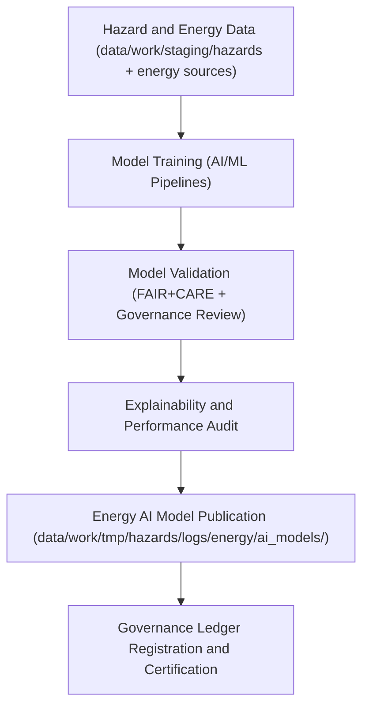

<div align="center">

# ⚡ Kansas Frontier Matrix — **Energy AI Models for Hazard Analytics**
`data/work/tmp/hazards/logs/energy/ai_models/README.md`

**Purpose:** Repository for energy-related AI and ML models developed for hazard prediction, resilience analytics, and infrastructure impact assessment within the Kansas Frontier Matrix (KFM).  
This directory documents AI model configurations, training metadata, and validation reports linking energy systems with natural hazard data under FAIR+CARE governance.

[](../../../../../../../docs/standards/faircare-validation.md)
[](../../../../../../../LICENSE)
[](../../../../../../../docs/architecture/repo-focus.md)

</div>

---

## 📚 Overview

The `data/work/tmp/hazards/logs/energy/ai_models/` directory contains **AI and ML models focused on hazard-energy interactions**, including predictive models assessing grid reliability, renewable energy disruption, and cascading hazard impacts.  
These models integrate environmental hazard datasets (flood, drought, storm) with energy infrastructure data (grid topology, generation assets, pipelines) to support resilient energy planning and risk mitigation.

### Core Functions:
- Develop and store AI/ML models analyzing hazard impacts on energy systems.  
- Record model architectures, hyperparameters, and training data sources.  
- Maintain FAIR+CARE-aligned audit and governance metadata for ethical AI operation.  
- Support explainability, bias detection, and validation for energy hazard forecasting.  

All AI models are FAIR+CARE-audited and registered in the **AI Governance Ledger** for traceability and accountability.

---

## 🗂️ Directory Layout

```plaintext
data/work/tmp/hazards/logs/energy/ai_models/
├── README.md                                # This file — overview of energy AI models
│
├── model_card_energy_resilience_v3.json     # Model card describing energy resilience forecasting model
├── training_metadata_energy_forecast.json   # Training dataset and hyperparameter registry
├── validation_report_energy_model.json      # Validation results and FAIR+CARE audit record
├── explainability_energy_model.json         # SHAP and LIME explainability output for transparency
├── performance_metrics_energy_model.csv     # Model performance, bias, and drift summary
└── metadata.json                            # Provenance, checksum, and governance linkage
```

---

## ⚙️ AI Model Workflow



### Workflow Description:
1. **Training:** Energy AI models trained using integrated hazard datasets (NOAA, FEMA, USGS) and energy system data (DOE EIA, grid assets).  
2. **Validation:** FAIR+CARE compliance audit and schema verification performed on all trained models.  
3. **Explainability:** Interpretability metrics generated via SHAP, LIME, and attention-based visualization.  
4. **Governance:** Model metadata registered in `data/reports/audit/ai_hazards_ledger.json`.  
5. **Deployment:** Certified models promoted for use in hazard simulation and resilience analytics.

---

## 🧩 Example Model Metadata Record

```json
{
  "id": "energy_hazard_ai_model_v9.3.2",
  "model_name": "energy_resilience_forecaster_v3",
  "architecture": "Hybrid LSTM + Gradient Boosted Decision Trees",
  "training_dataset": [
    "data/work/staging/hazards/hazards_composite_v9.3.2.geojson",
    "data/work/staging/energy/grid_assets_v2025.csv"
  ],
  "epochs": 200,
  "f1_score": 0.91,
  "drift_status": "stable",
  "explainability_frameworks": ["SHAP", "LIME"],
  "bias_index": 0.04,
  "fairstatus": "certified",
  "validator": "@kfm-ai-energy",
  "created": "2025-10-28T15:50:00Z",
  "checksum": "sha256:8e4b4b8f3a0c19f3c3aa6de09b2a7a58f94127c2...",
  "governance_ref": "data/reports/audit/ai_hazards_ledger.json"
}
```

---

## 🧠 FAIR+CARE AI Governance Alignment

| Principle | Implementation |
|------------|----------------|
| **Findable** | Models indexed in AI Governance Ledger and cataloged by version. |
| **Accessible** | Metadata stored in open JSON and CSV formats for reproducibility. |
| **Interoperable** | Schema aligns with ONNX, TensorFlow, and FAIR+CARE AI contracts. |
| **Reusable** | Includes training configuration, explainability, and validation reports. |
| **Collective Benefit** | Enhances resilience and equity in Kansas energy infrastructure planning. |
| **Authority to Control** | FAIR+CARE Council certifies model ethics and operational safety. |
| **Responsibility** | Validators document hyperparameters, training context, and bias audits. |
| **Ethics** | Ensures AI models are transparent, accountable, and human-centered. |

Certification and lineage tracked through:  
`data/reports/audit/ai_hazards_ledger.json` and  
`data/reports/fair/data_care_assessment.json`.

---

## ⚙️ Model Validation & QA Artifacts

| File | Description | Format |
|------|--------------|--------|
| `model_card_energy_resilience_v3.json` | Describes model purpose, inputs, outputs, and ethics. | JSON |
| `training_metadata_energy_forecast.json` | Contains dataset lineage and hyperparameter details. | JSON |
| `validation_report_energy_model.json` | Performance metrics and FAIR+CARE validation summary. | JSON |
| `explainability_energy_model.json` | Feature attribution results from SHAP and LIME. | JSON |
| `performance_metrics_energy_model.csv` | Aggregated precision, recall, and bias metrics. | CSV |
| `metadata.json` | Records governance linkage, checksums, and certification metadata. | JSON |

Governance synchronization automated via `ai_energy_model_sync.yml`.

---

## ⚖️ Governance & Provenance Integration

| Record | Description |
|---------|-------------|
| `metadata.json` | Tracks model lineage, ethics audit, and governance registration. |
| `data/reports/audit/ai_hazards_ledger.json` | Logs model training, validation, and certification. |
| `data/reports/fair/data_care_assessment.json` | FAIR+CARE Council audit summary for AI compliance. |
| `releases/v9.3.2/manifest.zip` | Contains checksum registry for AI models and reports. |

All governance synchronization handled via FAIR+CARE automation pipelines.

---

## 🧾 Retention & Certification Policy

| Model Type | Retention Duration | Policy |
|-------------|--------------------|--------|
| Trained AI Models | Permanent | Retained under FAIR+CARE governance for reproducibility. |
| Training Logs | 365 days | Retained for retraining and audit verification. |
| Explainability Artifacts | 180 days | Maintained for transparency review. |
| FAIR+CARE Reports | Permanent | Archived for certification integrity. |

Lifecycle automation controlled by `ai_energy_model_cleanup.yml`.

---

## 🧾 Internal Use Citation

```text
Kansas Frontier Matrix (2025). Energy AI Models for Hazard Analytics (v9.3.2).
Governance-certified AI models integrating hazard and energy data to forecast grid resilience and environmental risk.
Maintained under FAIR+CARE ethical AI protocols and MCP-DL v6.3 governance standards.
```

---

## 🧾 Version Notes

| Version | Date | Notes |
|----------|------|--------|
| v9.3.2 | 2025-10-28 | Added governance certification and explainability audit linkage. |
| v9.2.0 | 2024-07-15 | Integrated energy-hazard hybrid AI architecture and bias validation metrics. |
| v9.0.0 | 2023-01-10 | Established AI model repository for energy and hazard analytics. |

---

<div align="center">

**Kansas Frontier Matrix** · *AI Innovation × Energy Resilience × FAIR+CARE Ethics*  
[🔗 Repository](https://github.com/bartytime4life/Kansas-Frontier-Matrix) • [🧭 Docs Portal](../../../../../../../docs/) • [⚖️ AI Governance Ledger](../../../../../../../docs/standards/governance/AI-GOVERNANCE.md)

</div>