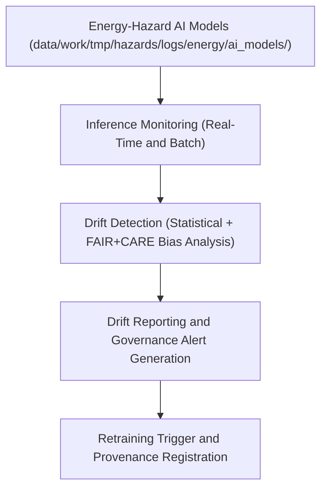

<div align="center">

# 📉 Kansas Frontier Matrix — **Energy Drift Monitoring for Hazard AI Systems**
`data/work/tmp/hazards/logs/energy/drift_monitoring/README.md`

**Purpose:** Repository for monitoring and auditing data drift, model drift, and ethics compliance in energy-integrated hazard AI models within the Kansas Frontier Matrix (KFM).  
This workspace ensures that predictive energy resilience and hazard interaction models maintain accuracy, fairness, and compliance under FAIR+CARE governance protocols.

[](../../../../../../../docs/standards/faircare-validation.md)
[](../../../../../../../LICENSE)
[](../../../../../../../docs/architecture/repo-focus.md)

</div>

---

## 📚 Overview

The `data/work/tmp/hazards/logs/energy/drift_monitoring/` directory tracks **model drift and input data distribution changes** for energy-hazard AI systems.  
It captures statistical shifts, bias drift, and governance alerts triggered during model inference or retraining cycles — providing a fully auditable drift-monitoring framework for FAIR+CARE-certified AI operations.

### Core Functions:
- Detect concept and data drift in AI models linking hazards with energy networks.  
- Log feature distribution, bias metrics, and model performance over time.  
- Maintain FAIR+CARE-aligned ethics audit for every detected drift event.  
- Support retraining, governance certification, and transparency in AI-driven energy resilience analytics.  

All drift logs are synchronized with the **AI Governance Ledger** for continuous compliance verification.

---

## 🗂️ Directory Layout

```plaintext
data/work/tmp/hazards/logs/energy/drift_monitoring/
├── README.md                               # This file — overview of drift monitoring workspace
│
├── drift_report_energy_ai_2024Q4.json      # Comprehensive drift detection report for Q4 2024
├── feature_shift_analysis_energy.csv       # Statistical PSI and KL divergence metrics
├── bias_drift_energy_audit.json            # Ethics audit results for fairness and demographic balance
├── retraining_trigger_log_2024Q4.log       # Governance-triggered retraining event record
└── metadata.json                           # Provenance, checksum, and governance linkage
```

---

## ⚙️ Drift Monitoring Workflow



### Workflow Description:
1. **Model Observation:** Monitor predictions and feature distributions from energy-hazard AI models.  
2. **Drift Detection:** Detect statistical and ethical drift using PSI, KL divergence, and bias score indices.  
3. **Audit Review:** Conduct FAIR+CARE bias audits for detected anomalies.  
4. **Governance Logging:** Record drift events in the AI Governance Ledger for oversight.  
5. **Retraining Trigger:** Initiate retraining if drift exceeds established FAIR+CARE thresholds.

---

## 🧩 Example Metadata Record

```json
{
  "id": "energy_drift_monitoring_v9.3.2_2024Q4",
  "model_monitored": "energy_resilience_forecaster_v3",
  "monitoring_cycle": "Q4 2024",
  "features_analyzed": 38,
  "max_psi": 0.24,
  "bias_shift_score": 0.09,
  "drift_detected": true,
  "retraining_recommended": false,
  "validator": "@kfm-ai-energy",
  "fairstatus": "compliant",
  "created": "2025-10-28T16:42:00Z",
  "checksum": "sha256:d32f79c56cbbaf42cba1d0e44c65a828b191b7aa...",
  "governance_ref": "data/reports/audit/ai_hazards_ledger.json"
}
```

---

## 🧠 FAIR+CARE AI Governance Alignment

| Principle | Implementation |
|------------|----------------|
| **Findable** | Drift reports indexed by model ID, cycle, and checksum. |
| **Accessible** | Reports stored in open JSON and CSV formats for review. |
| **Interoperable** | Aligned with KFM AI governance schema and FAIR+CARE audit models. |
| **Reusable** | Metadata includes lineage, validation context, and FAIR+CARE status. |
| **Collective Benefit** | Protects energy and environmental resilience through ethical AI oversight. |
| **Authority to Control** | FAIR+CARE Council oversees retraining authorization and drift thresholds. |
| **Responsibility** | AI maintainers document drift detection, retraining, and validation outcomes. |
| **Ethics** | Drift metrics interpreted within ethical frameworks for responsible AI operations. |

Governance logs and certification metadata stored in:  
`data/reports/audit/ai_hazards_ledger.json`  
and `data/reports/fair/data_care_assessment.json`.

---

## ⚙️ Drift Monitoring Metrics

| Metric | Description | Threshold |
|---------|--------------|------------|
| **Population Stability Index (PSI)** | Measures shift in input distributions. | > 0.2 = retraining required |
| **KL Divergence** | Quantifies deviation between probability distributions. | > 0.15 = model drift detected |
| **Bias Shift Score** | Indicates changes in fairness and demographic balance. | > 0.1 = ethical review triggered |
| **Accuracy Delta** | Detects change in model predictive performance. | ±5% from baseline triggers validation |
| **FAIR+CARE Compliance** | Verifies ethical and reproducible AI operation. | ≥ 98% = certified |

Drift detection pipelines automated by `energy_drift_monitor.yml`.

---

## ⚖️ Governance & Provenance Integration

| Record | Description |
|---------|-------------|
| `metadata.json` | Captures governance linkage, checksums, and drift audit metadata. |
| `data/reports/audit/ai_hazards_ledger.json` | Logs drift monitoring lineage, ethics review, and retraining actions. |
| `data/reports/fair/data_care_assessment.json` | FAIR+CARE compliance metrics for AI monitoring. |
| `releases/v9.3.2/manifest.zip` | Stores global checksum registry for drift artifacts. |

Governance synchronization automated through AI audit and monitoring pipelines.

---

## 🧾 Retention & Ethics Policy

| Report Type | Retention Duration | Policy |
|--------------|--------------------|--------|
| Drift Reports | 365 days | Archived after retraining certification. |
| FAIR+CARE Bias Audits | Permanent | Retained for ethics traceability. |
| Retraining Logs | 180 days | Maintained for governance reference. |
| Metadata | Permanent | Stored for provenance and certification verification. |

Retention management automated by `energy_drift_cleanup.yml`.

---

## 🧾 Internal Use Citation

```text
Kansas Frontier Matrix (2025). Energy Drift Monitoring for Hazard AI Systems (v9.3.2).
Comprehensive governance and ethics-driven monitoring of AI model drift in integrated energy–hazard forecasting systems.
Maintained under FAIR+CARE AI certification and MCP-DL v6.3 compliance protocols.
```

---

## 🧾 Version Notes

| Version | Date | Notes |
|----------|------|--------|
| v9.3.2 | 2025-10-28 | Introduced governance-linked drift metrics and FAIR+CARE audit synchronization. |
| v9.2.0 | 2024-07-15 | Added bias shift monitoring and retraining trigger logs. |
| v9.0.0 | 2023-01-10 | Established drift monitoring framework for energy-integrated hazard AI pipelines. |

---

<div align="center">

**Kansas Frontier Matrix** · *AI Drift Monitoring × FAIR+CARE Ethics × Provenance Assurance*  
[🔗 Repository](https://github.com/bartytime4life/Kansas-Frontier-Matrix) • [🧭 Docs Portal](../../../../../../../docs/) • [⚖️ AI Governance Ledger](../../../../../../../docs/standards/governance/AI-GOVERNANCE.md)

</div>