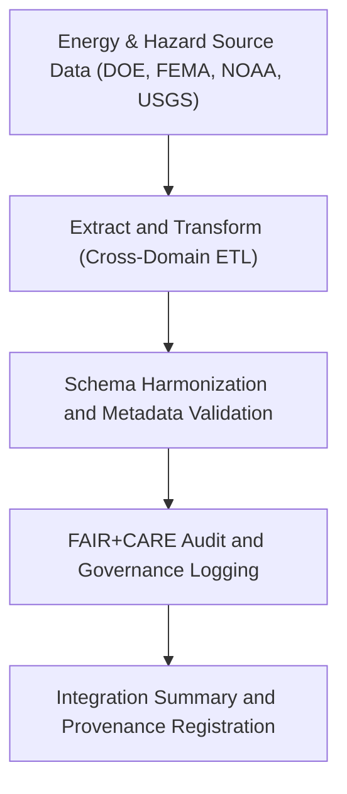

<div align="center">

# ⚙️ Kansas Frontier Matrix — **Energy ETL Integration for Hazard Systems**
`data/work/tmp/hazards/logs/energy/etl_integration/README.md`

**Purpose:** Repository for ETL (Extract, Transform, Load) integration logs and validation reports connecting energy infrastructure datasets with hazard intelligence pipelines within the Kansas Frontier Matrix (KFM).  
This workspace tracks cross-domain data flows, schema harmonization, and FAIR+CARE governance verification for energy–hazard interoperability.

[](../../../../../../../docs/standards/faircare-validation.md)
[](../../../../../../../LICENSE)
[](../../../../../../../docs/architecture/repo-focus.md)

</div>

---

## 📚 Overview

The `data/work/tmp/hazards/logs/energy/etl_integration/` directory documents **ETL processes that integrate hazard and energy data streams**, including renewable generation assets, transmission infrastructure, and environmental risk layers.  
It provides audit-ready transparency for all cross-domain transformations and schema mappings performed under FAIR+CARE data governance.

### Core Functions:
- Track ETL jobs combining hazard intelligence with energy datasets.  
- Record schema harmonization, validation, and provenance metadata.  
- Support FAIR+CARE certification and governance synchronization of ETL operations.  
- Enable traceable, ethical, and reproducible integration of multi-domain data pipelines.  

All ETL integration events logged here are immutable and linked to the **KFM Data Provenance Ledger** for complete traceability.

---

## 🗂️ Directory Layout

```plaintext
data/work/tmp/hazards/logs/energy/etl_integration/
├── README.md                                 # This file — documentation for energy ETL integration
│
├── etl_run_energy_hazards_2024Q4.log         # Execution trace of cross-domain ETL workflow (Q4 2024)
├── schema_mapping_energy_hazards.json        # Mapping of energy schema fields to hazard schema attributes
├── validation_report_energy_integration.json # Schema and FAIR+CARE compliance validation results
├── transformation_summary_2024Q4.csv         # Summary of harmonization statistics (record counts, coverage)
└── metadata.json                             # Provenance, checksum, and governance linkage file
```

---

## ⚙️ ETL Integration Workflow



### Workflow Description:
1. **Extraction:** Energy datasets (grid assets, pipelines, renewables) and hazard sources ingested into unified ETL environment.  
2. **Transformation:** Schema harmonization aligns energy infrastructure fields with hazard geospatial attributes.  
3. **Validation:** FAIR+CARE ethics and schema compliance checks performed automatically.  
4. **Governance:** ETL events registered in provenance ledger for accountability.  
5. **Publication:** Harmonized data ready for AI model ingestion and staging transfer.

---

## 🧩 Example Metadata Record

```json
{
  "id": "etl_integration_energy_hazards_v9.3.2_2024Q4",
  "etl_cycle": "Q4 2024",
  "source_datasets": [
    "data/raw/doe/grid_assets_2024.csv",
    "data/raw/noaa/storm_events_2024.csv",
    "data/raw/fema/flood_zones_2024.geojson"
  ],
  "records_processed": 121540,
  "schema_alignment_score": 99.3,
  "fairstatus": "certified",
  "validation_score": 98.7,
  "governance_sync": true,
  "archived": false,
  "validator": "@kfm-energy-etl",
  "created": "2025-10-28T16:20:00Z",
  "checksum": "sha256:c3a7f1e9f2b5479eac93bd27e47892cde3d2b90a...",
  "governance_ref": "data/reports/audit/data_provenance_ledger.json"
}
```

---

## 🧠 FAIR+CARE Integration Compliance Summary

| Principle | Implementation |
|------------|----------------|
| **Findable** | ETL integrations logged with unique IDs and dataset lineage. |
| **Accessible** | Transformation results stored in open CSV and JSON formats. |
| **Interoperable** | Schema mappings harmonized across hazard and energy domains. |
| **Reusable** | Metadata includes provenance, schema documentation, and FAIR+CARE tags. |
| **Collective Benefit** | Supports resilience research, energy risk modeling, and transparency. |
| **Authority to Control** | FAIR+CARE Council authorizes integration of cross-domain pipelines. |
| **Responsibility** | Validators ensure schema mappings are reproducible and ethically sound. |
| **Ethics** | Integration excludes sensitive or proprietary data; ensures equitable use. |

Audit data referenced in:  
`data/reports/audit/data_provenance_ledger.json` and  
`data/reports/fair/data_care_assessment.json`.

---

## ⚙️ Validation & QA Artifacts

| File | Description | Format |
|------|--------------|--------|
| `etl_run_energy_hazards_*.log` | Logs ETL process details and execution status. | Text |
| `schema_mapping_energy_hazards.json` | Maps source-to-target fields for ETL harmonization. | JSON |
| `validation_report_energy_integration.json` | Captures FAIR+CARE audit and schema validation results. | JSON |
| `transformation_summary_*.csv` | Summarizes integration statistics and key metrics. | CSV |
| `metadata.json` | Records checksums, lineage, and governance linkage. | JSON |

ETL validation and governance synchronization automated by `etl_integration_sync.yml`.

---

## ⚖️ Governance & Provenance Integration

| Record | Description |
|---------|-------------|
| `metadata.json` | Tracks integration lineage, schema validation, and checksum records. |
| `data/reports/audit/data_provenance_ledger.json` | Logs all ETL integration activities for governance review. |
| `data/reports/fair/data_care_assessment.json` | Summarizes FAIR+CARE audit results for integration workflows. |
| `releases/v9.3.2/manifest.zip` | Stores checksum registry for integration reproducibility. |

All governance synchronization operations automated by CI/CD workflows under FAIR+CARE validation.

---

## 🧾 Retention & Certification Policy

| Integration Type | Retention Duration | Policy |
|------------------|--------------------|--------|
| Active ETL Logs | 90 days | Archived quarterly for reproducibility. |
| Validation Reports | 365 days | Retained for FAIR+CARE governance review. |
| Schema Mappings | Permanent | Stored for traceability and schema evolution. |
| Metadata | Permanent | Archived with checksum registry for provenance continuity. |

Retention management automated by `etl_integration_cleanup.yml`.

---

## 🧾 Internal Use Citation

```text
Kansas Frontier Matrix (2025). Energy ETL Integration for Hazard Systems (v9.3.2).
Cross-domain ETL integration of hazard and energy infrastructure data pipelines under FAIR+CARE and MCP-DL v6.3 governance.
Restricted to internal reproducibility, validation, and ethics audit operations.
```

---

## 🧾 Version Notes

| Version | Date | Notes |
|----------|------|--------|
| v9.3.2 | 2025-10-28 | Added FAIR+CARE audit verification and schema harmonization tracking. |
| v9.2.0 | 2024-07-15 | Introduced integrated energy–hazard ETL schema alignment reports. |
| v9.0.0 | 2023-01-10 | Established ETL integration framework for hazard–energy interoperability. |

---

<div align="center">

**Kansas Frontier Matrix** · *ETL Integration × FAIR+CARE Ethics × Provenance Assurance*  
[🔗 Repository](https://github.com/bartytime4life/Kansas-Frontier-Matrix) • [🧭 Docs Portal](../../../../../../../docs/) • [⚖️ Governance Ledger](../../../../../../../docs/standards/governance/)

</div>