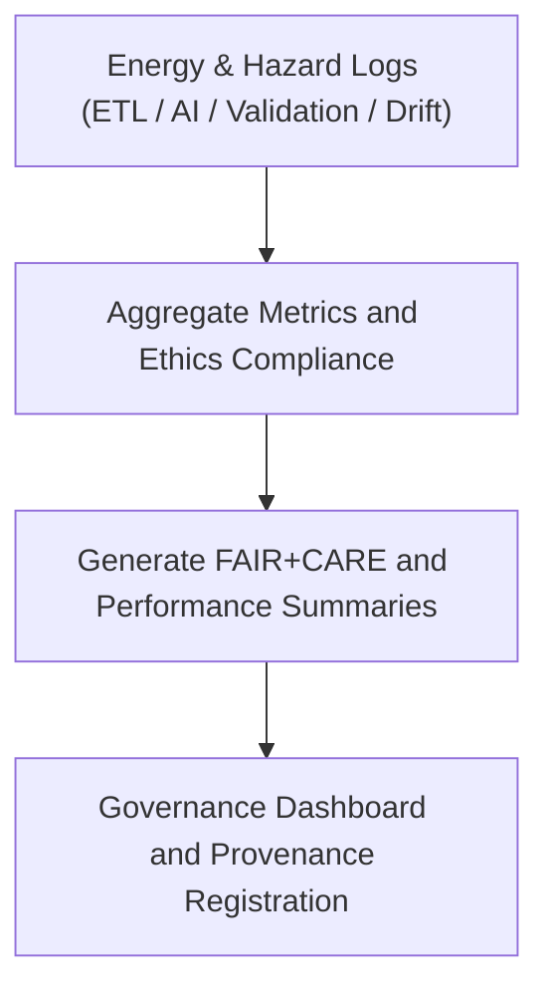

<div align="center">

# 📊 Kansas Frontier Matrix — **Energy System Summaries for Hazard Analytics**
`data/work/tmp/hazards/logs/energy/summaries/README.md`

**Purpose:** Repository for summary analytics, FAIR+CARE compliance digests, and governance dashboards integrating energy infrastructure data with hazard risk assessments in the Kansas Frontier Matrix (KFM).  
This workspace consolidates high-level performance, validation, and ethics summaries across all energy–hazard AI and ETL pipelines.

[](../../../../../../../docs/standards/faircare-validation.md)
[](../../../../../../../LICENSE)
[](../../../../../../../docs/architecture/repo-focus.md)

</div>

---

## 📚 Overview

The `data/work/tmp/hazards/logs/energy/summaries/` directory compiles **aggregated summaries and audit digests** of ETL, validation, AI model, and drift monitoring activities for hazard–energy integration pipelines.  
These summaries provide FAIR+CARE-certified transparency into energy resilience modeling, hazard forecasting accuracy, and ethics governance outcomes.

### Core Functions:
- Summarize performance and ethics outcomes for integrated energy–hazard workflows.  
- Record AI and ETL success rates, schema conformance, and governance traceability.  
- Generate FAIR+CARE summary dashboards for internal review and reporting.  
- Maintain lineage continuity between operational logs and governance audits.  

All summary artifacts are version-controlled, checksum-verified, and registered in the **KFM Governance Ledger**.

---

## 🗂️ Directory Layout

```plaintext
data/work/tmp/hazards/logs/energy/summaries/
├── README.md                                   # This file — overview of energy summary reports
│
├── energy_hazard_summary_2024Q4.json           # Summary metrics across ETL, AI, validation, and drift modules
├── faircare_summary_energy_2024Q4.json         # FAIR+CARE ethics compliance overview for energy–hazard datasets
├── performance_overview_energy_2024Q4.csv      # Aggregated model and ETL performance KPIs
├── governance_dashboard_snapshot_2024Q4.md     # Governance digest for Q4 2024
└── metadata.json                               # Provenance, checksum, and ledger linkage metadata
```

---

## ⚙️ Summary Generation Workflow



### Workflow Description:
1. **Data Aggregation:** Collect and normalize validation and AI log metrics across energy and hazard systems.  
2. **FAIR+CARE Compilation:** Combine ethics, reproducibility, and accessibility scores.  
3. **Performance Summary:** Calculate KPIs such as model accuracy, ETL throughput, and validation success rate.  
4. **Governance Dashboard:** Summarize findings in Markdown and JSON dashboards.  
5. **Ledger Registration:** Publish provenance and certification records to governance registry.

---

## 🧩 Example Metadata Record

```json
{
  "id": "energy_hazard_summary_v9.3.2_2024Q4",
  "summary_scope": "Q4 2024",
  "modules_included": ["etl_integration", "validation", "ai_models", "drift_monitoring"],
  "records_aggregated": 185920,
  "fairstatus": "certified",
  "avg_kpi_score": 98.9,
  "audit_score": 99.4,
  "created": "2025-10-28T16:46:00Z",
  "validator": "@kfm-ai-energy",
  "checksum": "sha256:8c93db4f3e152c9bcd6dcd87ba28e125a61b9183...",
  "governance_ref": "data/reports/audit/data_provenance_ledger.json"
}
```

---

## 🧠 FAIR+CARE Compliance Summary

| Principle | Implementation |
|------------|----------------|
| **Findable** | Summary artifacts indexed by governance cycle and energy domain. |
| **Accessible** | Reports published in open JSON, CSV, and Markdown formats. |
| **Interoperable** | Data aligned with FAIR+CARE schemas and governance dashboards. |
| **Reusable** | All summaries include provenance metadata and checksum registry. |
| **Collective Benefit** | Promotes transparency and trust in energy–hazard resilience research. |
| **Authority to Control** | FAIR+CARE Council certifies ethics compliance. |
| **Responsibility** | Validation and AI teams provide complete performance documentation. |
| **Ethics** | Ensures equitable, non-biased integration of hazard and energy data. |

Certification and lineage records found in:  
`data/reports/audit/data_provenance_ledger.json` and  
`data/reports/fair/data_care_assessment.json`.

---

## ⚙️ Summary Artifacts

| File | Description | Format |
|------|--------------|--------|
| `energy_hazard_summary_*.json` | Aggregated KPIs across AI, ETL, and validation modules. | JSON |
| `faircare_summary_energy_*.json` | Ethics and FAIR+CARE compliance summary. | JSON |
| `performance_overview_energy_*.csv` | Key performance and validation metrics. | CSV |
| `governance_dashboard_snapshot_*.md` | Governance-ready summary of audit cycle outcomes. | Markdown |
| `metadata.json` | Governance linkage and provenance registry. | JSON |

Summary compilation and validation handled by `energy_summary_sync.yml`.

---

## ⚖️ Governance & Provenance Integration

| Record | Description |
|---------|-------------|
| `metadata.json` | Captures governance linkage and certification record. |
| `data/reports/audit/data_provenance_ledger.json` | Logs summary publication and ethics certification lineage. |
| `data/reports/fair/data_care_assessment.json` | FAIR+CARE compliance metrics and Council verification. |
| `releases/v9.3.2/manifest.zip` | Contains checksum registry for summary artifacts. |

All governance synchronization automated via KFM CI/CD pipelines.

---

## 🧾 Retention & Certification Policy

| Report Type | Retention Duration | Policy |
|--------------|--------------------|--------|
| Summary Reports | 365 days | Archived for FAIR+CARE audit cycles. |
| Governance Dashboards | 180 days | Maintained for internal FAIR+CARE Council review. |
| Metadata | Permanent | Retained for provenance and certification continuity. |
| Performance CSVs | 180 days | Archived for KPI trend analysis. |

Retention automated through `energy_summary_cleanup.yml`.

---

## 🧾 Internal Use Citation

```text
Kansas Frontier Matrix (2025). Energy System Summaries for Hazard Analytics (v9.3.2).
FAIR+CARE-certified governance and performance summaries for integrated energy and hazard data pipelines.
Maintained under MCP-DL v6.3 and FAIR+CARE ethical compliance standards.
```

---

## 🧾 Version Notes

| Version | Date | Notes |
|----------|------|--------|
| v9.3.2 | 2025-10-28 | Added FAIR+CARE compliance dashboard and governance integration features. |
| v9.2.0 | 2024-07-15 | Introduced consolidated KPI summary reporting for energy–hazard pipelines. |
| v9.0.0 | 2023-01-10 | Established energy summary workspace under FAIR+CARE data governance. |

---

<div align="center">

**Kansas Frontier Matrix** · *Energy Analytics × FAIR+CARE Governance × Provenance Transparency*  
[🔗 Repository](https://github.com/bartytime4life/Kansas-Frontier-Matrix) • [🧭 Docs Portal](../../../../../../../docs/) • [⚖️ Governance Ledger](../../../../../../../docs/standards/governance/)

</div>