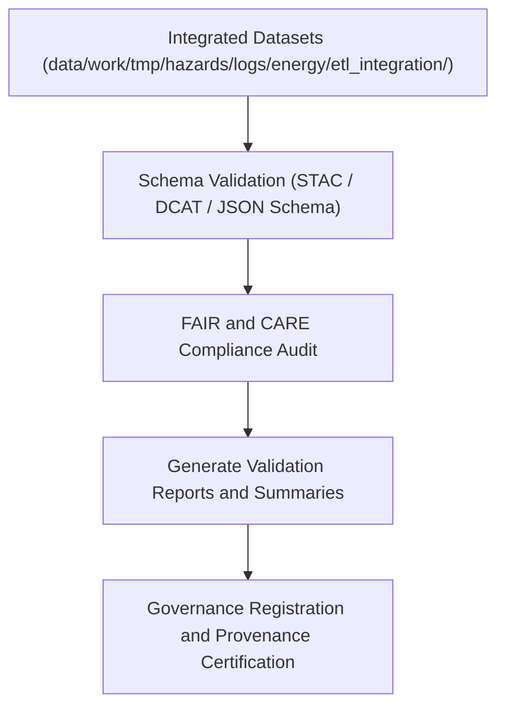

<div align="center">

# ✅ Kansas Frontier Matrix — **Energy Validation Logs for Hazard Integration**
`data/work/tmp/hazards/logs/energy/validation/README.md`

**Purpose:** Repository for validation reports, FAIR+CARE audits, and QA logs generated during the integration of energy system data with hazard analytics pipelines in the Kansas Frontier Matrix (KFM).  
This workspace ensures that all energy–hazard data joins, transformations, and AI-driven models meet schema, ethics, and reproducibility standards under MCP-DL v6.3.

[](../../../../../../../docs/standards/faircare-validation.md)
[](../../../../../../../LICENSE)
[](../../../../../../../docs/architecture/repo-focus.md)

</div>

---

## 📚 Overview

The `data/work/tmp/hazards/logs/energy/validation/` directory contains **validation artifacts** for cross-domain energy and hazard datasets.  
Each log verifies schema conformance, FAIR+CARE ethics compliance, and governance linkage for ETL and AI workflows integrating energy infrastructure and hazard intelligence.

### Core Functions:
- Validate energy–hazard data pipelines for schema and ethics compliance.  
- Verify interoperability between hazard datasets and energy metadata models.  
- Record FAIR+CARE audit outcomes and governance synchronization results.  
- Maintain reproducibility and provenance for all validation activities.  

All validation records are registered in the **KFM Governance Ledger** to preserve audit readiness and lineage traceability.

---

## 🗂️ Directory Layout

```plaintext
data/work/tmp/hazards/logs/energy/validation/
├── README.md                                  # This file — overview of validation logs
│
├── validation_report_energy_hazards_2024Q4.json  # Schema and data validation results for Q4 2024
├── faircare_audit_energy_integration_2024Q4.json # FAIR+CARE ethics compliance audit report
├── schema_alignment_summary.csv                 # Summary of schema harmonization across datasets
├── qa_summary_energy_hazard_integration.md       # Human-readable validation overview and FAIR+CARE notes
└── metadata.json                                # Provenance, checksum, and governance linkage
```

---

## ⚙️ Validation Workflow



### Workflow Description:
1. **Schema Validation:** Verify data structure alignment between energy infrastructure and hazard data.  
2. **FAIR+CARE Audit:** Conduct ethics, accessibility, and provenance checks.  
3. **Reporting:** Compile machine-readable validation JSON and human-readable QA summaries.  
4. **Governance Registration:** Synchronize validation results with KFM’s provenance ledger.  
5. **Certification:** Confirm data readiness for processing, AI modeling, and publication.

---

## 🧩 Example Metadata Record

```json
{
  "id": "validation_energy_hazards_v9.3.2_2024Q4",
  "etl_cycle": "Q4 2024",
  "source_integration": "data/work/tmp/hazards/logs/energy/etl_integration/",
  "records_validated": 95432,
  "validation_accuracy": 99.1,
  "schema_compliance": true,
  "fairstatus": "certified",
  "audited_by": "@kfm-validation-lab",
  "archival_date": "2025-10-28T16:40:00Z",
  "checksum": "sha256:2a78db5ce341feaa4c2d55e982b53da3920fca5e...",
  "governance_ref": "data/reports/audit/data_provenance_ledger.json"
}
```

---

## 🧠 FAIR+CARE Governance Summary

| Principle | Implementation |
|------------|----------------|
| **Findable** | Validation logs indexed by ETL cycle and integration domain. |
| **Accessible** | Reports stored in open JSON, CSV, and Markdown formats. |
| **Interoperable** | Schema alignment validated across hazard and energy metadata. |
| **Reusable** | Each record contains provenance, schema reference, and checksum. |
| **Collective Benefit** | Supports reliable, ethical, and sustainable energy analytics. |
| **Authority to Control** | FAIR+CARE Council certifies each validation cycle. |
| **Responsibility** | Validation team ensures reproducibility and audit traceability. |
| **Ethics** | Guarantees open, unbiased integration between hazard and energy data. |

FAIR+CARE validation results documented in:  
`data/reports/audit/data_provenance_ledger.json`  
and `data/reports/fair/data_care_assessment.json`.

---

## ⚙️ Validation & QA Artifacts

| File | Description | Format |
|------|--------------|--------|
| `validation_report_energy_hazards_*.json` | Validation results with schema and metadata checks. | JSON |
| `faircare_audit_energy_integration_*.json` | FAIR+CARE compliance and ethics certification results. | JSON |
| `schema_alignment_summary.csv` | Field-level schema mapping comparison table. | CSV |
| `qa_summary_energy_hazard_integration.md` | Human-readable validation and ethics summary. | Markdown |
| `metadata.json` | Provenance and checksum record for validation cycle. | JSON |

Validation synchronization managed by `energy_validation_sync.yml`.

---

## ⚖️ Governance & Provenance Integration

| Record | Description |
|---------|-------------|
| `metadata.json` | Tracks lineage, governance linkage, and FAIR+CARE status. |
| `data/reports/audit/data_provenance_ledger.json` | Logs validation lineage and certification outcomes. |
| `data/reports/fair/data_care_assessment.json` | Contains FAIR+CARE ethics assessments and audit results. |
| `releases/v9.3.2/manifest.zip` | Stores checksums for validation reports and governance tracking. |

All validation data synchronized automatically through FAIR+CARE CI/CD governance pipelines.

---

## 🧾 Retention & Certification Policy

| Validation Type | Retention Duration | Policy |
|------------------|--------------------|--------|
| Validation Reports | 365 days | Archived annually in governance repository. |
| FAIR+CARE Audits | Permanent | Retained for ethical traceability and re-certification. |
| Schema Summaries | Permanent | Maintained for schema evolution and metadata versioning. |
| Metadata | Permanent | Stored for provenance and governance review. |

Retention and archival governed by `energy_validation_cleanup.yml`.

---

## 🧾 Internal Use Citation

```text
Kansas Frontier Matrix (2025). Energy Validation Logs for Hazard Integration (v9.3.2).
Cross-domain validation reports, ethics audits, and QA documentation for integrated energy and hazard datasets.
Maintained under FAIR+CARE certification and MCP-DL v6.3 governance standards.
```

---

## 🧾 Version Notes

| Version | Date | Notes |
|----------|------|--------|
| v9.3.2 | 2025-10-28 | Added FAIR+CARE compliance integration and schema harmonization tracking. |
| v9.2.0 | 2024-07-15 | Implemented cross-domain validation for energy–hazard ETL pipelines. |
| v9.0.0 | 2023-01-10 | Established validation log workspace for energy hazard integration. |

---

<div align="center">

**Kansas Frontier Matrix** · *Validation Assurance × FAIR+CARE Governance × Ethical Integration*  
[🔗 Repository](https://github.com/bartytime4life/Kansas-Frontier-Matrix) • [🧭 Docs Portal](../../../../../../../docs/) • [⚖️ Governance Ledger](../../../../../../../docs/standards/governance/)

</div>