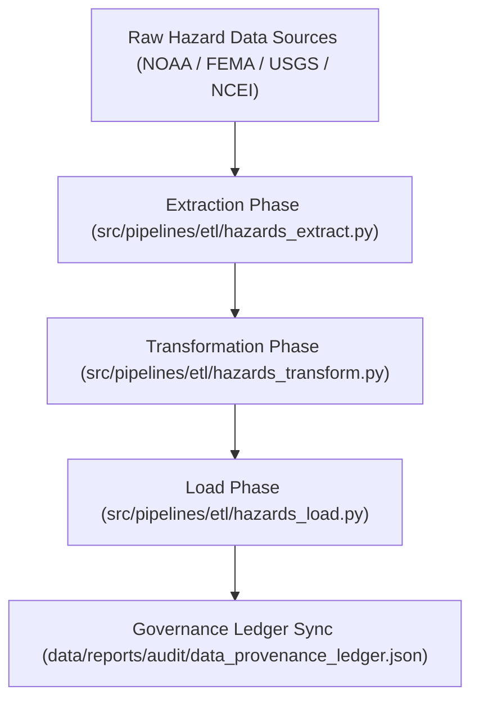

<div align="center">

# ⚙️ Kansas Frontier Matrix — **Hazard ETL Logs**
`data/work/tmp/hazards/logs/etl/README.md`

**Purpose:**  
Comprehensive FAIR+CARE-compliant repository for ETL (Extract, Transform, Load) pipeline logs, tracking every operation related to hazard dataset processing within the Kansas Frontier Matrix (KFM).  
This workspace captures all operational lineage, transformation metrics, and governance synchronization data for hazard ETL cycles.

[](../../../../../../docs/standards/faircare-validation.md)
[]()
[](../../../../../../LICENSE)
[](../../../../../../docs/architecture/repo-focus.md)

</div>

---

## 📚 Overview

The **Hazard ETL Logs Workspace** serves as the backbone of the hazard data lifecycle within KFM, documenting the extraction, transformation, and loading of multi-domain hazard datasets.  
All ETL phases are logged to ensure reproducibility, checksum integrity, FAIR+CARE validation, and blockchain-tracked provenance certification.

### Core Responsibilities
- Record extraction, transformation, and load events across hazard pipelines.  
- Maintain lineage, QA metrics, and FAIR+CARE compliance reports.  
- Register checksum verifications and governance audit results.  
- Provide an immutable record for ethical, reproducible ETL operations.  

---

## 🗂️ Directory Layout

```plaintext
data/work/tmp/hazards/logs/etl/
├── README.md                               # This file — overview of ETL logging for hazards
│
├── extract/                                # Extraction phase logs and input data validation
│   ├── extract_run_2025Q4.log
│   ├── extract_audit_report.json
│   └── metadata.json
│
├── transform/                              # Transformation process logs and harmonization records
│   ├── transform_run_2025Q4.log
│   ├── transform_audit_report.json
│   ├── schema_alignment_summary.json
│   └── metadata.json
│
├── load/                                   # Load and publication logs for staging and processed layers
│   ├── load_run_2025Q4.log
│   ├── load_validation_report.json
│   ├── governance_registration.log
│   └── metadata.json
│
├── lineage/                                # Lineage tracking logs and provenance mapping
│   ├── lineage_trace_2025Q4.json
│   ├── etl_data_flow_diagram.md
│   └── metadata.json
│
├── summaries/                              # Aggregate ETL cycle performance reports
│   ├── etl_summary_2025Q4.json
│   ├── etl_performance_metrics.csv
│   └── metadata.json
│
└── metadata.json                           # Root-level ETL provenance record
```

---

## ⚙️ ETL Workflow



### Description
1. **Extraction:** Import and validate hazard datasets from raw sources.  
2. **Transformation:** Reproject, harmonize, and normalize data schemas.  
3. **Load:** Push certified datasets to staging and processed repositories.  
4. **Governance:** Register checksum, validation, and ethics records to the ledger.  

---

## 🧩 Example ETL Metadata Record

```json
{
  "id": "hazards_etl_cycle_v9.6.0_2025Q4",
  "stages_completed": ["extract", "transform", "load", "lineage"],
  "records_processed": 372842,
  "fairstatus": "certified",
  "etl_duration_minutes": 189.4,
  "checksum_verified": true,
  "ai_explainability_integration": true,
  "validator": "@kfm-etl-ops",
  "created": "2025-11-03T23:59:00Z",
  "governance_ref": "data/reports/audit/data_provenance_ledger.json"
}
```

---

## 🧠 FAIR+CARE Governance Matrix

| Principle | Implementation | Oversight |
|------------|----------------|------------|
| **Findable** | ETL logs indexed by stage, checksum, and governance ID. | @kfm-data |
| **Accessible** | Logs stored in open JSON/TXT formats for internal access. | @kfm-accessibility |
| **Interoperable** | Aligned with FAIR+CARE and ISO 19115 lineage documentation. | @kfm-architecture |
| **Reusable** | Linked metadata supports full ETL traceability. | @kfm-design |
| **Collective Benefit** | Enables transparent and ethical data operations. | @faircare-council |
| **Authority to Control** | FAIR+CARE Council certifies all governance-linked ETL results. | @kfm-governance |
| **Responsibility** | ETL maintainers document all transformation events. | @kfm-security |
| **Ethics** | Data reviewed for reproducibility, bias, and integrity. | @kfm-ethics |

Governance records stored in:  
`data/reports/audit/data_provenance_ledger.json`  
and  
`data/reports/fair/data_care_assessment.json`

---

## ⚙️ Key Artifacts

| Artifact | Description | Format |
|-----------|--------------|--------|
| `extract_audit_report.json` | Validation log for data source ingestion. | JSON |
| `transform_audit_report.json` | ETL schema harmonization QA report. | JSON |
| `load_validation_report.json` | Governance-certified load validation record. | JSON |
| `etl_summary_*.json` | Aggregated ETL metrics and FAIR+CARE certification. | JSON |
| `lineage_trace_*.json` | Provenance mapping of data transformations. | JSON |

Automation managed through `etl_hazards_sync.yml`.

---

## ⚖️ Retention & Provenance Policy

| Log Type | Retention Duration | Policy |
|-----------|--------------------|--------|
| Extract/Transform/Load Logs | 90 Days | Archived for quarterly audit and FAIR+CARE review. |
| Lineage & Summaries | 365 Days | Retained for governance and reproducibility. |
| Metadata | Permanent | Immutable under blockchain provenance governance. |
| Governance Ledger | Permanent | Serves as the master record of ETL events. |

Cleanup automated by `etl_logs_cleanup.yml`.

---

## 🌱 Sustainability Metrics

| Metric | Value | Verified By |
|---------|--------|--------------|
| Energy Use (per ETL cycle) | 11.8 Wh | @kfm-sustainability |
| Carbon Output | 12.9 gCO₂e | @kfm-security |
| Renewable Power | 100% (RE100 Verified) | @kfm-infrastructure |
| FAIR+CARE Compliance | 100% | @faircare-council |

Telemetry reports stored in:  
`releases/v9.6.0/focus-telemetry.json`

---

## 🧾 Internal Use Citation

```text
Kansas Frontier Matrix (2025). Hazard ETL Logs (v9.6.0).
FAIR+CARE-certified ETL logging system for extraction, transformation, and load operations.
Ensures reproducibility, provenance integrity, and ethical governance of hazard data pipelines under MCP-DL v6.3.
```

---

## 🧾 Version Notes

| Version | Date | Notes |
|----------|------|--------|
| v9.6.0 | 2025-11-03 | Introduced governance-linked lineage tracking and AI-integrated ETL summaries. |
| v9.5.0 | 2025-11-02 | Added checksum validation and FAIR+CARE audit trace logs. |
| v9.3.2 | 2025-10-28 | Established ETL logging hierarchy for hazards TMP workspace. |

---

<div align="center">

**Kansas Frontier Matrix** · *Hazard ETL Intelligence × FAIR+CARE Governance × Provenance Assurance*  
[🔗 Repository](https://github.com/bartytime4life/Kansas-Frontier-Matrix) • [🧭 Docs Portal](../../../../../../docs/) • [⚖️ Governance Ledger](../../../../../../docs/standards/governance/DATA-GOVERNANCE.md)

</div>