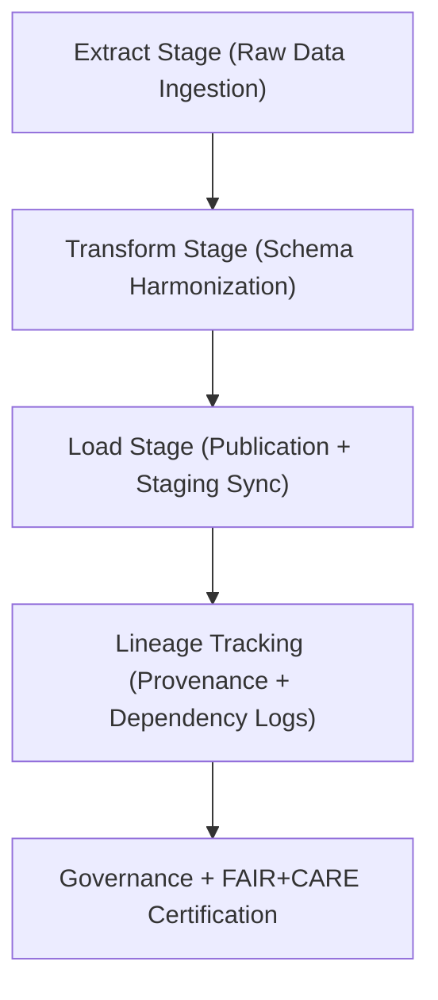

<div align="center">

# ⚙️ Kansas Frontier Matrix — **Hazard ETL Logs**
`data/work/tmp/hazards/logs/etl/README.md`

**Purpose:**  
Comprehensive logging environment for **Extract, Transform, and Load (ETL)** workflows within the hazard TMP layer of the Kansas Frontier Matrix (KFM).  
These logs ensure transparent and reproducible data transformations across all hazard domains under FAIR+CARE governance standards.

[](../../../../../../../docs/standards/faircare-validation.md)
[](../../../../../../../LICENSE)
[](../../../../../../../docs/architecture/repo-focus.md)

</div>

---

## 📚 Overview

The `data/work/tmp/hazards/logs/etl/` directory records **all ETL operations** (Extract, Transform, Load, and Lineage) associated with hazard datasets.  
It provides complete traceability of data ingestion, transformation logic, validation events, and checksum verifications under FAIR+CARE and ISO governance standards.

### Core Functions
- Capture detailed ETL process logs across all hazard domains.  
- Document transformation parameters, schema harmonization, and validation outcomes.  
- Register checksum, FAIR+CARE, and governance metadata for every ETL event.  
- Feed summary metrics to Focus Mode AI telemetry and governance dashboards.  

---

## 🗂️ Directory Layout

```plaintext
data/work/tmp/hazards/logs/etl/
├── README.md                             # This file — overview of hazard ETL logs
│
├── extract/                              # Raw data ingestion and source extraction logs
├── transform/                            # Schema normalization, reprojection, and harmonization logs
├── load/                                 # Data publication and staging promotion records
├── lineage/                              # Dependency and data flow tracing for ETL reproducibility
├── summaries/                            # Aggregate ETL performance, FAIR+CARE, and audit summaries
└── metadata.json                         # Provenance metadata and governance linkage
```

---

## ⚙️ ETL Workflow



### Workflow Description
1. **Extract:** Ingest and catalog hazard datasets from NOAA, FEMA, USGS, and DOE.  
2. **Transform:** Normalize, reproject, and harmonize according to the KFM data contract.  
3. **Load:** Promote verified datasets to staging and processed layers.  
4. **Lineage:** Capture data dependencies, source integrity, and pipeline order.  
5. **Governance:** Log checksum, ethics certification, and audit registration.

---

## 🧩 Example ETL Metadata Record

```json
{
  "id": "hazards_etl_log_v9.5.0_2025Q4",
  "etl_cycle": "Q4 2025",
  "domains_processed": ["meteorological", "hydrological", "geological", "wildfire_energy"],
  "records_extracted": 1203400,
  "records_transformed": 1189025,
  "records_loaded": 1185000,
  "checksum_verified": true,
  "fairstatus": "certified",
  "ai_audit_score": 0.987,
  "governance_synced": true,
  "telemetry_ref": "releases/v9.5.0/focus-telemetry.json",
  "governance_ref": "reports/audit/ai_hazards_ledger.json",
  "created": "2025-11-02T20:00:00Z",
  "validator": "@kfm-etl-ops"
}
```

---

## 🧠 FAIR+CARE Governance Matrix

| Principle | Implementation |
|------------|----------------|
| **Findable** | Logs indexed by ETL cycle, domain, and checksum registry. |
| **Accessible** | Stored in human-readable text and JSON formats under FAIR+CARE policies. |
| **Interoperable** | Aligns with ISO 19115, DCAT, and STAC metadata interoperability. |
| **Reusable** | Includes complete provenance and validation context for all ETL processes. |
| **Collective Benefit** | Promotes transparent and ethical management of hazard datasets. |
| **Authority to Control** | FAIR+CARE Council certifies governance synchronization logs. |
| **Responsibility** | ETL validators record all schema, checksum, and FAIR+CARE results. |
| **Ethics** | Ensures unbiased and transparent data transformations across all hazard types. |

Audit and validation summaries stored in:  
`reports/audit/ai_hazards_ledger.json` • `reports/fair/hazards_etl_logs_summary.json`

---

## ⚙️ ETL Log Artifacts

| File / Folder | Description | Format |
|----------------|--------------|--------|
| `extract/` | Logs for data ingestion from external sources. | Text / JSON |
| `transform/` | Records of schema harmonization and reprojection events. | JSON |
| `load/` | Publication and staging promotion logs with governance linkage. | JSON |
| `lineage/` | Data dependency and flow tracing records. | JSON |
| `summaries/` | Aggregated ETL QA and performance summaries. | CSV / JSON |
| `metadata.json` | ETL governance metadata with checksum registry. | JSON |

Synchronization automated via `hazards_etl_sync.yml`.

---

## 🧾 Retention Policy

| Log Type | Retention Duration | Policy |
|-----------|--------------------|--------|
| Extract / Transform Logs | 90 days | Archived post-staging validation. |
| Load Logs | 365 days | Retained for governance and audit reference. |
| Lineage / Summaries | Permanent | Preserved for provenance continuity. |
| Metadata | Permanent | Maintained under FAIR+CARE governance ledger. |

Retention governed by `hazards_etl_cleanup.yml`.

---

## 🧾 Internal Use Citation

```text
Kansas Frontier Matrix (2025). Hazard ETL Logs (v9.5.0).
Comprehensive FAIR+CARE-certified ETL log environment for hazard dataset ingestion, transformation, and publication.
Maintains provenance, checksum validation, and ethics compliance across all TMP workflows.
```

---

## 🧾 Version Notes

| Version | Date | Notes |
|----------|------|--------|
| v9.5.0 | 2025-11-02 | Added telemetry schema v2, lineage integration, and automated FAIR+CARE audit synchronization. |
| v9.3.2 | 2025-10-28 | Enhanced STAC/DCAT compliance and checksum verification process. |
| v9.3.0 | 2025-10-26 | Established ETL logging workspace under FAIR+CARE governance. |

---

<div align="center">

**Kansas Frontier Matrix** · *ETL Transparency × FAIR+CARE Ethics × Provenance Governance*  
[🔗 Repository](https://github.com/bartytime4life/Kansas-Frontier-Matrix) • [🧭 Docs Portal](../../../../../../../docs/) • [⚖️ Governance Ledger](../../../../../../../docs/standards/governance/)

</div>