<div align="center">

# 🧱 Kansas Frontier Matrix — **Hazards ETL Logs**
`data/work/tmp/hazards/logs/etl/README.md`

**Purpose:**  
Centralized repository for **Extract, Transform, and Load (ETL) logs** that record hazard data ingestion, transformation, and export workflows across meteorological, hydrological, geological, and energy domains within the Kansas Frontier Matrix (KFM).  
Provides transparent, FAIR+CARE-compliant tracking of ETL performance, schema validation, and governance synchronization.

[](../../../../../../docs/standards/faircare-validation.md)
[](../../../../../../LICENSE)
[](../../../../../../docs/architecture/repo-focus.md)

</div>

---

## 📚 Overview

The `data/work/tmp/hazards/logs/etl/` directory contains all logs generated by the **hazard ETL pipelines**, covering ingestion, transformation, harmonization, and export operations.  
Every ETL process within the hazards domain is checksum-verified, FAIR+CARE-audited, and recorded for governance provenance.

### Core Functions
- Document the full lifecycle of ETL operations across all hazard domains.  
- Capture transformation scripts, schema mapping, and checksum generation.  
- Record pipeline performance, audit events, and errors for reproducibility.  
- Synchronize log metadata with AI Governance and FAIR+CARE ledgers.  

---

## 🗂️ Directory Layout

```plaintext
data/work/tmp/hazards/logs/etl/
├── README.md                               # This file — overview of hazards ETL logs
│
├── hazards_etl_run.log                     # Full pipeline execution trace for hazard ETL tasks
├── schema_mapping_trace.log                # Field mapping between raw and transformed datasets
├── transformation_audit.json               # ETL transformation results, harmonization actions
├── checksum_audit.json                     # Hash validation for all ETL output artifacts
├── pipeline_performance_metrics.json       # Runtime statistics and throughput metrics
└── metadata.json                           # Provenance and FAIR+CARE audit metadata
```

---

## ⚙️ ETL Workflow Logging

```mermaid
flowchart TD
    A["Raw Hazard Datasets (meteorological, hydrological, geological, wildfire_energy)"] --> B["Extraction (Data Ingest)"]
    B --> C["Transformation (Schema Harmonization + CRS Normalization)"]
    C --> D["Checksum and FAIR+CARE Audit"]
    D --> E["Export (TMP Transforms → Validation Layer)"]
    E --> F["Governance Sync + Telemetry Update"]
```



### Workflow Description
1. **Extraction:** Log start and end of raw data ingestion per domain.  
2. **Transformation:** Record schema harmonization, reprojection, and cleaning activities.  
3. **Checksum Audit:** Verify data integrity post-transformation.  
4. **Export:** Log promotion of validated outputs to `data/work/tmp/hazards/transforms/`.  
5. **Governance:** Sync records to `ai_hazards_ledger.json` and telemetry manifests.

---

## 🧩 Example ETL Log Record

```json
{
  "id": "hazards_etl_cycle_v9.5.0",
  "domain": ["meteorological", "hydrological", "wildfire_energy"],
  "records_processed": 25600,
  "schema_validations": 5,
  "checksum_verified": true,
  "fairstatus": "compliant",
  "etl_runtime_seconds": 486.4,
  "transformations": ["normalize_fields", "reproject_epsg4326", "cf_alignment"],
  "validator": "@kfm-etl-ops",
  "telemetry_ref": "releases/v9.5.0/focus-telemetry.json",
  "governance_ref": "reports/audit/ai_hazards_ledger.json",
  "timestamp": "2025-11-02T18:20:00Z"
}
```

---

## 🧠 FAIR+CARE Compliance in ETL Logging

| Principle | Implementation |
|------------|----------------|
| **Findable** | Logs indexed by pipeline ID, checksum, and timestamp in governance ledger. |
| **Accessible** | Stored as open JSON or text files under FAIR+CARE licensing. |
| **Interoperable** | Schema aligned with KFM logging model and ISO 19115. |
| **Reusable** | Logs contain provenance, ethics metadata, and telemetry references. |
| **Collective Benefit** | Promotes reproducible ETL processes across hazards domains. |
| **Authority to Control** | FAIR+CARE Council monitors log retention and integrity. |
| **Responsibility** | Validators record schema and harmonization trace outputs. |
| **Ethics** | Logs anonymized for system security and ethical publication. |

Audit data synchronized to:  
`reports/audit/ai_hazards_ledger.json` • `reports/fair/hazards_etl_logs_summary.json`

---

## ⚙️ QA & Provenance Artifacts

| File | Description | Format |
|------|--------------|--------|
| `hazards_etl_run.log` | Full ETL process trace including validation checkpoints. | Text |
| `schema_mapping_trace.log` | Details field harmonization between raw and normalized data. | Text |
| `transformation_audit.json` | Transformation operations and normalization results. | JSON |
| `checksum_audit.json` | Checksum and integrity validation across all ETL outputs. | JSON |
| `pipeline_performance_metrics.json` | Records ETL runtime performance and resource metrics. | JSON |
| `metadata.json` | FAIR+CARE and provenance metadata for the ETL cycle. | JSON |

ETL log synchronization managed by `hazards_etl_log_sync.yml`.

---

## 🧾 Retention Policy

| Log Type | Retention Duration | Policy |
|-----------|--------------------|--------|
| ETL Pipeline Logs | 30 days | Archived post-validation and governance sync. |
| Checksum and Audit Logs | 90 days | Retained for reproducibility and compliance. |
| Schema Mapping Logs | 180 days | Stored for provenance verification. |
| Metadata & Performance Logs | 365 days | Archived for governance traceability. |

Cleanup automated through `hazards_etl_log_cleanup.yml`.

---

## 🧾 Internal Use Citation

```text
Kansas Frontier Matrix (2025). Hazards ETL Logs (v9.5.0).
Comprehensive FAIR+CARE and governance-aligned ETL logging workspace for multi-domain hazard ingestion and transformation.
Documents schema harmonization, checksum verification, and governance synchronization for all temporary hazard workflows.
Restricted to internal ETL, QA, and audit review.
```

---

## 🧾 Version Notes

| Version | Date | Notes |
|----------|------|--------|
| v9.5.0 | 2025-11-02 | Integrated telemetry v2 schema and multi-domain ETL log unification. |
| v9.3.2 | 2025-10-28 | Added FAIR+CARE audit integration and checksum registry linkage. |
| v9.3.0 | 2025-10-26 | Established baseline ETL logging directory for hazard pipelines. |

---

<div align="center">

**Kansas Frontier Matrix** · *ETL Transparency × FAIR+CARE Governance × Provenance Integrity*  
[🔗 Repository](https://github.com/bartytime4life/Kansas-Frontier-Matrix) • [🧭 Docs Portal](../../../../../../docs/) • [⚖️ Governance Ledger](../../../../../../docs/standards/governance/)

</div>
