<div align="center">

# ⚙️ Kansas Frontier Matrix — **Hazard ETL Logs**
`data/work/tmp/hazards/logs/etl/README.md`

**Purpose:**  
FAIR+CARE-compliant repository for **Extract · Transform · Load** pipeline logs covering all hazard dataset processing in KFM.  
Captures operational lineage, transformation metrics, and governance sync data across the full ETL lifecycle.

[](../../../../../../docs/architecture/README.md)
[](../../../../../../docs/standards/faircare-validation.md)
[]()
[](../../../../../../LICENSE)

</div>

---

## 📘 Overview

The **Hazard ETL Logs Workspace** documents extraction, transformation, and loading of multi-domain hazard datasets.  
All ETL phases are logged to ensure reproducibility, checksum integrity, FAIR+CARE validation, and ledger-tracked provenance.

### Core Responsibilities
- Record extract/transform/load events for hazard pipelines.  
- Maintain lineage, QA metrics, and FAIR+CARE compliance traces.  
- Register checksum verifications and governance audit results.  
- Provide an immutable record for ethical, reproducible ETL operations.  

---

## 🗂️ Directory Layout

```plaintext
data/work/tmp/hazards/logs/etl/
├── README.md
├── extract/
│   ├── extract_run_2025Q4.log
│   ├── extract_audit_report.json
│   └── metadata.json
├── transform/
│   ├── transform_run_2025Q4.log
│   ├── transform_audit_report.json
│   ├── schema_alignment_summary.json
│   └── metadata.json
├── load/
│   ├── load_run_2025Q4.log
│   ├── load_validation_report.json
│   ├── governance_registration.log
│   └── metadata.json
├── lineage/
│   ├── lineage_trace_2025Q4.json
│   ├── etl_data_flow_diagram.md
│   └── metadata.json
├── summaries/
│   ├── etl_summary_2025Q4.json
│   ├── etl_performance_metrics.csv
│   └── metadata.json
└── metadata.json
```

---

## ⚙️ ETL Workflow

```mermaid
flowchart TD
    A["Raw Hazards (NOAA · FEMA · USGS · NCEI)"] --> B["Extract (src/pipelines/etl/hazards_extract.py)"]
    B --> C["Transform (src/pipelines/etl/hazards_transform.py)"]
    C --> D["Load (src/pipelines/etl/hazards_load.py)"]
    D --> E["Governance Sync → data/reports/audit/data_provenance_ledger.json"]
```



### Steps
1. **Extract** — Import + validate source datasets.  
2. **Transform** — Reproject, harmonize, normalize schemas.  
3. **Load** — Publish to staging/processed layers.  
4. **Governance** — Register checksums, validations, ethics records.

---

## 🧩 Example ETL Metadata Record

```json
{
  "id": "hazards_etl_cycle_v9.7.0_2025Q4",
  "stages_completed": ["extract", "transform", "load", "lineage"],
  "records_processed": 372842,
  "fairstatus": "certified",
  "etl_duration_minutes": 189.4,
  "checksum_verified": true,
  "ai_explainability_integration": true,
  "validator": "@kfm-etl-ops",
  "created": "2025-11-06T23:59:00Z",
  "governance_ref": "data/reports/audit/data_provenance_ledger.json"
}
```

---

## 🧠 FAIR+CARE Governance Matrix

| Principle | Implementation | Oversight |
|-----------|----------------|-----------|
| **Findable** | Logs indexed by stage, checksum, governance ID. | `@kfm-data` |
| **Accessible** | JSON/TXT logs for internal council access. | `@kfm-accessibility` |
| **Interoperable** | FAIR+CARE + ISO 19115 lineage documentation. | `@kfm-architecture` |
| **Reusable** | Linked metadata supports full ETL traceability. | `@kfm-design` |
| **Collective Benefit** | Transparent, ethical data operations. | `@faircare-council` |
| **Authority to Control** | Council certifies governance-linked ETL results. | `@kfm-governance` |
| **Responsibility** | ETL maintainers document transformation events. | `@kfm-security` |
| **Ethics** | Reviews for reproducibility, bias, integrity. | `@kfm-ethics` |

**Audit refs:**  
`data/reports/audit/data_provenance_ledger.json` · `data/reports/fair/data_care_assessment.json`

---

## ⚙️ Key Artifacts

| Artifact | Description | Format |
|----------|-------------|--------|
| `extract_audit_report.json` | Source ingestion validation log | JSON |
| `transform_audit_report.json` | Schema harmonization QA report | JSON |
| `load_validation_report.json` | Governance-certified load validation | JSON |
| `etl_summary_*.json` | Aggregated ETL metrics + FAIR+CARE status | JSON |
| `lineage_trace_*.json` | Provenance mapping across stages | JSON |

**Automation:** `etl_hazards_sync.yml`

---

## ♻️ Retention & Sustainability

| Log Type | Retention | Policy |
|----------|----------:|--------|
| Extract/Transform/Load | 90 Days | Archived for quarterly audit. |
| Lineage & Summaries    | 365 Days | Retained for governance & reproducibility. |
| Metadata               | Permanent | Immutable blockchain provenance. |
| Governance Ledger      | Permanent | Master record of ETL events. |

**Telemetry:** `../../../../../../releases/v9.7.0/focus-telemetry.json`

---

## 🌱 Sustainability Metrics

| Metric | Value | Verified By |
|--------|------:|-------------|
| Energy Use (per ETL cycle) | 11.8 Wh | `@kfm-sustainability` |
| Carbon Output | 12.9 gCO₂e | `@kfm-security` |
| Renewable Power | 100% (RE100) | `@kfm-infrastructure` |
| FAIR+CARE Compliance | 100% | `@faircare-council` |

---

## 🧾 Citation

```text
Kansas Frontier Matrix (2025). Hazard ETL Logs (v9.7.0).
FAIR+CARE-certified ETL logging repository ensuring reproducibility, provenance integrity, and ethical governance of hazard data pipelines under MCP-DL v6.3.
```

---

<div align="center">

**Kansas Frontier Matrix**  
*Hazard ETL Intelligence × FAIR+CARE Governance × Provenance Assurance*  
© 2025 Kansas Frontier Matrix — Internal Governance Data · Diamond⁹ Ω / Crown∞Ω Ultimate Certified  

[Back to Hazards Logs](../README.md) · [Governance Charter](../../../../../../docs/standards/governance/DATA-GOVERNANCE.md)

</div>