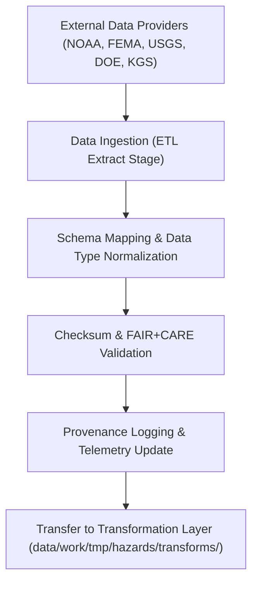

<div align="center">

# 📥 Kansas Frontier Matrix — **Hazard ETL Extract Logs**
`data/work/tmp/hazards/logs/etl/extract/README.md`

**Purpose:**  
Comprehensive logging workspace for **hazard dataset extraction, ingestion, and raw data verification events** across meteorological, hydrological, geological, and wildfire-energy domains within the Kansas Frontier Matrix (KFM).  
All extraction operations are recorded with **checksum validation, FAIR+CARE governance metadata, and provenance registration** to ensure transparent and reproducible data acquisition.

[](../../../../../../../docs/standards/faircare-validation.md)
[](../../../../../../../LICENSE)
[](../../../../../../../docs/architecture/repo-focus.md)

</div>

---

## 📚 Overview

The `data/work/tmp/hazards/logs/etl/extract/` directory captures all extraction and ingestion logs from raw hazard data sources.  
These include NOAA, FEMA, USGS, DOE, and state-level datasets that form the foundation of KFM’s hazard intelligence workflows.

### Core Functions
- Record ingestion events for all raw hazard data acquisitions.  
- Log schema mapping, encoding detection, and conversion metadata.  
- Store checksum verifications and FAIR+CARE compliance summaries.  
- Register provenance for all extraction operations in the AI Hazards Governance Ledger.  

---

## 🗂️ Directory Layout

```plaintext
data/work/tmp/hazards/logs/etl/extract/
├── README.md                                 # This file — overview of hazard ETL extract logs
│
├── extract_run_log_2025Q4.log                # ETL extraction runtime trace for hazard datasets
├── source_metadata_mapping.json              # Mapping of input schema to KFM data contract structure
├── checksum_registry_extract_2025Q4.json     # SHA-256 checksum validation for all raw source files
├── ingestion_audit_report_2025Q4.json        # FAIR+CARE ingestion audit and governance validation
├── raw_source_catalog_2025Q4.csv             # Tabular summary of all extracted raw datasets
└── metadata.json                             # Provenance metadata, checksum, and governance references
```

---

## ⚙️ Extraction Workflow



### Workflow Description
1. **Ingestion:** Download, decompress, and preprocess raw hazard files.  
2. **Schema Mapping:** Align input columns and attributes with the KFM data contract.  
3. **Checksum Validation:** Compute hashes for all inputs to ensure integrity.  
4. **FAIR+CARE Audit:** Record ethical and accessibility metadata during extraction.  
5. **Governance Logging:** Register operations in `ai_hazards_ledger.json`.  

---

## 🧩 Example Extraction Log Record

```json
{
  "id": "etl_extract_hazards_v9.5.0_2025Q4",
  "source_providers": ["NOAA", "FEMA", "USGS"],
  "records_extracted": 912340,
  "files_ingested": 26,
  "schema_mappings": 8,
  "checksum_verified": true,
  "fairstatus": "certified",
  "governance_synced": true,
  "telemetry_ref": "releases/v9.5.0/focus-telemetry.json",
  "governance_ref": "reports/audit/ai_hazards_ledger.json",
  "created": "2025-11-02T18:42:00Z",
  "validator": "@kfm-etl-ops"
}
```

---

## 🧠 FAIR+CARE Compliance in Extraction Logs

| Principle | Implementation |
|------------|----------------|
| **Findable** | Raw source logs indexed by provider, dataset ID, and checksum in governance ledger. |
| **Accessible** | Logs stored in open formats (JSON, CSV) under FAIR+CARE standards. |
| **Interoperable** | Aligned with ISO 19115 and DCAT metadata interoperability frameworks. |
| **Reusable** | Provenance data enables complete reconstruction of extraction workflow. |
| **Collective Benefit** | Supports open science and public access to validated hazard sources. |
| **Authority to Control** | FAIR+CARE Council oversees raw data ingestion and ethics checks. |
| **Responsibility** | ETL validators record ingestion results and schema conversions. |
| **Ethics** | Raw data reviewed for ethical sourcing and privacy constraints. |

Audit and provenance reports stored in:  
`reports/audit/ai_hazards_ledger.json` • `reports/fair/hazards_etl_extract_summary.json`

---

## ⚙️ QA & Provenance Artifacts

| File | Description | Format |
|------|--------------|--------|
| `extract_run_log_*.log` | Runtime execution log for all ETL extraction jobs. | Text |
| `source_metadata_mapping.json` | Field-level schema alignment to KFM data contracts. | JSON |
| `checksum_registry_extract_*.json` | Hash verification and checksum registry for input data. | JSON |
| `ingestion_audit_report_*.json` | FAIR+CARE ingestion audit report. | JSON |
| `raw_source_catalog_*.csv` | Catalog of all raw data sources ingested in current cycle. | CSV |
| `metadata.json` | Governance metadata for lineage and certification tracking. | JSON |

Automation managed via `etl_extract_sync.yml`.

---

## 🧾 Retention Policy

| Log Type | Retention Duration | Policy |
|-----------|--------------------|--------|
| Extraction Logs | 90 days | Archived post-ingestion audit. |
| Checksum Registries | 365 days | Retained for provenance integrity. |
| Ingestion Reports | 180 days | Stored for FAIR+CARE revalidation. |
| Metadata | Permanent | Preserved for lineage and governance certification. |

Cleanup managed through `etl_extract_cleanup.yml`.

---

## 🧾 Internal Use Citation

```text
Kansas Frontier Matrix (2025). Hazard ETL Extract Logs (v9.5.0).
FAIR+CARE-certified logging workspace for hazard data ingestion and extraction governance.
Tracks raw data source acquisition, checksum verification, and schema mapping for all hazard domains.
Restricted to internal ETL, QA, and provenance workflows.
```

---

## 🧾 Version Notes

| Version | Date | Notes |
|----------|------|--------|
| v9.5.0 | 2025-11-02 | Introduced multi-source lineage integration, telemetry v2, and FAIR+CARE ingestion validation. |
| v9.3.2 | 2025-10-28 | Added governance synchronization and raw source catalog generation. |
| v9.3.0 | 2025-10-26 | Established ETL extract log directory for hazard ingestion. |

---

<div align="center">

**Kansas Frontier Matrix** · *Hazard Data Ingestion × FAIR+CARE Governance × Provenance Transparency*  
[🔗 Repository](https://github.com/bartytime4life/Kansas-Frontier-Matrix) • [🧭 Docs Portal](../../../../../../../docs/) • [⚖️ Governance Ledger](../../../../../../../docs/standards/governance/)

</div>
