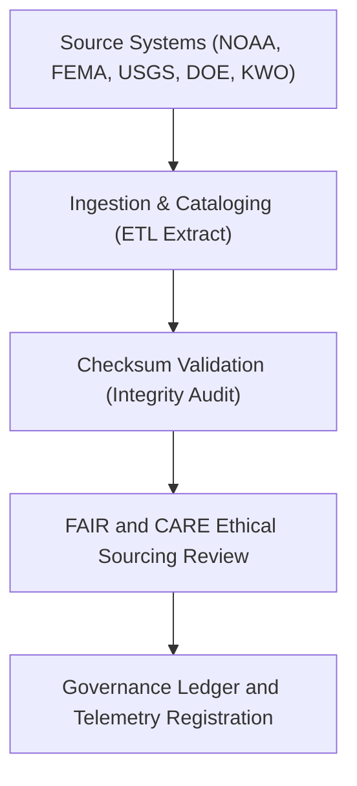

<div align="center">

# 📥 Kansas Frontier Matrix — **Hazard ETL Extract Logs**
`data/work/tmp/hazards/logs/etl/extract/README.md`

**Purpose:**  
Record and monitor all **data extraction events** from authoritative hazard data sources during ETL operations in the Kansas Frontier Matrix (KFM).  
Ensures full traceability, checksum integrity, and FAIR+CARE-compliant sourcing across NOAA, FEMA, USGS, DOE, and other domain providers.

[](../../../../../../../../docs/standards/faircare-validation.md)
[](../../../../../../../../LICENSE)
[](../../../../../../../../docs/architecture/repo-focus.md)

</div>

---

## 📚 Overview

The `data/work/tmp/hazards/logs/etl/extract/` directory contains all **source ingestion, download, and initial quality validation logs** generated during hazard ETL extraction.  
This layer is responsible for capturing raw input metadata, provenance checks, checksum verification, and audit-ready extraction events before transformation begins.

### Core Responsibilities
- Record data extraction operations from external hazard data providers.  
- Maintain provenance and checksum metadata for source datasets.  
- Validate ethical use and licensing terms (FAIR+CARE).  
- Provide extraction metrics to the Governance Ledger and Telemetry system.  

---

## 🗂️ Directory Layout

```plaintext
data/work/tmp/hazards/logs/etl/extract/
├── README.md                              # This file — documentation for hazard ETL extract logs
│
├── extract_run_log_2025Q4.log              # Extraction workflow execution log for Q4 2025
├── source_catalog_registry_2025Q4.json     # Registry of all extracted source datasets and origins
├── checksum_validation_extract_2025Q4.json # Verification of extracted file integrity (SHA-256)
├── faircare_source_audit_2025Q4.json       # FAIR+CARE ethical and license validation for source data
└── metadata.json                           # Provenance and governance linkage metadata
```

---

## ⚙️ Extraction Workflow



### Workflow Description
1. **Source Retrieval:** Fetch hazard data from trusted national and state agencies.  
2. **Checksum Verification:** Validate downloaded datasets for integrity and authenticity.  
3. **FAIR+CARE Compliance:** Confirm licensing, data-sharing ethics, and provenance alignment.  
4. **Ledger Registration:** Log extraction metadata to governance records for reproducibility.

---

## 🧩 Example Extraction Metadata Record

```json
{
  "id": "hazards_etl_extract_v9.5.0_2025Q4",
  "etl_stage": "extract",
  "sources": [
    "NOAA Storm Prediction Center",
    "FEMA National Flood Hazard Layer",
    "USGS Earthquake Hazards Program"
  ],
  "records_ingested": 426312,
  "files_downloaded": 84,
  "checksum_verified": true,
  "fairstatus": "certified",
  "source_audit_passed": true,
  "telemetry_ref": "releases/v9.5.0/focus-telemetry.json",
  "governance_ref": "reports/audit/ai_hazards_ledger.json",
  "created": "2025-11-02T20:10:00Z",
  "validator": "@kfm-etl-extract"
}
```

---

## 🧠 FAIR+CARE Governance Matrix

| Principle | Implementation |
|------------|----------------|
| **Findable** | Source extractions indexed by provider, dataset ID, and checksum. |
| **Accessible** | Open metadata logs available to governance reviewers. |
| **Interoperable** | Metadata conforms to STAC 1.0, DCAT 3.0, and ISO 19115 lineage standards. |
| **Reusable** | Maintains provenance, schema, and FAIR+CARE audit linkage. |
| **Collective Benefit** | Ensures ethical sourcing and transparent data reuse. |
| **Authority to Control** | FAIR+CARE Council certifies data acquisition compliance. |
| **Responsibility** | ETL engineers record all source details and checksum results. |
| **Ethics** | Confirms all data sourced under open license and ethical usage terms. |

Audit results stored in:  
`reports/audit/ai_hazards_ledger.json` • `reports/fair/hazards_etl_extract_summary.json`

---

## ⚙️ Extraction Log Artifacts

| File | Description | Format |
|------|--------------|--------|
| `extract_run_log_*.log` | Timestamped record of ETL extract activities. | Text |
| `source_catalog_registry_*.json` | List of all source datasets and endpoints. | JSON |
| `checksum_validation_extract_*.json` | SHA-256 integrity checks for ingested datasets. | JSON |
| `faircare_source_audit_*.json` | FAIR+CARE ethics and source license audit. | JSON |
| `metadata.json` | Provenance metadata linking extractions to governance ledger. | JSON |

Extraction automation managed by `hazards_etl_extract_sync.yml`.

---

## 🧾 Retention Policy

| Log Type | Retention Duration | Policy |
|-----------|--------------------|--------|
| Extraction Logs | 90 days | Archived after staging promotion. |
| FAIR+CARE Source Audits | 365 days | Retained for governance review. |
| Checksum Logs | 180 days | Stored for reproducibility validation. |
| Metadata | Permanent | Preserved under governance ledger. |

Retention managed via `hazards_etl_extract_cleanup.yml`.

---

## 🧾 Internal Use Citation

```text
Kansas Frontier Matrix (2025). Hazard ETL Extract Logs (v9.5.0).
FAIR+CARE-compliant extraction logging system for hazard dataset ingestion, checksum validation, and provenance recording.
Ensures reproducibility, transparency, and governance accountability across ETL pipelines.
```

---

## 🧾 Version Notes

| Version | Date | Notes |
|----------|------|--------|
| v9.5.0 | 2025-11-02 | Added FAIR+CARE source audit integration and telemetry schema v2. |
| v9.3.2 | 2025-10-28 | Enhanced checksum validation and lineage metadata registration. |
| v9.3.0 | 2025-10-26 | Established ETL extraction log workspace under FAIR+CARE governance. |

---

<div align="center">

**Kansas Frontier Matrix** · *Data Extraction Integrity × FAIR+CARE Ethics × Provenance Governance*  
[🔗 Repository](https://github.com/bartytime4life/Kansas-Frontier-Matrix) • [🧭 Docs Portal](../../../../../../../../docs/) • [⚖️ Governance Ledger](../../../../../../../../docs/standards/governance/)

</div>