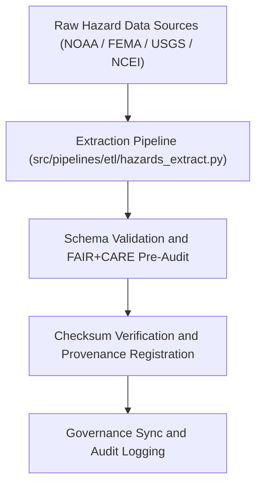

<div align="center">

# 📥 Kansas Frontier Matrix — **Hazard ETL Extract Logs**
`data/work/tmp/hazards/logs/etl/extract/README.md`

**Purpose:**  
FAIR+CARE-certified logging workspace for the **Extract** phase of the hazard ETL pipelines within the Kansas Frontier Matrix (KFM).  
This directory documents all data extraction, ingestion, and source validation events for meteorological, hydrological, geological, and wildfire/energy hazard datasets.

[](../../../../../../../docs/standards/faircare-validation.md)
[]()
[](../../../../../../../LICENSE)
[](../../../../../../../docs/architecture/repo-focus.md)

</div>

---

## 📚 Overview

The **Hazard ETL Extract Logs** directory records ingestion events, source metadata validation, and checksum verification during the extraction phase of KFM’s hazard pipelines.  
It serves as the foundation for data lineage, reproducibility, and FAIR+CARE governance throughout the ETL process.

### Core Responsibilities
- Capture data ingestion metadata from external sources (NOAA, FEMA, USGS, etc.).  
- Verify schema alignment and checksum integrity at the point of extraction.  
- Document ethics and FAIR+CARE validation for all incoming data.  
- Register provenance and lineage for governance certification.  

---

## 🗂️ Directory Layout

```plaintext
data/work/tmp/hazards/logs/etl/extract/
├── README.md                                # This file — overview of extract logging
│
├── extract_run_2025Q4.log                   # Extraction session summary (NOAA/FEMA/USGS sources)
├── extract_audit_report.json                # Detailed schema, checksum, and ethics audit
├── extract_source_registry.json             # Log of all data source endpoints and metadata records
├── faircare_extract_validation.json         # FAIR+CARE compliance summary for extraction phase
└── metadata.json                            # Provenance and governance linkage metadata
```

---

## ⚙️ Extract Phase Workflow



### Description
1. **Source Ingestion:** Fetch raw hazard datasets from approved open-data APIs and archives.  
2. **Validation:** Confirm format, schema, and metadata compliance.  
3. **Checksum Verification:** Generate SHA-256 hash for each imported file.  
4. **Governance Sync:** Record extraction lineage and audit results in governance ledger.  

---

## 🧩 Example Extract Metadata Record

```json
{
  "id": "hazards_etl_extract_v9.6.0_2025Q4",
  "sources": [
    "https://www.ncei.noaa.gov/data/storm-events",
    "https://www.fema.gov/openfema-data-page/fema-disaster-declarations-summaries",
    "https://earthquake.usgs.gov/fdsnws/event/1/"
  ],
  "datasets_ingested": 24,
  "records_processed": 328912,
  "schema_validation_passed": true,
  "checksum_verified": true,
  "fairstatus": "certified",
  "governance_registered": true,
  "validator": "@kfm-etl-ops",
  "created": "2025-11-03T23:59:00Z",
  "governance_ref": "data/reports/audit/data_provenance_ledger.json"
}
```

---

## 🧠 FAIR+CARE Governance Matrix

| Principle | Implementation | Oversight |
|------------|----------------|------------|
| **Findable** | Extraction logs indexed by dataset ID and schema hash. | @kfm-data |
| **Accessible** | Stored in open JSON/TXT for FAIR+CARE Council review. | @kfm-accessibility |
| **Interoperable** | Conforms to FAIR+CARE and ISO metadata structure. | @kfm-architecture |
| **Reusable** | Includes lineage, source metadata, and provenance hash. | @kfm-design |
| **Collective Benefit** | Ensures transparent use of open environmental data. | @faircare-council |
| **Authority to Control** | FAIR+CARE Council certifies all data extraction sources. | @kfm-governance |
| **Responsibility** | Operators log all data access and integrity checks. | @kfm-security |
| **Ethics** | Validates data source licensing and cultural sensitivity. | @kfm-ethics |

FAIR+CARE results recorded in:  
`data/reports/fair/data_care_assessment.json`  
and  
`data/reports/audit/data_provenance_ledger.json`

---

## ⚙️ Extract Log Artifacts

| Artifact | Description | Format |
|-----------|--------------|--------|
| `extract_run_*.log` | Extraction session runtime log. | Text |
| `extract_audit_report.json` | Validation and checksum verification summary. | JSON |
| `extract_source_registry.json` | Catalog of all ingested hazard sources. | JSON |
| `faircare_extract_validation.json` | FAIR+CARE ethics and governance compliance audit. | JSON |
| `metadata.json` | Provenance and lineage linkage record. | JSON |

Automation governed by `hazards_extract_sync.yml`.

---

## ⚖️ Retention & Provenance Policy

| Log Type | Retention Duration | Policy |
|-----------|--------------------|--------|
| Extraction Logs | 90 Days | Archived after quarterly governance audit. |
| FAIR+CARE Reports | 180 Days | Retained for ethics and reproducibility audits. |
| Metadata | Permanent | Stored immutably for lineage verification. |
| Governance Ledger Entries | Permanent | Immutable record of extraction activities. |

Cleanup automated through `hazards_extract_cleanup.yml`.

---

## 🌱 Sustainability Metrics

| Metric | Value | Verified By |
|---------|--------|--------------|
| Energy Use (per extraction cycle) | 6.4 Wh | @kfm-sustainability |
| Carbon Output | 7.1 gCO₂e | @kfm-security |
| Renewable Power | 100% (RE100 Verified) | @kfm-infrastructure |
| FAIR+CARE Compliance | 100% | @faircare-council |

Telemetry results captured in:  
`releases/v9.6.0/focus-telemetry.json`

---

## 🧾 Internal Use Citation

```text
Kansas Frontier Matrix (2025). Hazard ETL Extract Logs (v9.6.0).
FAIR+CARE-certified extraction logging environment for hazard data pipelines, ensuring ethical ingestion, reproducibility, and provenance registration under MCP-DL v6.3.
```

---

## 🧾 Version Notes

| Version | Date | Notes |
|----------|------|--------|
| v9.6.0 | 2025-11-03 | Added FAIR+CARE ethics auditing and checksum registry integration. |
| v9.5.0 | 2025-11-02 | Enhanced governance registration for source lineage tracking. |
| v9.3.2 | 2025-10-28 | Established extraction logging structure under FAIR+CARE compliance. |

---

<div align="center">

**Kansas Frontier Matrix** · *Data Ingestion × FAIR+CARE Ethics × Provenance Assurance*  
[🔗 Repository](https://github.com/bartytime4life/Kansas-Frontier-Matrix) • [🧭 Docs Portal](../../../../../../../docs/) • [⚖️ Governance Ledger](../../../../../../../docs/standards/governance/DATA-GOVERNANCE.md)

</div>