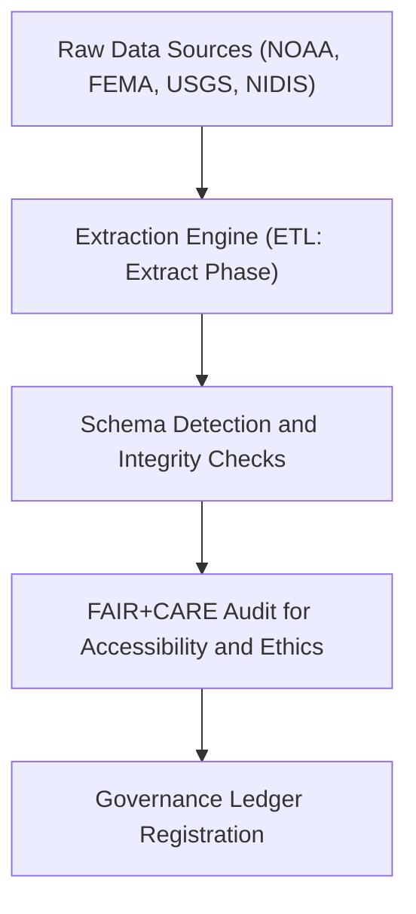

<div align="center">

# 📥 Kansas Frontier Matrix — **Hazard ETL Extract Logs**
`data/work/tmp/hazards/logs/etl/extract/README.md`

**Purpose:** Repository for extract-phase ETL logs documenting data sourcing, ingestion, and pre-transformation operations for hazard datasets in the Kansas Frontier Matrix (KFM).  
These logs capture data provenance, schema discovery, and FAIR+CARE pre-audits during the extract stage of KFM’s hazard data pipelines.

[](../../../../../../../docs/standards/faircare-validation.md)
[](../../../../../../../LICENSE)
[](../../../../../../../docs/architecture/repo-focus.md)

</div>

---

## 📚 Overview

The `data/work/tmp/hazards/logs/etl/extract/` directory contains **extraction-stage logs** for all raw hazard data sources ingested into KFM’s ETL pipelines.  
Each log provides evidence of dataset provenance, extraction timing, schema identification, and source compliance under FAIR+CARE governance.

### Core Functions:
- Document hazard dataset extractions from raw sources (NOAA, FEMA, USGS, NIDIS).  
- Record dataset origin metadata, file types, and integrity checksums.  
- Validate FAIR+CARE accessibility and licensing during ingestion.  
- Maintain traceability for all extract operations across hazard data workflows.  

All extraction records are immutable and versioned for governance audit reproducibility.

---

## 🗂️ Directory Layout

```plaintext
data/work/tmp/hazards/logs/etl/extract/
├── README.md                               # This file — overview of hazard ETL extract logs
│
├── extract_run_log_2024Q4.log              # Extraction process log (Q4 2024)
├── data_source_registry_2024Q4.json        # Registry of hazard data sources and metadata
├── checksum_verification_report_2024Q4.json # Integrity verification for all extracted datasets
├── schema_discovery_summary_2024Q4.csv     # Field-level schema discovery results
└── metadata.json                           # Provenance, checksums, and governance linkage
```

---

## ⚙️ Extraction Workflow



### Workflow Description:
1. **Data Retrieval:** Raw hazard datasets downloaded or accessed via API connectors.  
2. **Schema Identification:** Extracted fields analyzed for structural and metadata alignment.  
3. **Integrity Validation:** Checksums calculated and compared to source manifests.  
4. **FAIR+CARE Pre-Audit:** Confirm dataset licensing, ethical use, and accessibility compliance.  
5. **Governance Registration:** Extraction event recorded in provenance ledger.

---

## 🧩 Example Metadata Record

```json
{
  "id": "etl_extract_hazards_v9.3.2_2024Q4",
  "etl_cycle": "Q4 2024",
  "source_endpoints": [
    "https://www.noaa.gov/storm-events",
    "https://www.fema.gov/flood-maps",
    "https://waterdata.usgs.gov/ks/nwis"
  ],
  "records_ingested": 543210,
  "schema_fields_detected": 186,
  "checksums_verified": true,
  "fairstatus": "pre-certified",
  "archived": false,
  "validator": "@kfm-etl-ops",
  "created": "2025-10-28T16:50:00Z",
  "checksum": "sha256:12e7e6f9a3b95f6d4fa89a97e3c91d38f24d41e7...",
  "governance_ref": "data/reports/audit/data_provenance_ledger.json"
}
```

---

## 🧠 FAIR+CARE Governance Alignment

| Principle | Implementation |
|------------|----------------|
| **Findable** | Extraction events indexed by source endpoint and ETL cycle. |
| **Accessible** | Extraction metadata available under open FAIR+CARE schema. |
| **Interoperable** | Schema harmonized with DCAT and KFM metadata contracts. |
| **Reusable** | Metadata includes provenance, schema mappings, and licensing. |
| **Collective Benefit** | Promotes open data transparency and hazard research collaboration. |
| **Authority to Control** | FAIR+CARE Council validates all extraction sources. |
| **Responsibility** | ETL teams document extraction parameters and validation checks. |
| **Ethics** | Ensures all datasets respect ethical, legal, and accessibility standards. |

Governance and audit entries recorded in:  
`data/reports/audit/data_provenance_ledger.json`  
and `data/reports/fair/data_care_assessment.json`.

---

## ⚙️ Extraction Artifacts

| File | Description | Format |
|------|--------------|--------|
| `extract_run_log_*.log` | Raw log of extraction processes, sources, and results. | Text |
| `data_source_registry_*.json` | Details extracted data origins and FAIR+CARE validation. | JSON |
| `checksum_verification_report_*.json` | Records hash integrity validation for all raw files. | JSON |
| `schema_discovery_summary_*.csv` | Field and schema-level structure summaries. | CSV |
| `metadata.json` | Stores governance linkage, checksums, and provenance chain. | JSON |

All extraction tasks managed by automated ETL workflows (`etl_extract_sync.yml`).

---

## ⚖️ Governance & Provenance Integration

| Record | Description |
|---------|-------------|
| `metadata.json` | Tracks extraction provenance, checksum, and FAIR+CARE linkage. |
| `data/reports/audit/data_provenance_ledger.json` | Logs extraction lineage and governance synchronization. |
| `data/reports/fair/data_care_assessment.json` | FAIR+CARE accessibility and ethics audit records. |
| `releases/v9.3.2/manifest.zip` | Contains checksum registry for extracted datasets. |

Governance synchronization and audit validation automated through KFM CI/CD processes.

---

## 🧾 Retention & Audit Policy

| Record Type | Retention Duration | Policy |
|--------------|--------------------|--------|
| Extraction Logs | 365 days | Archived after governance certification. |
| Source Registries | Permanent | Retained for provenance and FAIR+CARE traceability. |
| Schema Discovery Reports | 180 days | Archived for reference and schema updates. |
| Metadata | Permanent | Stored in ledger for provenance verification. |

Cleanup and archival automated by `etl_extract_cleanup.yml`.

---

## 🧾 Internal Use Citation

```text
Kansas Frontier Matrix (2025). Hazard ETL Extract Logs (v9.3.2).
Extraction-stage documentation and governance-certified provenance records for hazard data ingestion workflows.
Maintained under FAIR+CARE and MCP-DL v6.3 governance for reproducibility and ethical transparency.
```

---

## 🧾 Version Notes

| Version | Date | Notes |
|----------|------|--------|
| v9.3.2 | 2025-10-28 | Added checksum verification and FAIR+CARE governance linkage. |
| v9.2.0 | 2024-07-15 | Introduced automated schema discovery and source registry validation. |
| v9.0.0 | 2023-01-10 | Established extraction log workspace for hazard ETL pipelines. |

---

<div align="center">

**Kansas Frontier Matrix** · *Data Extraction × FAIR+CARE Ethics × Provenance Integrity*  
[🔗 Repository](https://github.com/bartytime4life/Kansas-Frontier-Matrix) • [🧭 Docs Portal](../../../../../../../docs/) • [⚖️ Governance Ledger](../../../../../../../docs/standards/governance/)

</div>