<div align="center">

# 📥 Kansas Frontier Matrix — **Hazard ETL Extract Logs**
`data/work/tmp/hazards/logs/etl/extract/README.md`

**Purpose:**  
FAIR+CARE-certified logging hub for the **Extract** phase of the hazard ETL pipelines within KFM.  
Tracks data ingestion, validation, and checksum verification across meteorological, hydrological, geological, and wildfire/energy hazard sources.

[](../../../../../../../docs/architecture/README.md)
[](../../../../../../../docs/standards/faircare-validation.md)
[]()
[](../../../../../../../LICENSE)

</div>

---

## 📘 Overview

The **Hazard ETL Extract Logs** record ingestion, source validation, and checksum events during the extraction phase of hazard ETL workflows.  
Serves as the foundation for lineage integrity, FAIR+CARE ethics compliance, and provenance certification.

### Core Responsibilities
- Capture ingestion metadata from NOAA, FEMA, USGS, and NCEI sources.  
- Validate schema structure, data types, and licensing.  
- Verify checksum integrity and ethics compliance.  
- Register all extraction lineage and FAIR+CARE audit results in governance ledgers.  

---

## 🗂️ Directory Layout

```plaintext
data/work/tmp/hazards/logs/etl/extract/
├── README.md
├── extract_run_2025Q4.log
├── extract_audit_report.json
├── extract_source_registry.json
├── faircare_extract_validation.json
└── metadata.json
```

---

## ⚙️ Extract Workflow

```mermaid
flowchart TD
    A["Raw Hazards (NOAA · FEMA · USGS · NCEI)"] --> B["Ingestion via src/pipelines/etl/hazards_extract.py"]
    B --> C["Schema Validation + FAIR+CARE Ethics Audit"]
    C --> D["Checksum Verification + Provenance Logging"]
    D --> E["Governance Sync → data/reports/audit/data_provenance_ledger.json"]
```



### Steps
1. **Source Ingestion** — Retrieve hazard datasets from open repositories.  
2. **Schema Validation** — Verify structure and metadata conformity.  
3. **Checksum Audit** — Compute and confirm SHA-256 integrity.  
4. **Governance Sync** — Record extraction lineage in audit ledgers.

---

## 🧩 Example Extract Metadata Record

```json
{
  "id": "hazards_etl_extract_v9.7.0_2025Q4",
  "sources": [
    "https://www.ncei.noaa.gov/data/storm-events",
    "https://www.fema.gov/openfema-data-page/fema-disaster-declarations-summaries",
    "https://earthquake.usgs.gov/fdsnws/event/1/"
  ],
  "datasets_ingested": 24,
  "records_processed": 328912,
  "schema_validation_passed": true,
  "checksum_verified": true,
  "fairstatus": "certified",
  "governance_registered": true,
  "validator": "@kfm-etl-ops",
  "created": "2025-11-06T23:59:00Z",
  "governance_ref": "data/reports/audit/data_provenance_ledger.json"
}
```

---

## 🧠 FAIR+CARE Governance Matrix

| Principle | Implementation | Oversight |
|-----------|----------------|-----------|
| **Findable** | Logs indexed by dataset ID, schema hash, and cycle. | `@kfm-data` |
| **Accessible** | JSON/TXT formats open for FAIR+CARE Council audits. | `@kfm-accessibility` |
| **Interoperable** | Conforms to FAIR+CARE, ISO, and MCP-DL lineage schemas. | `@kfm-architecture` |
| **Reusable** | Lineage metadata and source hashes ensure reproducibility. | `@kfm-design` |
| **Collective Benefit** | Promotes ethical open-data reusability. | `@faircare-council` |
| **Authority to Control** | Council certifies data sources and FAIR+CARE compliance. | `@kfm-governance` |
| **Responsibility** | ETL operators log all access and checksum events. | `@kfm-security` |
| **Ethics** | Validates licensing, attribution, and cultural sensitivity. | `@kfm-ethics` |

**Audit refs:**  
`data/reports/fair/data_care_assessment.json` · `data/reports/audit/data_provenance_ledger.json`

---

## ⚙️ Extract Log Artifacts

| Artifact | Description | Format |
|-----------|--------------|--------|
| `extract_run_*.log` | Runtime extraction log | Text |
| `extract_audit_report.json` | Schema + checksum validation summary | JSON |
| `extract_source_registry.json` | Catalog of ingested data sources | JSON |
| `faircare_extract_validation.json` | FAIR+CARE pre-validation results | JSON |
| `metadata.json` | Provenance and governance linkage metadata | JSON |

**Automation:** `hazards_extract_sync.yml`

---

## ♻️ Retention & Sustainability

| Log Type | Retention | Policy |
|----------|----------:|--------|
| Extraction Logs | 90 Days | Archived after governance review. |
| FAIR+CARE Reports | 180 Days | Maintained for ethics validation. |
| Metadata | Permanent | Immutable under blockchain provenance. |
| Ledger Entries | Permanent | Serves as certified lineage record. |

**Telemetry:** `../../../../../../../releases/v9.7.0/focus-telemetry.json`

---

## 🌱 Sustainability Metrics

| Metric | Value | Verified By |
|--------|------:|-------------|
| Energy Use (per cycle) | 6.2 Wh | `@kfm-sustainability` |
| Carbon Output | 6.8 gCO₂e | `@kfm-security` |
| Renewable Power | 100% | `@kfm-infrastructure` |
| FAIR+CARE Compliance | 100% | `@faircare-council` |

---

## 🧾 Citation

```text
Kansas Frontier Matrix (2025). Hazard ETL Extract Logs (v9.7.0).
FAIR+CARE-certified logging environment for ethical ingestion and reproducible provenance tracking of hazard datasets under MCP-DL v6.3.
```

---

<div align="center">

**Kansas Frontier Matrix**  
*Data Ingestion × FAIR+CARE Ethics × Provenance Assurance*  
© 2025 Kansas Frontier Matrix — Internal Governance Data · Diamond⁹ Ω / Crown∞Ω Ultimate Certified  

[Back to Hazard ETL Logs](../README.md) · [Governance Charter](../../../../../../../docs/standards/governance/DATA-GOVERNANCE.md)

</div>