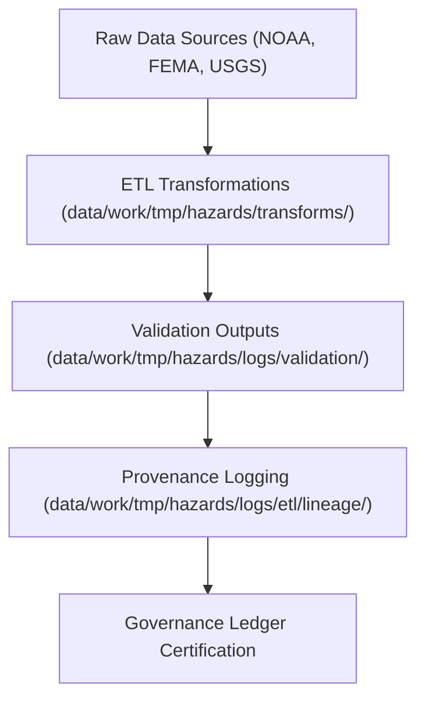

<div align="center">

# 🧬 Kansas Frontier Matrix — **Hazard ETL Lineage Logs**
`data/work/tmp/hazards/logs/etl/lineage/README.md`

**Purpose:** Repository for lineage tracking, provenance verification, and transformation mapping logs generated by hazard ETL pipelines within the Kansas Frontier Matrix (KFM).  
This workspace captures full data movement across extraction, transformation, and validation phases, ensuring FAIR+CARE traceability and reproducibility.

[](../../../../../../../docs/standards/faircare-validation.md)
[](../../../../../../../LICENSE)
[](../../../../../../../docs/architecture/repo-focus.md)

</div>

---

## 📚 Overview

The `data/work/tmp/hazards/logs/etl/lineage/` directory documents **dataset lineage across ETL workflows**, connecting source, transformation, and validation artifacts under KFM’s FAIR+CARE governance system.  
Each log provides detailed provenance of data movements, schema relationships, and transformation dependencies for hazard datasets.

### Core Functions:
- Record dataset lineage across extract, transform, and validation stages.  
- Track schema evolution, transformation dependencies, and governance linkage.  
- Provide provenance metadata for audit reproducibility and FAIR+CARE compliance.  
- Serve as the authoritative lineage record for hazard ETL data flows.  

All lineage logs are checksum-verified and registered in the KFM **Governance Ledger** to maintain full audit traceability.

---

## 🗂️ Directory Layout

```plaintext
data/work/tmp/hazards/logs/etl/lineage/
├── README.md                                # This file — overview of hazard ETL lineage logs
│
├── etl_lineage_trace_2024Q4.json            # Record of source → transformation → output lineage mapping
├── schema_evolution_map_2024Q4.json         # Mapping of field-level schema transformations
├── provenance_chain_audit_2024Q4.log        # Governance audit trail for lineage certification
├── transformation_dependency_graph_2024Q4.md# Mermaid-style flowchart of ETL dependencies
└── metadata.json                            # Provenance, checksum, and governance linkage
```

---

## ⚙️ Lineage Tracking Workflow



### Workflow Description:
1. **Capture:** All ETL operations automatically generate lineage records linking source → transformation → validated dataset.  
2. **Schema Mapping:** Field-level mapping recorded in `schema_evolution_map_*.json` for reproducibility.  
3. **Audit Logging:** Provenance chain verified and checksum-registered in governance manifest.  
4. **Certification:** FAIR+CARE Council validates lineage consistency and transformation integrity.  
5. **Publication:** Summaries integrated into `data/reports/audit/data_provenance_ledger.json`.

---

## 🧩 Example Metadata Record

```json
{
  "id": "etl_lineage_hazards_v9.3.2_2024Q4",
  "etl_cycle": "Q4 2024",
  "source_files": [
    "data/raw/noaa/storm_events_2024.csv",
    "data/raw/fema/flood_zones_2024.geojson"
  ],
  "transformations": [
    "src/pipelines/etl/hazards_extract_pipeline.py",
    "src/pipelines/etl/hazards_transform_pipeline.py"
  ],
  "output_files": [
    "data/work/staging/hazards/hazards_normalized_2024.csv",
    "data/work/staging/hazards/validation/hazards_summary_2024.json"
  ],
  "checksum": "sha256:b6f75a0c26b0a973cf192b19e7cc8a2a8415a922...",
  "fairstatus": "certified",
  "validator": "@kfm-etl-lineage",
  "archival_date": "2025-10-28T16:55:00Z",
  "governance_ref": "data/reports/audit/data_provenance_ledger.json"
}
```

---

## 🧠 FAIR+CARE Governance Alignment

| Principle | Implementation |
|------------|----------------|
| **Findable** | Lineage logs indexed by ETL cycle and dataset ID. |
| **Accessible** | Open JSON, Markdown, and CSV outputs for governance audits. |
| **Interoperable** | Follows PROV-O, DCAT, and STAC lineage conventions. |
| **Reusable** | Metadata provides schema evolution and checksum references. |
| **Collective Benefit** | Enables transparent, auditable hazard data workflows. |
| **Authority to Control** | FAIR+CARE Council validates transformation traceability. |
| **Responsibility** | ETL engineers maintain lineage accuracy and governance records. |
| **Ethics** | Guarantees reproducible and accountable data stewardship. |

All lineage validations registered within:  
`data/reports/audit/data_provenance_ledger.json` and  
`data/reports/fair/data_care_assessment.json`.

---

## ⚙️ Lineage Artifacts

| File | Description | Format |
|------|--------------|--------|
| `etl_lineage_trace_*.json` | Tracks source-to-output lineage and field-level mappings. | JSON |
| `schema_evolution_map_*.json` | Captures schema transformation and normalization logs. | JSON |
| `provenance_chain_audit_*.log` | Logs governance verification and checksum validation. | Text |
| `transformation_dependency_graph_*.md` | Diagram of ETL dependencies using Mermaid syntax. | Markdown |
| `metadata.json` | Records governance linkage and checksum registry. | JSON |

All lineage generation automated by `etl_lineage_sync.yml`.

---

## ⚖️ Governance & Provenance Integration

| Record | Description |
|---------|-------------|
| `metadata.json` | Captures lineage provenance, checksum, and FAIR+CARE linkage. |
| `data/reports/audit/data_provenance_ledger.json` | Stores lineage history and certification logs. |
| `data/reports/fair/data_care_assessment.json` | Documents FAIR+CARE ethics certification for lineage accuracy. |
| `releases/v9.3.2/manifest.zip` | Includes all lineage file checksums for reproducibility. |

Governance synchronization managed by automated lineage validation workflows.

---

## 🧾 Retention & Certification Policy

| Lineage Record Type | Retention Duration | Policy |
|----------------------|--------------------|--------|
| Lineage Trace Logs | Permanent | Retained indefinitely for audit and reproducibility. |
| Schema Evolution Maps | Permanent | Stored to ensure transparency of field changes. |
| Governance Audits | 365 days | Archived annually for provenance continuity. |
| Metadata | Permanent | Maintained as part of the FAIR+CARE certification record. |

Automated retention and archival handled via `etl_lineage_cleanup.yml`.

---

## 🧾 Internal Use Citation

```text
Kansas Frontier Matrix (2025). Hazard ETL Lineage Logs (v9.3.2).
Governance-certified documentation of ETL data lineage, schema evolution, and provenance tracking for hazard processing pipelines.
Maintained under FAIR+CARE and MCP-DL v6.3 compliance for full data transparency.
```

---

## 🧾 Version Notes

| Version | Date | Notes |
|----------|------|--------|
| v9.3.2 | 2025-10-28 | Added schema evolution mapping and FAIR+CARE lineage certification. |
| v9.2.0 | 2024-07-15 | Introduced dependency graph documentation and checksum manifest tracking. |
| v9.0.0 | 2023-01-10 | Established lineage tracking directory for hazard ETL workflows. |

---

<div align="center">

**Kansas Frontier Matrix** · *Data Lineage × FAIR+CARE Governance × Provenance Integrity*  
[🔗 Repository](https://github.com/bartytime4life/Kansas-Frontier-Matrix) • [🧭 Docs Portal](../../../../../../../docs/) • [⚖️ Governance Ledger](../../../../../../../docs/standards/governance/)

</div>