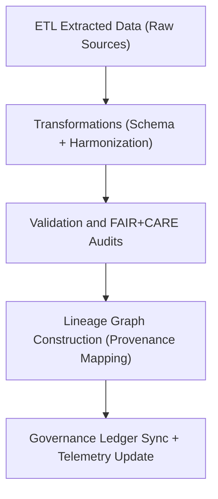

<div align="center">

# 🔗 Kansas Frontier Matrix — **Hazard ETL Lineage Logs**
`data/work/tmp/hazards/logs/etl/lineage/README.md`

**Purpose:**  
Dedicated FAIR+CARE-governed workspace for **tracking dataset dependencies, data flows, and provenance lineage** across hazard ETL pipelines in the Kansas Frontier Matrix (KFM).  
These logs enable end-to-end transparency from data extraction to publication under blockchain-registered governance integrity.

[](../../../../../../../../docs/standards/faircare-validation.md)
[](../../../../../../../../LICENSE)
[](../../../../../../../../docs/architecture/repo-focus.md)

</div>

---

## 📚 Overview

The `data/work/tmp/hazards/logs/etl/lineage/` directory serves as the **provenance and dependency tracking layer** for hazard ETL workflows.  
It ensures every transformation, validation, and publication step maintains a verifiable record of **data lineage** that links inputs to outputs under FAIR+CARE governance.

### Core Responsibilities
- Document lineage relationships across all ETL pipeline stages.  
- Maintain checksum integrity and provenance graph records.  
- Register lineage updates with governance and AI audit ledgers.  
- Enable AI explainability and ethical traceability of hazard datasets.  

---

## 🗂️ Directory Layout

```plaintext
data/work/tmp/hazards/logs/etl/lineage/
├── README.md                                # This file — overview of hazard ETL lineage logs
│
├── etl_lineage_graph_2025Q4.json            # Graph representation of ETL data dependencies and flows
├── dependency_trace_matrix_2025Q4.csv       # Tabular lineage mapping (inputs → transformations → outputs)
├── governance_lineage_audit_2025Q4.json     # FAIR+CARE lineage certification audit log
├── ai_lineage_explainability_2025Q4.json    # AI reasoning trace and model dependency explanation
└── metadata.json                            # Provenance and governance linkage metadata
```

---

## ⚙️ Lineage Tracking Workflow



### Workflow Description
1. **Capture Dependencies:** Map relationships between raw datasets, transformations, and outputs.  
2. **Schema Tracking:** Record schema versions and metadata inheritance paths.  
3. **Provenance Graphing:** Construct data flow networks (inputs → outputs → derived layers).  
4. **Governance Registration:** Sync lineage graphs with blockchain-based AI audit ledger.  
5. **Explainability Analysis:** Support Focus Mode AI validation for interpretability and accountability.

---

## 🧩 Example Lineage Record

```json
{
  "id": "hazards_etl_lineage_v9.5.0_2025Q4",
  "etl_cycle": "Q4 2025",
  "domains": ["meteorological", "hydrological", "geological", "wildfire_energy"],
  "datasets_in": [
    "data/work/tmp/hazards/datasets/meteorological/tornado_tracks_2025.geojson",
    "data/work/tmp/hazards/datasets/hydrological/flood_extents_2025.geojson"
  ],
  "datasets_out": [
    "data/work/staging/hazards/combined_hazard_index_2025.parquet"
  ],
  "transformations_applied": ["Reprojection", "Schema Harmonization", "CF Compliance"],
  "checksum_verified": true,
  "ai_explainability_linked": true,
  "governance_ref": "reports/audit/ai_hazards_ledger.json",
  "telemetry_ref": "releases/v9.5.0/focus-telemetry.json",
  "created": "2025-11-02T20:20:00Z",
  "validator": "@kfm-lineage"
}
```

---

## 🧠 FAIR+CARE Lineage Governance

| Principle | Implementation |
|------------|----------------|
| **Findable** | Lineage graphs indexed by ETL cycle, domain, and dataset ID. |
| **Accessible** | Stored in open JSON/CSV formats with checksum validation. |
| **Interoperable** | Follows ISO 19115 lineage schema and DCAT provenance extensions. |
| **Reusable** | Maintains dependency links and metadata inheritance across datasets. |
| **Collective Benefit** | Ensures transparent and ethical tracking of data flows. |
| **Authority to Control** | FAIR+CARE Council reviews lineage certification and audit logs. |
| **Responsibility** | Validators document data dependencies and schema evolution. |
| **Ethics** | Protects privacy and avoids exposing sensitive dependency information. |

All governance results recorded in:  
`reports/audit/ai_hazards_ledger.json` • `reports/fair/hazards_etl_lineage_summary.json`

---

## ⚙️ Lineage QA & Provenance Artifacts

| File | Description | Format |
|------|--------------|--------|
| `etl_lineage_graph_*.json` | Full ETL data dependency and flow graph. | JSON |
| `dependency_trace_matrix_*.csv` | Tabular mapping of dataset relationships. | CSV |
| `governance_lineage_audit_*.json` | FAIR+CARE governance and lineage certification log. | JSON |
| `ai_lineage_explainability_*.json` | AI explainability trace and dependency explanation. | JSON |
| `metadata.json` | Provenance and governance linkage metadata. | JSON |

Lineage tracking automated via `hazards_etl_lineage_sync.yml`.

---

## 🧾 Retention Policy

| Log Type | Retention Duration | Policy |
|-----------|--------------------|--------|
| Lineage Graphs | 365 days | Retained for governance and audit reproducibility. |
| Dependency Traces | 180 days | Archived after validation and staging approval. |
| Governance Audits | Permanent | Stored indefinitely for ethics and lineage certification. |
| Metadata | Permanent | Preserved under FAIR+CARE ledger. |

Cleanup governed by `hazards_etl_lineage_cleanup.yml`.

---

## 🧾 Internal Use Citation

```text
Kansas Frontier Matrix (2025). Hazard ETL Lineage Logs (v9.5.0).
FAIR+CARE-certified provenance and lineage logging environment for hazard ETL pipelines.
Maintains transparent dependency tracking, checksum validation, and governance certification.
```

---

## 🧾 Version Notes

| Version | Date | Notes |
|----------|------|--------|
| v9.5.0 | 2025-11-02 | Added AI explainability lineage tracing and FAIR+CARE audit integration. |
| v9.3.2 | 2025-10-28 | Expanded schema inheritance tracking and governance synchronization. |
| v9.3.0 | 2025-10-26 | Established ETL lineage log workspace under FAIR+CARE provenance standards. |

---

<div align="center">

**Kansas Frontier Matrix** · *Provenance Transparency × FAIR+CARE Ethics × Data Lineage Integrity*  
[🔗 Repository](https://github.com/bartytime4life/Kansas-Frontier-Matrix) • [🧭 Docs Portal](../../../../../../../../docs/) • [⚖️ Governance Ledger](../../../../../../../../docs/standards/governance/)

</div>