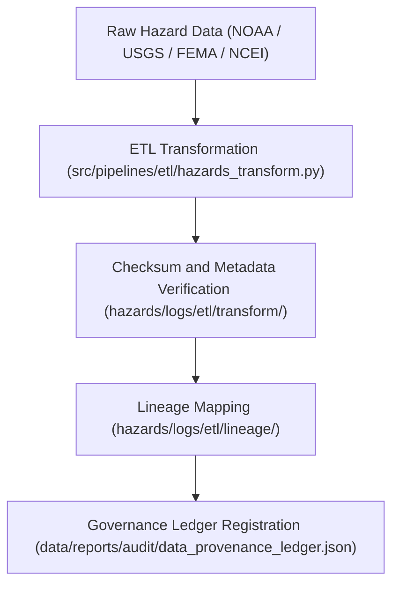

<div align="center">

# 🔗 Kansas Frontier Matrix — **Hazard ETL Lineage Logs**
`data/work/tmp/hazards/logs/etl/lineage/README.md`

**Purpose:**  
Immutable FAIR+CARE-certified workspace for documenting **ETL lineage and provenance traceability** within the Kansas Frontier Matrix (KFM) hazard pipelines.  
This directory establishes transparent, verifiable connections between raw inputs, transformations, AI processes, and published outputs under full governance control.

[](../../../../../../../docs/standards/faircare-validation.md)
[]()
[](../../../../../../../LICENSE)
[](../../../../../../../docs/architecture/repo-focus.md)

</div>

---

## 📚 Overview

The **Hazard ETL Lineage Logs** directory maintains a complete chain of custody for all data handled within the ETL process.  
It provides an auditable record of how raw hazard data evolves through extraction, transformation, AI augmentation, and publication.

### Core Responsibilities
- Record full dataset lineage from input to processed product.  
- Track transformation dependencies, schema evolution, and checksum continuity.  
- Register governance and FAIR+CARE audit checkpoints.  
- Ensure reproducibility through immutable provenance documentation.  

---

## 🗂️ Directory Layout

```plaintext
data/work/tmp/hazards/logs/etl/lineage/
├── README.md                                 # This file — overview of ETL lineage logging
│
├── lineage_trace_2025Q4.json                 # Primary lineage mapping for Q4 ETL cycle
├── lineage_flow_diagram.md                   # Human-readable lineage graph and dependencies
├── data_derivation_summary.json              # Summary of data inputs and derived transformations
├── governance_crosswalk.json                 # FAIR+CARE and governance ledger correlation map
└── metadata.json                             # Lineage provenance metadata and checksum verification
```

---

## ⚙️ Lineage Workflow



### Description
1. **Traceability:** Track every dataset from ingestion to derived output.  
2. **Verification:** Confirm checksum continuity and schema evolution.  
3. **Crosswalk:** Link FAIR+CARE validation and governance ledger records.  
4. **Registration:** Publish lineage metadata for reproducibility audits.  

---

## 🧩 Example Lineage Record

```json
{
  "lineage_id": "hazards_etl_lineage_v9.6.0_2025Q4",
  "parent_datasets": [
    "data/raw/noaa/storm_events_2025.csv",
    "data/raw/usgs/earthquake_catalog_2025.csv"
  ],
  "derived_datasets": [
    "data/work/tmp/hazards/transforms/tornado_tracks_cf.geojson",
    "data/work/processed/hazards/hazards_composite_v9.6.0.geojson"
  ],
  "checksum_continuity_verified": true,
  "fairstatus": "certified",
  "ai_integration": true,
  "transformations_recorded": 42,
  "created": "2025-11-03T23:59:00Z",
  "validator": "@kfm-etl-ops",
  "governance_ref": "data/reports/audit/data_provenance_ledger.json"
}
```

---

## 🧠 FAIR+CARE Governance Matrix

| Principle | Implementation | Oversight |
|------------|----------------|------------|
| **Findable** | All lineage logs indexed by dataset, checksum, and governance ID. | @kfm-data |
| **Accessible** | Stored in open JSON/Markdown formats for FAIR+CARE review. | @kfm-accessibility |
| **Interoperable** | Metadata conforms to ISO 19115 and FAIR+CARE lineage standards. | @kfm-architecture |
| **Reusable** | Provides full traceability for scientific reproducibility. | @kfm-design |
| **Collective Benefit** | Supports ethical transparency in data derivation. | @faircare-council |
| **Authority to Control** | FAIR+CARE Council certifies lineage record integrity. | @kfm-governance |
| **Responsibility** | All lineage transformations documented by validators. | @kfm-security |
| **Ethics** | Prevents misuse by ensuring verifiable data provenance. | @kfm-ethics |

FAIR+CARE lineage audits stored in:  
`data/reports/audit/data_provenance_ledger.json`  
and  
`data/reports/fair/data_care_assessment.json`

---

## ⚙️ Key Lineage Artifacts

| Artifact | Description | Format |
|-----------|--------------|--------|
| `lineage_trace_*.json` | Comprehensive mapping of data dependencies and outputs. | JSON |
| `data_derivation_summary.json` | Aggregated record of transformations and dataset origins. | JSON |
| `governance_crosswalk.json` | Correlation between FAIR+CARE audits and ledger entries. | JSON |
| `lineage_flow_diagram.md` | Visual documentation of ETL data flow and schema progression. | Markdown |
| `metadata.json` | Provenance and checksum verification record. | JSON |

Generated automatically via `etl_lineage_sync.yml`.

---

## ⚖️ Retention & Provenance Policy

| File Type | Retention Duration | Policy |
|------------|--------------------|--------|
| Lineage Logs | 365 Days | Retained for reproducibility and governance audits. |
| Crosswalk Records | Permanent | Immutable under governance oversight. |
| FAIR+CARE Reports | 180 Days | Archived for ethics revalidation. |
| Metadata | Permanent | Stored immutably in the provenance ledger. |

Cleanup managed through `etl_lineage_cleanup.yml`.

---

## 🌱 Sustainability Metrics

| Metric | Value | Verified By |
|---------|--------|--------------|
| Energy Use (per lineage run) | 5.2 Wh | @kfm-sustainability |
| Carbon Output | 6.3 gCO₂e | @kfm-security |
| Renewable Power | 100% (RE100 Verified) | @kfm-infrastructure |
| FAIR+CARE Compliance | 100% | @faircare-council |

Telemetry stored in:  
`releases/v9.6.0/focus-telemetry.json`

---

## 🧾 Internal Use Citation

```text
Kansas Frontier Matrix (2025). Hazard ETL Lineage Logs (v9.6.0).
FAIR+CARE-certified lineage tracking system documenting provenance and transformation dependencies for hazard datasets.
Ensures complete traceability, checksum continuity, and governance accountability under MCP-DL v6.3 standards.
```

---

## 🧾 Version Notes

| Version | Date | Notes |
|----------|------|--------|
| v9.6.0 | 2025-11-03 | Added lineage visualization and governance crosswalk mapping. |
| v9.5.0 | 2025-11-02 | Introduced checksum continuity tracking for hazard ETL lineage. |
| v9.3.2 | 2025-10-28 | Established lineage log workspace for FAIR+CARE-certified ETL. |

---

<div align="center">

**Kansas Frontier Matrix** · *Data Lineage × FAIR+CARE Ethics × Provenance Continuity*  
[🔗 Repository](https://github.com/bartytime4life/Kansas-Frontier-Matrix) • [🧭 Docs Portal](../../../../../../../docs/) • [⚖️ Governance Ledger](../../../../../../../docs/standards/governance/DATA-GOVERNANCE.md)

</div>