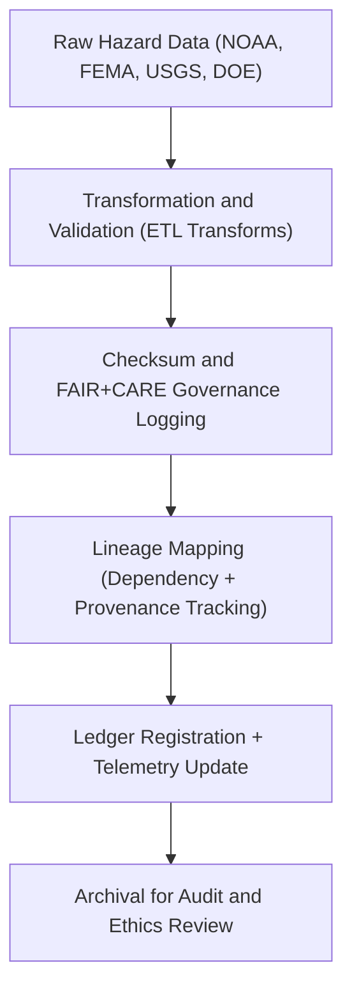

<div align="center">

# 🧬 Kansas Frontier Matrix — **Hazard ETL Lineage Logs**
`data/work/tmp/hazards/logs/etl/lineage/README.md`

**Purpose:**  
Dedicated workspace for recording **dataset lineage, dependency tracking, and transformation ancestry logs** throughout the hazard ETL pipeline within the Kansas Frontier Matrix (KFM).  
Provides cryptographically verifiable data provenance ensuring **full lifecycle traceability, FAIR+CARE alignment, and governance accountability.**

[](../../../../../../../docs/standards/faircare-validation.md)
[](../../../../../../../LICENSE)
[](../../../../../../../docs/architecture/repo-focus.md)

</div>

---

## 📚 Overview

The `data/work/tmp/hazards/logs/etl/lineage/` directory maintains **complete ETL lineage records**, documenting relationships between **raw inputs, transformed outputs, and published datasets** across hazard domains (meteorological, hydrological, geological, wildfire-energy).  
This lineage ensures reproducibility, ethical transparency, and audit readiness across all data governance workflows.

### Core Functions
- Log dataset dependencies and transformation ancestry.  
- Trace lineage from source ingestion through staging, processing, and catalog.  
- Maintain FAIR+CARE-compliant provenance chains with checksum references.  
- Synchronize lineage with **AI Hazards Governance Ledger** and telemetry systems.  

---

## 🗂️ Directory Layout

```plaintext
data/work/tmp/hazards/logs/etl/lineage/
├── README.md                                 # This file — ETL lineage documentation
│
├── lineage_trace_2025Q4.json                 # Dataset-level dependency graph and ancestry mapping
├── transformation_ancestry_2025Q4.json       # Linked metadata of transformations and intermediate files
├── provenance_chain_2025Q4.json              # Provenance record linking raw → staging → processed → catalog
├── ledger_hash_registry_2025Q4.json          # Blockchain-anchored lineage verification hashes
├── governance_crosswalk_2025Q4.json          # Mapping between lineage, governance, and FAIR+CARE reports
└── metadata.json                             # Lineage provenance metadata and FAIR+CARE linkage
```

---

## ⚙️ ETL Lineage Workflow



### Workflow Description
1. **Extraction:** Log dataset source details (origin, schema, and acquisition date).  
2. **Transformation Tracking:** Record each modification, reprojection, or harmonization event.  
3. **Checksum + FAIR+CARE:** Register ethics validation and digital fingerprint for traceability.  
4. **Lineage Mapping:** Establish relationships across data lifecycle (raw → staging → processed).  
5. **Governance:** Commit lineage hash chains to blockchain-anchored provenance ledger.

---

## 🧩 Example Lineage Record

```json
{
  "lineage_id": "hazards_etl_lineage_v9.5.0_2025Q4",
  "raw_sources": [
    "data/raw/noaa/tornado_reports_2025.csv",
    "data/raw/fema/flood_zones_2025.geojson"
  ],
  "intermediate_products": [
    "data/work/tmp/hazards/transforms/tornado_tracks_cf.geojson",
    "data/work/tmp/hazards/transforms/flood_extents_cf.geojson"
  ],
  "final_outputs": [
    "data/work/processed/hazards/tornado_tracks.geojson",
    "data/work/processed/hazards/flood_extents.geojson"
  ],
  "checksum_verified": true,
  "fairstatus": "compliant",
  "governance_synced": true,
  "ledger_hash": "sha256:8bde27b91a45e6a24f51f8d8f38eafcd2a91a6b9...",
  "telemetry_ref": "releases/v9.5.0/focus-telemetry.json",
  "governance_ref": "reports/audit/ai_hazards_ledger.json",
  "created": "2025-11-02T18:55:00Z",
  "validator": "@kfm-etl-lineage"
}
```

---

## 🧠 FAIR+CARE Governance Integration

| Principle | Implementation |
|------------|----------------|
| **Findable** | Lineage indexed by dataset ID and checksum within provenance ledger. |
| **Accessible** | Lineage stored as open JSON under FAIR+CARE license. |
| **Interoperable** | Conforms to ISO 19115, PROV-O, and CIDOC CRM lineage standards. |
| **Reusable** | Enables complete dataset recreation from provenance metadata. |
| **Collective Benefit** | Promotes open, ethical data reuse and environmental resilience. |
| **Authority to Control** | FAIR+CARE Council reviews lineage records before certification. |
| **Responsibility** | Validators document all transformation ancestry chains. |
| **Ethics** | Ensures no alteration of sensitive data or misrepresentation of provenance. |

Governance and audit outputs stored in:  
`reports/audit/ai_hazards_ledger.json` • `reports/fair/hazards_etl_lineage_summary.json`

---

## ⚙️ Provenance & Audit Artifacts

| File | Description | Format |
|------|--------------|--------|
| `lineage_trace_*.json` | Dependency mapping between datasets and transformations. | JSON |
| `transformation_ancestry_*.json` | Detailed logs of intermediate processing steps. | JSON |
| `provenance_chain_*.json` | Hash-linked chain of dataset evolution. | JSON |
| `ledger_hash_registry_*.json` | Blockchain-backed record of lineage signatures. | JSON |
| `metadata.json` | Governance and FAIR+CARE lineage metadata. | JSON |

Automation handled by `etl_lineage_sync.yml`.

---

## 🧾 Retention Policy

| Log Type | Retention Duration | Policy |
|-----------|--------------------|--------|
| Lineage Logs | Permanent | Retained for reproducibility and audit integrity. |
| Transformation Ancestry | 365 days | Archived for governance validation. |
| Checksum & Hash Records | Permanent | Maintained indefinitely under governance ledger. |
| Metadata | Permanent | Preserved for provenance and certification. |

Cleanup governed by `etl_lineage_cleanup.yml`.

---

## 🧾 Internal Use Citation

```text
Kansas Frontier Matrix (2025). Hazard ETL Lineage Logs (v9.5.0).
Comprehensive lineage tracking system recording dependencies, ancestry, and provenance of all hazard datasets across ETL workflows.
Maintained under FAIR+CARE, ISO 19115, and CIDOC CRM lineage governance for transparent reproducibility.
```

---

## 🧾 Version Notes

| Version | Date | Notes |
|----------|------|--------|
| v9.5.0 | 2025-11-02 | Added blockchain lineage registry, telemetry v2 schema, and PROV-O alignment. |
| v9.3.2 | 2025-10-28 | Expanded FAIR+CARE lineage validation and hash integrity reporting. |
| v9.3.0 | 2025-10-26 | Established ETL lineage log directory for multi-domain hazard provenance. |

---

<div align="center">

**Kansas Frontier Matrix** · *Data Provenance × FAIR+CARE Governance × Immutable Lineage*  
[🔗 Repository](https://github.com/bartytime4life/Kansas-Frontier-Matrix) • [🧭 Docs Portal](../../../../../../../docs/) • [⚖️ Governance Ledger](../../../../../../../docs/standards/governance/)

</div>
