<div align="center">

# 🔗 Kansas Frontier Matrix — **Hazard ETL Lineage Logs**
`data/work/tmp/hazards/logs/etl/lineage/README.md`

**Purpose:**  
Immutable, FAIR+CARE-certified workspace for **ETL lineage and provenance traceability** within KFM hazard pipelines.  
Establishes verifiable links between raw inputs, transformations, AI processes, and published outputs under full governance control.

[](../../../../../../../docs/architecture/README.md)
[](../../../../../../../docs/standards/faircare-validation.md)
[]()
[](../../../../../../../LICENSE)

</div>

---

## 📘 Overview

The **Hazard ETL Lineage Logs** maintain a complete chain of custody for hazard data—auditing how raw inputs evolve through extraction, transformation, AI augmentation, and publication.

### Core Responsibilities
- Record full dataset lineage from input to processed product.  
- Track transformation dependencies, schema evolution, and checksum continuity.  
- Register FAIR+CARE audit checkpoints and governance approvals.  
- Ensure reproducibility via immutable provenance documentation.  

---

## 🗂️ Directory Layout

```plaintext
data/work/tmp/hazards/logs/etl/lineage/
├── README.md
├── lineage_trace_2025Q4.json
├── lineage_flow_diagram.md
├── data_derivation_summary.json
├── governance_crosswalk.json
└── metadata.json
```

---

## ⚙️ Lineage Workflow

```mermaid
flowchart TD
    A["Raw Hazards (NOAA · USGS · FEMA · NCEI)"] --> B["ETL Transform (src/pipelines/etl/hazards_transform.py)"]
    B --> C["Checksum + Metadata Verify (hazards/logs/etl/transform/)"]
    C --> D["Lineage Mapping (hazards/logs/etl/lineage/)"]
    D --> E["Governance Registration → data/reports/audit/data_provenance_ledger.json"]
```



### Steps
1. **Traceability** — Track every dataset from ingestion to derived output.  
2. **Verification** — Confirm checksum continuity + schema evolution.  
3. **Crosswalk** — Link FAIR+CARE audits with governance ledger entries.  
4. **Registration** — Publish lineage metadata for reproducibility audits.

---

## 🧩 Example Lineage Record

```json
{
  "lineage_id": "hazards_etl_lineage_v9.7.0_2025Q4",
  "parent_datasets": [
    "data/raw/noaa/storm_events_2025.csv",
    "data/raw/usgs/earthquake_catalog_2025.csv"
  ],
  "derived_datasets": [
    "data/work/tmp/hazards/transforms/tornado_tracks_cf.geojson",
    "data/work/processed/hazards/hazards_composite_v9.7.0.geojson"
  ],
  "checksum_continuity_verified": true,
  "fairstatus": "certified",
  "ai_integration": true,
  "transformations_recorded": 42,
  "created": "2025-11-06T23:59:00Z",
  "validator": "@kfm-etl-ops",
  "governance_ref": "data/reports/audit/data_provenance_ledger.json"
}
```

---

## 🧠 FAIR+CARE Governance Matrix

| Principle | Implementation | Oversight |
|-----------|----------------|-----------|
| **Findable** | Lineage logs indexed by dataset, checksum, governance ID. | `@kfm-data` |
| **Accessible** | JSON/Markdown for FAIR+CARE review. | `@kfm-accessibility` |
| **Interoperable** | ISO 19115 lineage + FAIR+CARE standards. | `@kfm-architecture` |
| **Reusable** | End-to-end traceability for scientific reproducibility. | `@kfm-design` |
| **Collective Benefit** | Ethical transparency in derivation and release. | `@faircare-council` |
| **Authority to Control** | Council certifies lineage integrity. | `@kfm-governance` |
| **Responsibility** | Validators document all transformation steps. | `@kfm-security` |
| **Ethics** | Prevents misuse via verifiable provenance. | `@kfm-ethics` |

**Audit refs:**  
`data/reports/audit/data_provenance_ledger.json` · `data/reports/fair/data_care_assessment.json`

---

## ⚙️ Key Lineage Artifacts

| Artifact                      | Description                                        | Format |
|-------------------------------|----------------------------------------------------|--------|
| `lineage_trace_*.json`        | Dependency graph mapping inputs → outputs          | JSON   |
| `data_derivation_summary.json`| Inputs, transforms, and derived artifacts summary  | JSON   |
| `governance_crosswalk.json`   | FAIR+CARE ↔ Ledger correlation                     | JSON   |
| `lineage_flow_diagram.md`     | Visual flow of data + schema progression           | Markdown |
| `metadata.json`               | Provenance and checksum verification record        | JSON   |

**Automation:** `etl_lineage_sync.yml`

---

## ♻️ Retention & Sustainability

| File Type | Retention | Policy |
|----------|----------:|--------|
| Lineage Logs | 365 Days | Retained for reproducibility & audits. |
| Crosswalk Records | Permanent | Immutable under governance. |
| FAIR+CARE Reports | 180 Days | Archived for revalidation. |
| Metadata | Permanent | Stored immutably in ledger. |

**Telemetry:** `../../../../../../../releases/v9.7.0/focus-telemetry.json`

---

## 🌱 Sustainability Metrics

| Metric | Value | Verified By |
|--------|------:|-------------|
| Energy Use (per lineage run) | 5.2 Wh | `@kfm-sustainability` |
| Carbon Output | 6.3 gCO₂e | `@kfm-security` |
| Renewable Power | 100% | `@kfm-infrastructure` |
| FAIR+CARE Compliance | 100% | `@faircare-council` |

---

## 🧾 Citation

```text
Kansas Frontier Matrix (2025). Hazard ETL Lineage Logs (v9.7.0).
FAIR+CARE-certified lineage workspace documenting provenance and transformation dependencies for hazard datasets—ensuring checksum continuity, governance accountability, and reproducible science.
```

---

<div align="center">

**Kansas Frontier Matrix**  
*Data Lineage × FAIR+CARE Ethics × Provenance Continuity*  
© 2025 Kansas Frontier Matrix — Internal Governance Data · Diamond⁹ Ω / Crown∞Ω Ultimate Certified  

[Back to ETL Logs](../README.md) · [Governance Charter](../../../../../../../docs/standards/governance/DATA-GOVERNANCE.md)

</div>