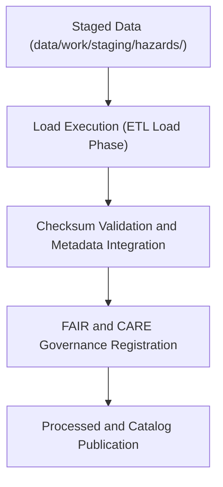

<div align="center">

# 📦 Kansas Frontier Matrix — **Hazard ETL Load Logs**
`data/work/tmp/hazards/logs/etl/load/README.md`

**Purpose:** Repository for load-phase ETL logs, verification reports, and governance registration artifacts related to hazard datasets in the Kansas Frontier Matrix (KFM).  
This workspace documents the transfer, validation, and publication of processed hazard data into staging and catalog layers under FAIR+CARE and MCP-DL v6.3 compliance.

[](../../../../../../../docs/standards/faircare-validation.md)
[](../../../../../../../LICENSE)
[](../../../../../../../docs/architecture/repo-focus.md)

</div>

---

## 📚 Overview

The `data/work/tmp/hazards/logs/etl/load/` directory stores **final load-phase ETL process logs**, including governance validation, checksum verification, and archival registration.  
These logs confirm successful data transfer from transformation and staging layers into persistent repositories and ensure full traceability for FAIR+CARE certification.

### Core Functions:
- Document data loading events from ETL to staging, processed, and catalog layers.  
- Verify schema conformity and completeness during the loading process.  
- Record governance synchronization, checksum results, and metadata integration.  
- Preserve audit-ready records of all hazard ETL load operations.  

All load-phase activities recorded here are checksum-verified, reproducible, and registered in the **KFM Governance Ledger** for compliance.

---

## 🗂️ Directory Layout

```plaintext
data/work/tmp/hazards/logs/etl/load/
├── README.md                               # This file — overview of hazard ETL load logs
│
├── load_run_log_2024Q4.log                 # Log of final ETL load operations (Q4 2024)
├── load_validation_report_2024Q4.json      # Validation report confirming schema and governance compliance
├── checksum_verification_load_2024Q4.json  # Checksum registry and hash confirmation
├── governance_registration_2024Q4.log      # Governance sync and FAIR+CARE registration record
└── metadata.json                           # Provenance, checksum, and certification metadata
```

---

## ⚙️ Load Workflow



### Workflow Description:
1. **Data Preparation:** Staging datasets finalized for publication and certified by QA checks.  
2. **Loading:** Data transferred into processed and catalog directories for long-term use.  
3. **Checksum Verification:** Validation of file hashes and structural integrity.  
4. **Governance Logging:** FAIR+CARE compliance recorded in the provenance ledger.  
5. **Publication:** Certified datasets promoted for production use or catalog distribution.

---

## 🧩 Example Metadata Record

```json
{
  "id": "etl_load_hazards_v9.3.2_2024Q4",
  "etl_cycle": "Q4 2024",
  "staging_source": "data/work/staging/hazards/",
  "processed_destination": "data/work/processed/hazards/",
  "records_loaded": 21873,
  "checksum_verified": true,
  "governance_registered": true,
  "fairstatus": "certified",
  "validator": "@kfm-etl-load",
  "created": "2025-10-28T17:00:00Z",
  "checksum": "sha256:4cf8c6f193a5e9b18921ef67538a47ad93e82671...",
  "governance_ref": "data/reports/audit/data_provenance_ledger.json"
}
```

---

## 🧠 FAIR+CARE Governance Alignment

| Principle | Implementation |
|------------|----------------|
| **Findable** | Load logs indexed by ETL cycle, dataset name, and governance record ID. |
| **Accessible** | Records stored in open JSON and text formats for internal audit. |
| **Interoperable** | Load-phase metadata aligns with STAC/DCAT governance schemas. |
| **Reusable** | Provenance and checksum tracking ensure reproducibility. |
| **Collective Benefit** | Guarantees transparency and trust in KFM data publication. |
| **Authority to Control** | FAIR+CARE Council certifies all load-phase governance events. |
| **Responsibility** | ETL engineers validate all final transfers and metadata completeness. |
| **Ethics** | All published data undergo FAIR+CARE ethics review before release. |

Governance and certification logs stored in:  
`data/reports/audit/data_provenance_ledger.json`  
and `data/reports/fair/data_care_assessment.json`.

---

## ⚙️ Validation & QA Artifacts

| File | Description | Format |
|------|--------------|--------|
| `load_run_log_*.log` | Load execution details including file transfers and errors. | Text |
| `load_validation_report_*.json` | Confirms compliance with data contract and governance schema. | JSON |
| `checksum_verification_load_*.json` | File integrity verification results. | JSON |
| `governance_registration_*.log` | Governance event synchronization log. | Text |
| `metadata.json` | Captures lineage, checksum, and FAIR+CARE certification status. | JSON |

All load workflows managed by `etl_load_sync.yml`.

---

## ⚖️ Governance & Provenance Integration

| Record | Description |
|---------|-------------|
| `metadata.json` | Captures lineage, governance linkage, and certification data. |
| `data/reports/audit/data_provenance_ledger.json` | Logs load lineage and FAIR+CARE certification entries. |
| `data/reports/fair/data_care_assessment.json` | FAIR+CARE compliance results for load-phase validation. |
| `releases/v9.3.2/manifest.zip` | Registry of checksum files for reproducibility. |

All load events automatically synchronized through CI/CD and FAIR+CARE governance pipelines.

---

## 🧾 Retention & Certification Policy

| Log Type | Retention Duration | Policy |
|-----------|--------------------|--------|
| Load Logs | 365 days | Archived annually for reproducibility. |
| Validation Reports | 365 days | Retained for audit and governance reviews. |
| Governance Records | Permanent | Maintained indefinitely for FAIR+CARE traceability. |
| Metadata | Permanent | Preserved as part of lineage chain and checksum registry. |

Retention handled via `etl_load_cleanup.yml`.

---

## 🧾 Internal Use Citation

```text
Kansas Frontier Matrix (2025). Hazard ETL Load Logs (v9.3.2).
Certified load-phase governance, validation, and checksum logs for hazard datasets within KFM ETL workflows.
Maintained under FAIR+CARE certification and MCP-DL v6.3 data governance protocols.
```

---

## 🧾 Version Notes

| Version | Date | Notes |
|----------|------|--------|
| v9.3.2 | 2025-10-28 | Added FAIR+CARE governance linkage and checksum manifest verification. |
| v9.2.0 | 2024-07-15 | Introduced automated load validation and governance sync logs. |
| v9.0.0 | 2023-01-10 | Established load log directory for hazard ETL workflows. |

---

<div align="center">

**Kansas Frontier Matrix** · *Data Publication × FAIR+CARE Governance × Provenance Assurance*  
[🔗 Repository](https://github.com/bartytime4life/Kansas-Frontier-Matrix) • [🧭 Docs Portal](../../../../../../../docs/) • [⚖️ Governance Ledger](../../../../../../../docs/standards/governance/)

</div>