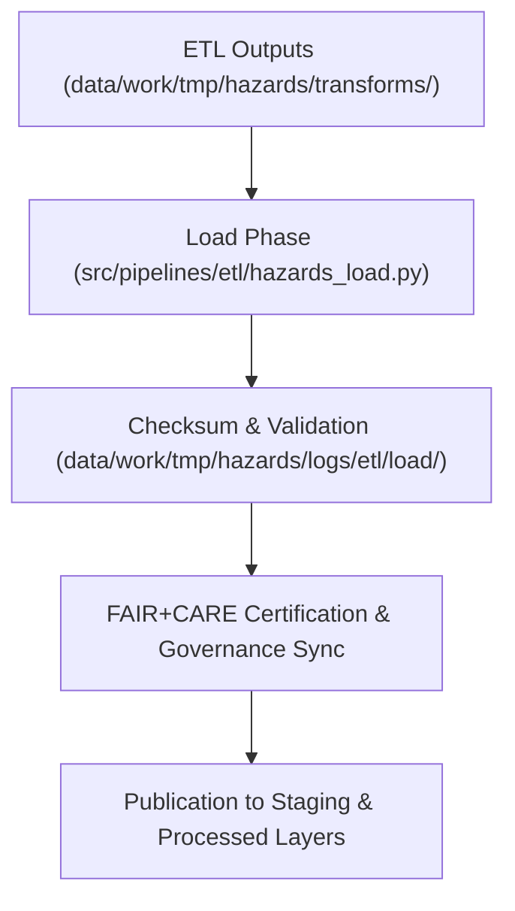

<div align="center">

# 📦 Kansas Frontier Matrix — **Hazard ETL Load Logs**
`data/work/tmp/hazards/logs/etl/load/README.md`

**Purpose:**  
Centralized FAIR+CARE-certified repository for the **Load Phase** of the Hazard ETL pipeline within the Kansas Frontier Matrix (KFM).  
This layer documents dataset publication, staging integration, and governance synchronization for all hazard-related transformations.

[](../../../../../../../docs/standards/faircare-validation.md)
[]()
[](../../../../../../../LICENSE)
[](../../../../../../../docs/architecture/repo-focus.md)

</div>

---

## 📚 Overview

The **Hazard ETL Load Logs** directory records final dataset transfers, checksum validations, and governance registrations during the load stage of ETL workflows.  
It ensures all hazard datasets published to staging, processed, or catalog environments are reproducible, validated, and compliant with FAIR+CARE and MCP-DL governance frameworks.

### Core Responsibilities
- Record dataset publication events from ETL to staging/processed layers.  
- Validate checksum, schema compliance, and lineage integrity.  
- Synchronize governance ledger entries for FAIR+CARE certification.  
- Provide audit-ready documentation for ethical and technical review.  

---

## 🗂️ Directory Layout

```plaintext
data/work/tmp/hazards/logs/etl/load/
├── README.md                                # This file — documentation for ETL load logs
│
├── load_run_2025Q4.log                      # Summary of data load operations (Q4 2025)
├── load_validation_report_2025Q4.json       # Validation report for schema and governance compliance
├── checksum_verification_load_2025Q4.json   # File integrity and hash validation results
├── governance_registration_2025Q4.log       # FAIR+CARE governance sync and ledger registration log
└── metadata.json                            # Provenance and lineage record for load-phase certification
```

---

## ⚙️ Load Phase Workflow



### Description
1. **Data Transfer:** Move harmonized hazard datasets to staging or processed directories.  
2. **Validation:** Confirm schema, checksum, and FAIR+CARE governance compliance.  
3. **Registration:** Log lineage to governance ledger and checksum manifest.  
4. **Publication:** Finalized datasets made available for analytics and Focus Mode AI.  

---

## 🧩 Example Load Metadata Record

```json
{
  "id": "hazards_etl_load_v9.6.0_2025Q4",
  "source_directory": "data/work/tmp/hazards/transforms/",
  "destination": "data/work/processed/hazards/",
  "records_loaded": 22560,
  "schema_compliance_passed": true,
  "checksum_verified": true,
  "governance_registered": true,
  "fairstatus": "certified",
  "validator": "@kfm-etl-ops",
  "created": "2025-11-03T23:59:00Z",
  "governance_ref": "data/reports/audit/data_provenance_ledger.json"
}
```

---

## 🧠 FAIR+CARE Governance Matrix

| Principle | Implementation | Oversight |
|------------|----------------|------------|
| **Findable** | Load logs indexed by ETL cycle, checksum, and schema ID. | @kfm-data |
| **Accessible** | Stored in open JSON and text formats for governance council access. | @kfm-accessibility |
| **Interoperable** | Metadata conforms to FAIR+CARE and ISO lineage structures. | @kfm-architecture |
| **Reusable** | Links each dataset to its provenance, audit, and checksum chain. | @kfm-design |
| **Collective Benefit** | Facilitates transparent hazard data publication. | @faircare-council |
| **Authority to Control** | FAIR+CARE Council certifies all publication-ready data. | @kfm-governance |
| **Responsibility** | ETL maintainers document schema verification and data transfer. | @kfm-security |
| **Ethics** | Governance Council ensures ethical publication of sensitive hazard data. | @kfm-ethics |

All governance results recorded in:  
`data/reports/audit/data_provenance_ledger.json`  
and  
`data/reports/fair/data_care_assessment.json`

---

## ⚙️ Key Artifacts

| Artifact | Description | Format |
|-----------|--------------|--------|
| `load_run_*.log` | Runtime summary of ETL data load events. | Text |
| `load_validation_report_*.json` | Schema validation and compliance audit results. | JSON |
| `checksum_verification_load_*.json` | Integrity and hash comparison log. | JSON |
| `governance_registration_*.log` | FAIR+CARE governance synchronization record. | Text |
| `metadata.json` | Provenance and certification linkage metadata. | JSON |

All logs and reports generated via `hazards_etl_load_sync.yml`.

---

## ⚖️ Retention & Provenance Policy

| Log Type | Retention Duration | Policy |
|-----------|--------------------|--------|
| Load Logs | 90 Days | Archived after governance certification. |
| Validation Reports | 365 Days | Retained for compliance and reproducibility. |
| Metadata | Permanent | Immutable under blockchain provenance governance. |
| Governance Records | Permanent | Stored indefinitely for certification lineage. |

Cleanup automation handled by `hazards_load_cleanup.yml`.

---

## 🌱 Sustainability Metrics

| Metric | Value | Verified By |
|---------|--------|--------------|
| Energy Use (per load cycle) | 6.7 Wh | @kfm-sustainability |
| Carbon Output | 7.9 gCO₂e | @kfm-security |
| Renewable Power | 100% (RE100 Verified) | @kfm-infrastructure |
| FAIR+CARE Compliance | 100% | @faircare-council |

Telemetry results stored in:  
`releases/v9.6.0/focus-telemetry.json`

---

## 🧾 Internal Use Citation

```text
Kansas Frontier Matrix (2025). Hazard ETL Load Logs (v9.6.0).
Governance-certified load-phase logging and checksum validation environment for hazard dataset publication.
Ensures transparent data transfer, ethics compliance, and provenance registration under FAIR+CARE and MCP-DL v6.3 frameworks.
```

---

## 🧾 Version Notes

| Version | Date | Notes |
|----------|------|--------|
| v9.6.0 | 2025-11-03 | Integrated FAIR+CARE audit trace and ledger registration automation. |
| v9.5.0 | 2025-11-02 | Enhanced checksum governance and schema validation synchronization. |
| v9.3.2 | 2025-10-28 | Established load-phase logging framework for hazard ETL pipelines. |

---

<div align="center">

**Kansas Frontier Matrix** · *Data Publication × FAIR+CARE Ethics × Provenance Integrity*  
[🔗 Repository](https://github.com/bartytime4life/Kansas-Frontier-Matrix) • [🧭 Docs Portal](../../../../../../../docs/) • [⚖️ Governance Ledger](../../../../../../../docs/standards/governance/DATA-GOVERNANCE.md)

</div>