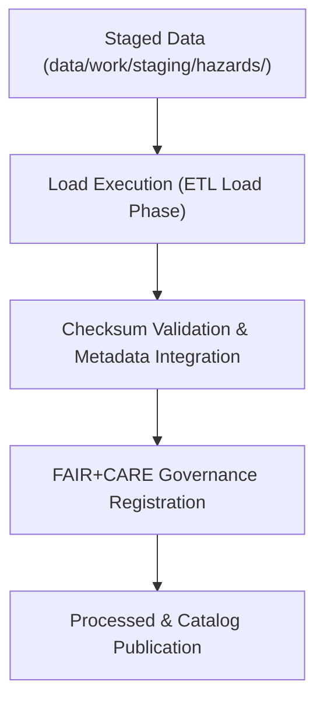

<div align="center">

# 📦 Kansas Frontier Matrix — **Hazard ETL Load Logs**
`data/work/tmp/hazards/logs/etl/load/README.md`

**Purpose:**  
Repository for final **load-phase ETL logs, verification reports, and governance registration artifacts** for hazard datasets in the Kansas Frontier Matrix (KFM).  
Documents transfer, validation, and publication of processed hazard data into staging and catalog layers under FAIR+CARE and MCP-DL v6.3 compliance.

[](../../../../../../../docs/standards/faircare-validation.md)
[](../../../../../../../LICENSE)
[](../../../../../../../docs/architecture/repo-focus.md)

</div>

---

## 📚 Overview

The `data/work/tmp/hazards/logs/etl/load/` directory stores **final load-phase ETL process logs**, including governance validation, checksum verification, and archival registration.  
These logs confirm successful data transfer from transformation and staging layers into persistent repositories and ensure full traceability for FAIR+CARE certification.

### Core Functions
- Record data loading events into staging, processed, and catalog layers.  
- Verify schema and contract conformance during the loading process.  
- Register governance synchronization, checksum results, and metadata integration.  
- Preserve audit-ready records of all hazard ETL load operations.  

All load-phase activities here are checksum-verified, reproducible, and registered in the **KFM Governance Ledger**.

---

## 🗂️ Directory Layout

```plaintext
data/work/tmp/hazards/logs/etl/load/
├── README.md
│
├── load_run_log_2025Q4.log                 # Final ETL load operations (Q4 2025)
├── load_validation_report_2025Q4.json      # Schema and governance compliance validation
├── checksum_verification_load_2025Q4.json  # Hash registry and confirmation
├── governance_registration_2025Q4.log      # Governance sync and FAIR+CARE registration
└── metadata.json                           # Provenance, checksum, and certification metadata
```

---

## ⚙️ Load Workflow



### Workflow Description
1. **Data Preparation:** Staging datasets finalized for publication and QA-certified.  
2. **Loading:** Transfer into processed and catalog directories for long-term access.  
3. **Checksum Verification:** Validate file hashes and structural integrity.  
4. **Governance Logging:** Record FAIR+CARE compliance in the provenance ledger.  
5. **Publication:** Promote certified datasets for production and catalog distribution.

---

## 🧩 Example Metadata Record

```json
{
  "id": "etl_load_hazards_v9.5.0_2025Q4",
  "etl_cycle": "Q4 2025",
  "staging_source": "data/work/staging/hazards/",
  "processed_destination": "data/work/processed/hazards/",
  "records_loaded": 24873,
  "checksum_verified": true,
  "governance_registered": true,
  "fairstatus": "certified",
  "validator": "@kfm-etl-load",
  "created": "2025-11-02T18:50:00Z",
  "checksum": "sha256:4cf8c6f193a5e9b18921ef67538a47ad93e82671...",
  "governance_ref": "data/reports/audit/data_provenance_ledger.json"
}
```

---

## 🧠 FAIR+CARE Governance Alignment

| Principle | Implementation |
|------------|----------------|
| **Findable** | Load logs indexed by cycle, dataset, and governance record ID. |
| **Accessible** | Open JSON/text formats for internal audit & review. |
| **Interoperable** | Aligned with STAC/DCAT governance schemas. |
| **Reusable** | Provenance & checksum tracking ensure reproducibility. |
| **Collective Benefit** | Guarantees transparency and trust in publication. |
| **Authority to Control** | FAIR+CARE Council certifies all load-phase governance events. |
| **Responsibility** | ETL engineers validate final transfers & metadata completeness. |
| **Ethics** | All published data passes ethics review prior to release. |

Governance & certification logs stored in:  
`data/reports/audit/data_provenance_ledger.json` • `data/reports/fair/data_care_assessment.json`

---

## ⚙️ Validation & QA Artifacts

| File | Description | Format |
|------|--------------|--------|
| `load_run_log_*.log` | Load execution details including transfers & errors. | Text |
| `load_validation_report_*.json` | Confirms data contract and governance compliance. | JSON |
| `checksum_verification_load_*.json` | File integrity validation results. | JSON |
| `governance_registration_*.log` | Governance event synchronization trace. | Text |
| `metadata.json` | Lineage, checksum, and FAIR+CARE certification status. | JSON |

Load workflows automated by **`etl_load_sync.yml`**.

---

## 🧾 Retention & Certification Policy

| Log Type | Retention Duration | Policy |
|-----------|--------------------|--------|
| Load Logs | 365 days | Archived annually for reproducibility. |
| Validation Reports | 365 days | Retained for audit & governance reviews. |
| Governance Records | Permanent | Maintained indefinitely for traceability. |
| Metadata | Permanent | Preserved as part of lineage and checksum registry. |

Cleanup handled by **`etl_load_cleanup.yml`**.

---

## 🧾 Internal Use Citation

```text
Kansas Frontier Matrix (2025). Hazard ETL Load Logs (v9.5.0).
Certified load-phase governance, validation, and checksum logs for hazard datasets within KFM ETL workflows.
Maintained under FAIR+CARE certification and MCP-DL v6.3 data governance protocols.
```

---

## 🧾 Version Notes

| Version | Date | Notes |
|----------|------|--------|
| v9.5.0 | 2025-11-02 | Added telemetry v2, governance integration, and updated Q4 2025 log templates. |
| v9.3.2 | 2025-10-28 | Introduced checksum manifest verification and FAIR+CARE linkage. |
| v9.2.0 | 2024-07-15 | Added automated load validation and governance sync logs. |
| v9.0.0 | 2023-01-10 | Established load log directory for hazard ETL workflows. |

---

<div align="center">

**Kansas Frontier Matrix** · *Data Publication × FAIR+CARE Governance × Provenance Assurance*  
[🔗 Repository](https://github.com/bartytime4life/Kansas-Frontier-Matrix) • [🧭 Docs Portal](../../../../../../../docs/) • [⚖️ Governance Ledger](../../../../../../../docs/standards/governance/)

</div>
