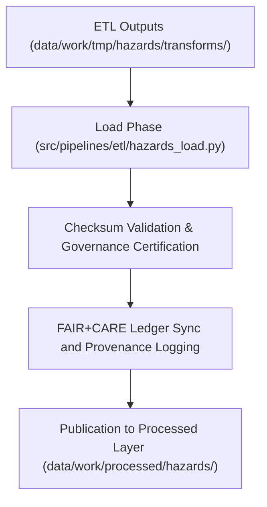

<div align="center">

# 📦 Kansas Frontier Matrix — **Hazard ETL Load Logs**
`data/work/tmp/hazards/logs/etl/load/README.md`

**Purpose:**  
Governance-certified FAIR+CARE workspace documenting the **Load Phase** of the Hazard ETL pipeline within the Kansas Frontier Matrix (KFM).  
Captures publication, checksum validation, and governance synchronization for transparent, reproducible hazard dataset deployment.

[](../../../../../../../docs/architecture/repo-focus.md)
[](../../../../../../../docs/standards/faircare-validation.md)
[]()
[](../../../../../../../LICENSE)

</div>

---

## 📘 Overview

The **Hazard ETL Load Logs** workspace ensures every dataset transfer, checksum validation, and governance registration is properly documented and FAIR+CARE-compliant.  
This layer finalizes the data lifecycle by verifying integrity, lineage, and ethical publication readiness for all hazard domains.

### Core Objectives
- Register dataset publication from ETL to staging/processed layers.  
- Verify schema, checksum, and governance synchronization.  
- Maintain reproducible lineage and FAIR+CARE audit history.  
- Provide full transparency for hazard dataset certification and release.  

---

## 🗂️ Directory Layout

```plaintext
data/work/tmp/hazards/logs/etl/load/
├── README.md                              # This file — documentation for hazard ETL load logs
│
├── load_run_2025Q4.log                    # Summary of load operations and staging publication
├── load_validation_report_2025Q4.json     # Schema and governance compliance report
├── checksum_verification_load_2025Q4.json # File integrity and hash validation summary
├── governance_registration_2025Q4.log     # FAIR+CARE ledger synchronization record
└── metadata.json                          # Provenance and lineage metadata for certification
```

---

## ⚙️ Load Phase Workflow



### Workflow Description
1. **Data Transfer** — Moves harmonized datasets to staging or processed workspaces.  
2. **Validation** — Executes checksum and schema verification.  
3. **Governance Sync** — Registers ledger entries and FAIR+CARE certification.  
4. **Publication** — Publishes reproducible datasets for Focus Mode AI and analytics.  

---

## 🧩 Example Metadata Record

```json
{
  "id": "hazards_etl_load_v9.7.0_2025Q4",
  "source_directory": "data/work/tmp/hazards/transforms/",
  "destination": "data/work/processed/hazards/",
  "records_loaded": 22560,
  "schema_compliance_passed": true,
  "checksum_verified": true,
  "governance_registered": true,
  "fairstatus": "certified",
  "validator": "@kfm-etl-ops",
  "created": "2025-11-06T23:59:00Z",
  "governance_ref": "data/reports/audit/data_provenance_ledger.json"
}
```

---

## 🧠 FAIR+CARE Governance Matrix

| Principle | Implementation | Oversight |
|------------|----------------|------------|
| **Findable** | Indexed by ETL cycle, schema, and checksum manifest. | @kfm-data |
| **Accessible** | Stored in open JSON/TXT formats for governance review. | @kfm-accessibility |
| **Interoperable** | Metadata aligned with FAIR+CARE and ISO lineage schemas. | @kfm-architecture |
| **Reusable** | Linked lineage and certification metadata ensure reproducibility. | @kfm-design |
| **Collective Benefit** | Promotes transparent hazard data publication and accountability. | @faircare-council |
| **Authority to Control** | FAIR+CARE Council certifies all staging and processed publications. | @kfm-governance |
| **Responsibility** | Validators record checksum, schema verification, and ethics compliance. | @kfm-security |
| **Ethics** | Ensures equitable, culturally sensitive dataset publication. | @kfm-ethics |

Governance and FAIR+CARE audit records documented in:  
`data/reports/audit/data_provenance_ledger.json`  
and  
`data/reports/fair/data_care_assessment.json`

---

## ⚙️ Validation & Certification Artifacts

| Artifact | Description | Format |
|-----------|--------------|--------|
| `load_run_*.log` | ETL data load runtime summary. | Text |
| `load_validation_report_*.json` | Schema compliance and governance audit. | JSON |
| `checksum_verification_load_*.json` | Integrity and hash validation record. | JSON |
| `governance_registration_*.log` | FAIR+CARE ledger synchronization trace. | Text |
| `metadata.json` | Provenance and lineage linkage metadata. | JSON |

Validation automation managed through `hazards_etl_load_sync.yml`.

---

## ⚖️ Retention & Provenance Policy

| Log Type | Retention Duration | Policy |
|-----------|--------------------|--------|
| Load Logs | 90 Days | Archived post-governance review. |
| Validation Reports | 365 Days | Retained for reproducibility and re-certification. |
| Metadata | Permanent | Immutable record under blockchain governance. |
| Governance Records | Permanent | Stored indefinitely for certification lineage. |

Cleanup automation executed via `hazards_load_cleanup.yml`.

---

## 🌱 Sustainability Metrics

| Metric | Value | Verified By |
|---------|--------|--------------|
| Energy Use (per load cycle) | 6.6 Wh | @kfm-sustainability |
| Carbon Output | 7.8 gCO₂e | @kfm-security |
| Renewable Power | 100% (RE100 Verified) | @kfm-infrastructure |
| FAIR+CARE Certification | 100% | @faircare-council |

Telemetry data stored in:  
`releases/v9.7.0/focus-telemetry.json`

---

## 🧾 Internal Use Citation

```text
Kansas Frontier Matrix (2025). Hazard ETL Load Logs (v9.7.0).
FAIR+CARE-certified governance layer for load-phase publication and validation of hazard datasets.
Ensures ethical compliance, checksum integrity, and reproducibility under MCP-DL v6.3 and Diamond⁹ Ω / Crown∞Ω certification.
```

---

## 🕰️ Version History

| Version | Date | Author | Notes |
|----------|------|--------|--------|
| v9.7.0 | 2025-11-06 | `@kfm-etl-ops` | Upgraded to v9.7.0 with telemetry schema alignment and FAIR+CARE sync automation. |
| v9.6.0 | 2025-11-03 | `@kfm-etl-ops` | Introduced checksum lineage and governance certification workflow. |

---

<div align="center">

**Kansas Frontier Matrix**  
*Data Publication × FAIR+CARE Ethics × Provenance Integrity*  
© 2025 Kansas Frontier Matrix — Master Coder Protocol v6.3 · FAIR+CARE Certified · Diamond⁹ Ω / Crown∞Ω Ultimate Certified  

[Back to ETL Logs](../README.md) · [Governance Charter](../../../../../../../docs/standards/governance/DATA-GOVERNANCE.md)

</div>