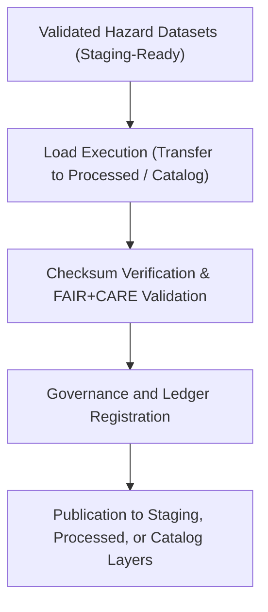

<div align="center">

# 📦 Kansas Frontier Matrix — **Hazard ETL Load Logs**
`data/work/tmp/hazards/logs/etl/load/README.md`

**Purpose:**  
Governed repository for **load-phase ETL logs and data publication records** in the Kansas Frontier Matrix (KFM).  
This layer verifies dataset transfer, validation, and publication into staging, processed, and catalog directories under FAIR+CARE, ISO, and MCP-DL v6.3 governance compliance.

[](../../../../../../../../docs/standards/faircare-validation.md)
[](../../../../../../../../LICENSE)
[](../../../../../../../../docs/architecture/repo-focus.md)

</div>

---

## 📚 Overview

The `data/work/tmp/hazards/logs/etl/load/` directory documents the **final stage of the ETL pipeline**—when validated hazard datasets are transferred to staging, processed, and catalog layers.  
Each log captures load performance metrics, checksum validation, and FAIR+CARE governance confirmations to ensure full reproducibility and traceability.

### Core Responsibilities
- Record dataset publication events and transfer logs.  
- Validate file integrity, checksum matching, and schema conformance.  
- Register governance and FAIR+CARE certification data.  
- Maintain traceable lineage to the provenance ledger and telemetry logs.  

---

## 🗂️ Directory Layout

```plaintext
data/work/tmp/hazards/logs/etl/load/
├── README.md                               # This file — overview of hazard ETL load logs
│
├── load_run_log_2025Q4.log                 # Execution log of all dataset load operations for Q4 2025
├── load_validation_report_2025Q4.json      # Validation and governance compliance report
├── checksum_verification_load_2025Q4.json  # File integrity and hash registry for load events
├── governance_registration_2025Q4.log      # Governance and FAIR+CARE registration summary
└── metadata.json                           # Provenance linkage and certification metadata
```

---

## ⚙️ Load Workflow



### Workflow Description
1. **Preparation:** Collect all validated datasets ready for staging or publication.  
2. **Load Execution:** Transfer and integrate datasets into the KFM’s managed repositories.  
3. **Checksum Audit:** Confirm dataset integrity and validate against manifest entries.  
4. **Governance Registration:** Log transfer metadata, ethics review, and certification results.  
5. **Publication:** Complete data registration for internal and open-access catalog distribution.

---

## 🧩 Example Metadata Record

```json
{
  "id": "hazards_etl_load_v9.5.0_2025Q4",
  "etl_stage": "load",
  "datasets_published": [
    "data/work/staging/hazards/flood_extents_cf.geojson",
    "data/work/staging/hazards/tornado_tracks_cf.geojson"
  ],
  "records_loaded": 267819,
  "checksum_verified": true,
  "fairstatus": "certified",
  "governance_registered": true,
  "publication_status": "complete",
  "telemetry_ref": "releases/v9.5.0/focus-telemetry.json",
  "governance_ref": "reports/audit/ai_hazards_ledger.json",
  "created": "2025-11-02T20:25:00Z",
  "validator": "@kfm-etl-load"
}
```

---

## 🧠 FAIR+CARE Governance Matrix

| Principle | Implementation |
|------------|----------------|
| **Findable** | Load logs indexed by ETL cycle, dataset, and governance registration ID. |
| **Accessible** | Logs stored as open JSON and text records for internal governance access. |
| **Interoperable** | Aligns with STAC 1.0, DCAT 3.0, ISO 19115, and MCP-DL governance frameworks. |
| **Reusable** | Metadata contains checksum and provenance linkage for reproducibility. |
| **Collective Benefit** | Ensures transparency in hazard dataset publication and distribution. |
| **Authority to Control** | FAIR+CARE Council certifies load completion and governance registration. |
| **Responsibility** | ETL engineers and governance maintainers record compliance and lineage. |
| **Ethics** | Protects open-data principles and verifies non-sensitive publication standards. |

All certification and audit results logged in:  
`reports/audit/ai_hazards_ledger.json` • `reports/fair/hazards_etl_load_summary.json`

---

## ⚙️ Load Log Artifacts

| File | Description | Format |
|------|--------------|--------|
| `load_run_log_*.log` | Execution and event log for dataset publication. | Text |
| `load_validation_report_*.json` | Validation and governance compliance record. | JSON |
| `checksum_verification_load_*.json` | File integrity validation summary. | JSON |
| `governance_registration_*.log` | Governance ledger synchronization and ethics record. | Text |
| `metadata.json` | Provenance and checksum linkage metadata. | JSON |

Load workflow automation handled by `hazards_etl_load_sync.yml`.

---

## 🧾 Retention Policy

| Log Type | Retention Duration | Policy |
|-----------|--------------------|--------|
| Load Logs | 365 days | Archived annually for governance continuity. |
| Validation Reports | 365 days | Retained for FAIR+CARE and ISO compliance. |
| Governance Records | Permanent | Stored indefinitely under ledger traceability. |
| Metadata | Permanent | Retained as part of checksum and provenance registry. |

Retention managed by `hazards_etl_load_cleanup.yml`.

---

## 🧾 Internal Use Citation

```text
Kansas Frontier Matrix (2025). Hazard ETL Load Logs (v9.5.0).
Governed ETL load-phase log repository for hazard dataset publication, checksum validation, and FAIR+CARE certification.
Maintains ethical traceability, governance integrity, and reproducible audit workflows.
```

---

## 🧾 Version Notes

| Version | Date | Notes |
|----------|------|--------|
| v9.5.0 | 2025-11-02 | Integrated telemetry v2, FAIR+CARE ledger automation, and checksum registry enhancements. |
| v9.3.2 | 2025-10-28 | Expanded publication event logging and governance registration integration. |
| v9.3.0 | 2025-10-26 | Established ETL load logging layer under MCP-DL v6.3 governance framework. |

---

<div align="center">

**Kansas Frontier Matrix** · *Data Publication × FAIR+CARE Ethics × Provenance Certification*  
[🔗 Repository](https://github.com/bartytime4life/Kansas-Frontier-Matrix) • [🧭 Docs Portal](../../../../../../../../docs/) • [⚖️ Governance Ledger](../../../../../../../../docs/standards/governance/)

</div>