<div align="center">

# 📦 Kansas Frontier Matrix — **Hazard ETL Load Logs**
`data/work/tmp/hazards/logs/etl/load/README.md`

**Purpose:**  
Governance-aligned FAIR+CARE-certified environment documenting the **Load Phase** of the Hazard ETL pipeline within KFM.  
Captures dataset publication, checksum validation, and ledger synchronization for final staging and processed-layer deployment.

[](../../../../../../../docs/architecture/README.md)
[](../../../../../../../docs/standards/faircare-validation.md)
[]()
[](../../../../../../../LICENSE)

</div>

---

## 📘 Overview

The **Hazard ETL Load Logs** serve as the terminal stage record for all hazard ETL cycles — ensuring certified data publication and reproducibility.  
This workspace validates dataset transfers to staging and processed layers while embedding FAIR+CARE and blockchain-governed lineage tracking.

### Core Responsibilities
- Register dataset publication and checksum verification events.  
- Document schema compliance and FAIR+CARE certification.  
- Record governance synchronization and ledger entries.  
- Maintain auditable transparency across all hazard load operations.  

---

## 🗂️ Directory Layout

```plaintext
data/work/tmp/hazards/logs/etl/load/
├── README.md
├── load_run_2025Q4.log
├── load_validation_report_2025Q4.json
├── checksum_verification_load_2025Q4.json
├── governance_registration_2025Q4.log
└── metadata.json
```

---

## ⚙️ Load Workflow

```mermaid
flowchart TD
    A["ETL Output (data/work/tmp/hazards/transforms/)"] --> B["Load Phase (src/pipelines/etl/hazards_load.py)"]
    B --> C["Checksum & Validation (hazards/logs/etl/load/)"]
    C --> D["FAIR+CARE Certification & Ledger Sync"]
    D --> E["Final Publication → data/work/processed/hazards/"]
```



### Steps
1. **Data Transfer** — Move harmonized datasets into processed workspaces.  
2. **Validation** — Verify schema compliance, hashes, and FAIR+CARE metadata.  
3. **Governance Sync** — Register checksum, certification, and ethics results.  
4. **Publication** — Deploy certified datasets to downstream KFM systems.  

---

## 🧩 Example Load Metadata Record

```json
{
  "id": "hazards_etl_load_v9.7.0_2025Q4",
  "source_directory": "data/work/tmp/hazards/transforms/",
  "destination": "data/work/processed/hazards/",
  "records_loaded": 22560,
  "schema_compliance_passed": true,
  "checksum_verified": true,
  "governance_registered": true,
  "fairstatus": "certified",
  "validator": "@kfm-etl-ops",
  "created": "2025-11-06T23:59:00Z",
  "governance_ref": "data/reports/audit/data_provenance_ledger.json"
}
```

---

## 🧠 FAIR+CARE Governance Matrix

| Principle | Implementation | Oversight |
|-----------|----------------|-----------|
| **Findable** | Indexed by cycle, schema, and checksum identifiers. | `@kfm-data` |
| **Accessible** | Open JSON/TXT logs for FAIR+CARE Council validation. | `@kfm-accessibility` |
| **Interoperable** | Metadata structured per ISO 19115 and FAIR+CARE lineage. | `@kfm-architecture` |
| **Reusable** | Linked provenance metadata ensures full reproducibility. | `@kfm-design` |
| **Collective Benefit** | Promotes ethical data accessibility and transparency. | `@faircare-council` |
| **Authority to Control** | FAIR+CARE Council approves dataset promotions. | `@kfm-governance` |
| **Responsibility** | Validators document compliance and checksum integrity. | `@kfm-security` |
| **Ethics** | Governance ensures responsible hazard dataset release. | `@kfm-ethics` |

**Audit refs:**  
`data/reports/audit/data_provenance_ledger.json` · `data/reports/fair/data_care_assessment.json`

---

## ⚙️ Load Artifacts

| Artifact | Description | Format |
|-----------|--------------|--------|
| `load_run_*.log` | ETL data load runtime summary | Text |
| `load_validation_report_*.json` | Schema + governance validation results | JSON |
| `checksum_verification_load_*.json` | Checksum verification record | JSON |
| `governance_registration_*.log` | FAIR+CARE ledger synchronization log | Text |
| `metadata.json` | Provenance + lineage record for load cycle | JSON |

**Automation:** `hazards_etl_load_sync.yml`

---

## ♻️ Retention & Lifecycle Policy

| Log Type | Retention | Policy |
|-----------|-----------|--------|
| Load Logs | 90 Days | Archived post-certification. |
| Validation Reports | 365 Days | Retained for reproducibility. |
| Metadata | Permanent | Immutable under blockchain governance. |
| Governance Records | Permanent | Stored indefinitely for lineage audits. |

**Cleanup Automation:** `hazards_load_cleanup.yml`

---

## 🌱 Sustainability Metrics

| Metric | Value | Verified By |
|--------|------:|-------------|
| Energy Use (per cycle) | 6.6 Wh | `@kfm-sustainability` |
| Carbon Output | 7.8 gCO₂e | `@kfm-security` |
| Renewable Power | 100% (RE100 Certified) | `@kfm-infrastructure` |
| FAIR+CARE Compliance | 100% | `@faircare-council` |

**Telemetry:** `../../../../../../../releases/v9.7.0/focus-telemetry.json`

---

## 🧾 Citation

```text
Kansas Frontier Matrix (2025). Hazard ETL Load Logs (v9.7.0).
FAIR+CARE-aligned load-phase governance environment for publishing, validating, and auditing hazard datasets — ensuring reproducible, ethical data under MCP-DL v6.3.
```

---

<div align="center">

**Kansas Frontier Matrix**  
*Data Publication × FAIR+CARE Ethics × Provenance Integrity*  
© 2025 Kansas Frontier Matrix — Internal Governance Data · Diamond⁹ Ω / Crown∞Ω Ultimate Certified  

[Back to ETL Logs](../README.md) · [Governance Charter](../../../../../../../docs/standards/governance/DATA-GOVERNANCE.md)

</div>