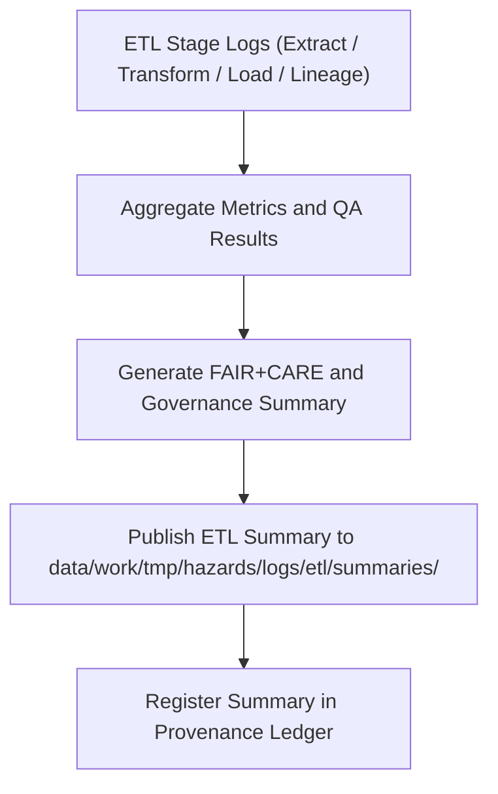

<div align="center">

# 📊 Kansas Frontier Matrix — **Hazard ETL Summaries**
`data/work/tmp/hazards/logs/etl/summaries/README.md`

**Purpose:** Repository for summary reports, FAIR+CARE audit digests, and performance analytics generated across the hazard ETL (Extract, Transform, Load) pipeline in the Kansas Frontier Matrix (KFM).  
These summaries consolidate metrics, compliance results, and lineage statistics from all ETL stages to ensure transparency, reproducibility, and data governance accountability.

[](../../../../../../../docs/standards/faircare-validation.md)
[](../../../../../../../LICENSE)
[](../../../../../../../docs/architecture/repo-focus.md)

</div>

---

## 📚 Overview

The `data/work/tmp/hazards/logs/etl/summaries/` directory contains **aggregate ETL performance and governance summaries** compiled from extract, transform, load, and lineage stages.  
Each summary provides FAIR+CARE audit results, schema validation metrics, and quality assurance indicators for hazard data workflows executed within KFM’s reproducible data environment.

### Core Functions:
- Aggregate ETL statistics from extraction through final load.  
- Summarize validation, FAIR+CARE certification, and governance metrics.  
- Provide high-level QA dashboards for data lifecycle transparency.  
- Support reproducibility, ethics compliance, and audit readiness.  

All summaries are automatically generated by governance workflows and version-tracked through the KFM **Provenance Ledger**.

---

## 🗂️ Directory Layout

```plaintext
data/work/tmp/hazards/logs/etl/summaries/
├── README.md                                # This file — overview of ETL summaries
│
├── etl_summary_2024Q4.json                  # Consolidated ETL metrics and FAIR+CARE audit summary for Q4 2024
├── etl_performance_overview_2024Q4.csv      # Tabular performance report (run times, data volumes)
├── governance_dashboard_snapshot_2024Q4.md  # FAIR+CARE and governance digest for ETL certification
├── etl_audit_findings_matrix_2024Q4.json    # Cross-stage error and QA audit summary
└── metadata.json                            # Provenance, checksum, and certification metadata
```

---

## ⚙️ ETL Summary Workflow



### Workflow Description:
1. **Aggregation:** Collect metrics, validation logs, and audit reports from all ETL stages.  
2. **FAIR+CARE Review:** Compile ethical governance compliance and reproducibility metrics.  
3. **Dashboard Creation:** Generate human-readable and machine-readable governance summaries.  
4. **Ledger Registration:** Log ETL summary records in `data/reports/audit/data_provenance_ledger.json`.  
5. **Publication:** Archive results for governance review and future reproducibility audits.

---

## 🧩 Example Metadata Record

```json
{
  "id": "etl_summary_hazards_v9.3.2_2024Q4",
  "etl_cycle": "Q4 2024",
  "stages_included": ["extract", "transform", "load", "lineage"],
  "total_records_processed": 342918,
  "schema_validation_pass_rate": 99.4,
  "fairstatus": "certified",
  "avg_execution_time_minutes": 148.7,
  "qa_audit_score": 99.2,
  "created": "2025-10-28T17:05:00Z",
  "validator": "@kfm-etl-ops",
  "checksum": "sha256:e5b67a1dc01a6a893c78e924d4dc23c4b1274d1e...",
  "governance_ref": "data/reports/audit/data_provenance_ledger.json"
}
```

---

## 🧠 FAIR+CARE Governance Summary

| Principle | Implementation |
|------------|----------------|
| **Findable** | ETL summaries indexed by cycle and version in governance ledger. |
| **Accessible** | Reports stored in open JSON, CSV, and Markdown formats. |
| **Interoperable** | Schema aligned with FAIR+CARE audit and data governance standards. |
| **Reusable** | Summaries contain provenance, validation, and checksum data. |
| **Collective Benefit** | Enables transparent ETL performance tracking and ethical data validation. |
| **Authority to Control** | FAIR+CARE Council oversees audit and certification issuance. |
| **Responsibility** | ETL teams document all stages of data transformation and validation. |
| **Ethics** | Maintains transparency, avoids bias, and ensures open governance accountability. |

All governance references are maintained in:  
`data/reports/audit/data_provenance_ledger.json`  
and `data/reports/fair/data_care_assessment.json`.

---

## ⚙️ ETL Summary Artifacts

| File | Description | Format |
|------|--------------|--------|
| `etl_summary_*.json` | Aggregated ETL metrics and FAIR+CARE audit summary. | JSON |
| `etl_performance_overview_*.csv` | Tabular ETL runtime and throughput report. | CSV |
| `governance_dashboard_snapshot_*.md` | Human-readable dashboard for governance review. | Markdown |
| `etl_audit_findings_matrix_*.json` | Cross-stage error and QA summary. | JSON |
| `metadata.json` | Records lineage, checksum, and governance linkage. | JSON |

All ETL summary generation automated through `etl_summary_sync.yml`.

---

## ⚖️ Governance & Provenance Integration

| Record | Description |
|---------|-------------|
| `metadata.json` | Tracks ETL summary lineage, governance linkage, and checksums. |
| `data/reports/audit/data_provenance_ledger.json` | Logs ETL summary publication and FAIR+CARE certification. |
| `data/reports/fair/data_care_assessment.json` | Contains FAIR+CARE audit summaries and ethics validation. |
| `releases/v9.3.2/manifest.zip` | Includes checksum registry for ETL summary reproducibility. |

Governance synchronization executed automatically by CI/CD pipelines under FAIR+CARE compliance protocols.

---

## 🧾 Retention & Certification Policy

| Summary Type | Retention Duration | Policy |
|---------------|--------------------|--------|
| ETL Summaries | 365 days | Archived for governance and QA review. |
| Audit Findings | Permanent | Retained for ethics and validation traceability. |
| Governance Dashboards | 180 days | Stored for FAIR+CARE Council audit reference. |
| Metadata | Permanent | Maintained for provenance and certification continuity. |

Retention managed by `etl_summary_cleanup.yml`.

---

## 🧾 Internal Use Citation

```text
Kansas Frontier Matrix (2025). Hazard ETL Summaries (v9.3.2).
FAIR+CARE-certified ETL summary reports and governance dashboards documenting extraction, transformation, load, and lineage activities for hazard datasets.
Maintained under MCP-DL v6.3 and FAIR+CARE ethics compliance for open reproducibility.
```

---

## 🧾 Version Notes

| Version | Date | Notes |
|----------|------|--------|
| v9.3.2 | 2025-10-28 | Added FAIR+CARE governance dashboard integration and checksum manifest. |
| v9.2.0 | 2024-07-15 | Enhanced summary reporting with cross-stage QA metrics. |
| v9.0.0 | 2023-01-10 | Established ETL summary directory for hazard governance reporting. |

---

<div align="center">

**Kansas Frontier Matrix** · *ETL Analytics × FAIR+CARE Governance × Provenance Transparency*  
[🔗 Repository](https://github.com/bartytime4life/Kansas-Frontier-Matrix) • [🧭 Docs Portal](../../../../../../../docs/) • [⚖️ Governance Ledger](../../../../../../../docs/standards/governance/)

</div>