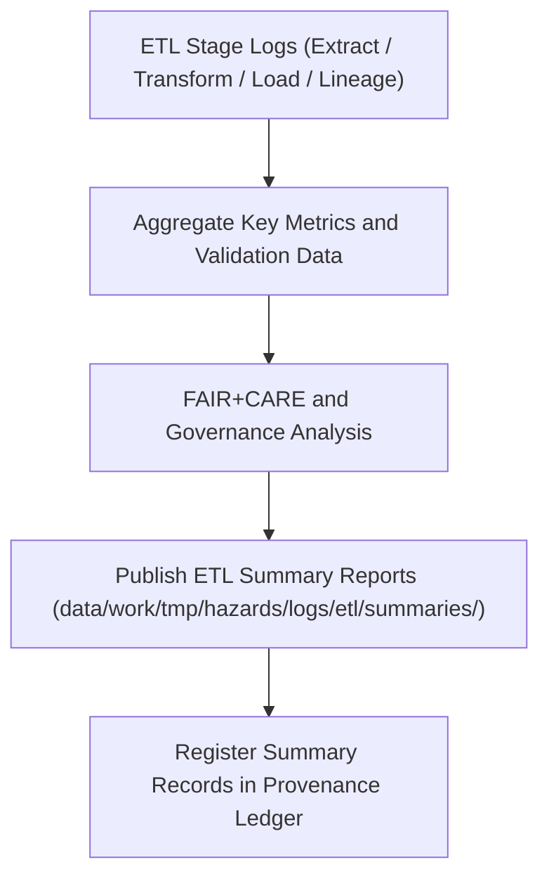

<div align="center">

# 📊 Kansas Frontier Matrix — **Hazard ETL Summaries**
`data/work/tmp/hazards/logs/etl/summaries/README.md`

**Purpose:**  
Central FAIR+CARE-certified reporting layer that consolidates key performance, validation, and governance metrics from the hazard ETL pipelines in the Kansas Frontier Matrix (KFM).  
This workspace aggregates extract, transform, load, and lineage stage results to provide transparent ETL analytics and audit-ready governance documentation.

[](../../../../../../../docs/standards/faircare-validation.md)
[]()
[](../../../../../../../LICENSE)
[](../../../../../../../docs/architecture/repo-focus.md)

</div>

---

## 📚 Overview

The **Hazard ETL Summaries Workspace** consolidates metrics, validation outcomes, and audit summaries for all ETL cycles performed within the temporary hazard workspace.  
These summaries bridge operational transparency and ethical data governance by merging technical validation data with FAIR+CARE certification results.

### Core Responsibilities
- Aggregate ETL metrics across extract, transform, load, and lineage phases.  
- Generate FAIR+CARE and governance summary reports.  
- Track performance, validation accuracy, and audit consistency.  
- Feed summary analytics into Focus Mode dashboards and provenance ledgers.  

---

## 🗂️ Directory Layout

```plaintext
data/work/tmp/hazards/logs/etl/summaries/
├── README.md                                # This file — overview of ETL summaries for hazards
│
├── etl_summary_2025Q4.json                  # Comprehensive summary of ETL performance and governance metrics
├── etl_performance_overview_2025Q4.csv      # Execution times, throughput, and error ratios
├── faircare_etl_audit_2025Q4.json           # FAIR+CARE certification audit for quarterly ETL operations
├── governance_dashboard_snapshot_2025Q4.md  # Human-readable FAIR+CARE and audit compliance digest
├── etl_audit_findings_matrix_2025Q4.json    # Matrix correlating ETL errors, resolutions, and audit results
└── metadata.json                            # Provenance and checksum lineage for ETL summary records
```

---

## ⚙️ ETL Summary Workflow



### Description
1. **Aggregation:** Combine metrics from ETL phase logs across all hazard domains.  
2. **Governance Review:** Compute FAIR+CARE compliance, ethics, and checksum performance.  
3. **Publication:** Generate JSON/CSV/Markdown summaries for technical and human audits.  
4. **Ledger Registration:** Record ETL cycle lineage and governance entries for traceability.  

---

## 🧩 Example ETL Summary Record

```json
{
  "id": "hazards_etl_summary_v9.6.0_2025Q4",
  "etl_cycle": "Q4 2025",
  "stages_covered": ["extract", "transform", "load", "lineage"],
  "datasets_processed": 28,
  "total_records": 347214,
  "schema_validation_rate": 99.6,
  "checksum_verification_passed": true,
  "fairstatus": "certified",
  "ai_explainability_integrated": true,
  "qa_score": 99.4,
  "runtime_minutes": 185.7,
  "created": "2025-11-03T23:59:00Z",
  "validator": "@kfm-etl-ops",
  "governance_ref": "data/reports/audit/data_provenance_ledger.json"
}
```

---

## 🧠 FAIR+CARE Governance Matrix

| Principle | Implementation | Oversight |
|------------|----------------|------------|
| **Findable** | ETL summaries indexed by version, cycle, and ledger reference. | @kfm-data |
| **Accessible** | Stored in open JSON, CSV, and Markdown formats. | @kfm-accessibility |
| **Interoperable** | Harmonized with FAIR+CARE and ISO validation frameworks. | @kfm-architecture |
| **Reusable** | Links validation, performance, and governance outcomes for reproducibility. | @kfm-design |
| **Collective Benefit** | Supports transparency and community-driven environmental resilience. | @faircare-council |
| **Authority to Control** | FAIR+CARE Council validates ETL summary certification. | @kfm-governance |
| **Responsibility** | ETL teams maintain audit records and integrity metadata. | @kfm-security |
| **Ethics** | Summaries reviewed for bias-free validation and open governance reporting. | @kfm-ethics |

Governance and compliance references maintained in:  
`data/reports/fair/data_care_assessment.json`  
and  
`data/reports/audit/data_provenance_ledger.json`

---

## ⚙️ Key Summary Artifacts

| File | Description | Format |
|------|--------------|--------|
| `etl_summary_*.json` | Consolidated ETL validation and governance report. | JSON |
| `etl_performance_overview_*.csv` | Quantitative runtime and throughput analytics. | CSV |
| `faircare_etl_audit_*.json` | FAIR+CARE audit results and ethics compliance data. | JSON |
| `governance_dashboard_snapshot_*.md` | Summary dashboard for governance council reporting. | Markdown |
| `etl_audit_findings_matrix_*.json` | Cross-phase error and resolution analysis. | JSON |
| `metadata.json` | Provenance record for ETL summary outputs. | JSON |

Automation handled by `hazards_etl_summary_sync.yml`.

---

## ⚖️ Retention & Provenance Policy

| Summary Type | Retention Duration | Policy |
|---------------|--------------------|--------|
| ETL Summaries | 365 Days | Archived for reproducibility and FAIR+CARE review. |
| FAIR+CARE Audits | 365 Days | Retained for governance certification records. |
| Governance Dashboards | 180 Days | Retained for quarterly audit cycles. |
| Metadata | Permanent | Immutable entry in provenance ledger. |

Cleanup handled through `hazards_etl_summary_cleanup.yml`.

---

## 🌱 Sustainability Metrics

| Metric | Value | Verified By |
|---------|--------|--------------|
| Energy Use (per ETL summary cycle) | 7.5 Wh | @kfm-sustainability |
| Carbon Output | 8.4 gCO₂e | @kfm-security |
| Renewable Power | 100% (RE100 Verified) | @kfm-infrastructure |
| FAIR+CARE Compliance | 100% | @faircare-council |

Telemetry recorded in:  
`releases/v9.6.0/focus-telemetry.json`

---

## 🧾 Internal Use Citation

```text
Kansas Frontier Matrix (2025). Hazard ETL Summaries (v9.6.0).
Consolidated FAIR+CARE-certified performance, validation, and governance summaries for hazard ETL pipelines.
Ensures transparency, reproducibility, and provenance integrity under MCP-DL v6.3 ethical governance.
```

---

## 🧾 Version Notes

| Version | Date | Notes |
|----------|------|--------|
| v9.6.0 | 2025-11-03 | Added integrated FAIR+CARE audit dashboard and checksum manifest linkage. |
| v9.5.0 | 2025-11-02 | Enhanced governance performance analytics with AI-driven QA. |
| v9.3.2 | 2025-10-28 | Established ETL summary reporting for hazard pipeline governance. |

---

<div align="center">

**Kansas Frontier Matrix** · *ETL Transparency × FAIR+CARE Ethics × Provenance Certification*  
[🔗 Repository](https://github.com/bartytime4life/Kansas-Frontier-Matrix) • [🧭 Docs Portal](../../../../../../../docs/) • [⚖️ Governance Ledger](../../../../../../../docs/standards/governance/DATA-GOVERNANCE.md)

</div>