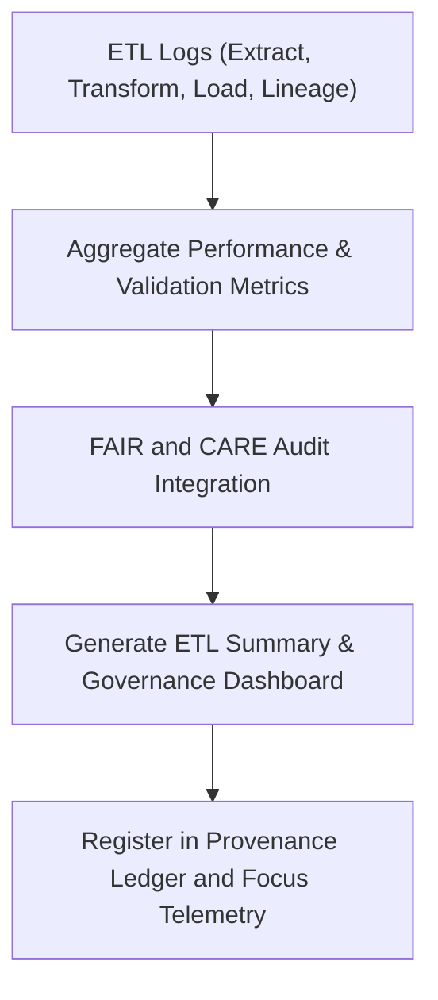

<div align="center">

# 📊 Kansas Frontier Matrix — **Hazard ETL Summaries**
`data/work/tmp/hazards/logs/etl/summaries/README.md`

**Purpose:**  
Aggregate FAIR+CARE-certified summaries of all **Extract, Transform, and Load (ETL)** cycles across hazard data domains within the Kansas Frontier Matrix (KFM).  
This directory consolidates performance metrics, audit results, and lineage reports from each ETL stage to ensure transparency and provenance integrity.

[](../../../../../../../../docs/standards/faircare-validation.md)
[](../../../../../../../../LICENSE)
[](../../../../../../../../docs/architecture/repo-focus.md)

</div>

---

## 📚 Overview

The `data/work/tmp/hazards/logs/etl/summaries/` directory functions as a **centralized reporting layer** for hazard ETL operations.  
Each summary captures a complete picture of ETL performance, FAIR+CARE compliance, AI validation, and checksum integrity, consolidating logs from `extract/`, `transform/`, `load/`, and `lineage/` submodules.

### Core Responsibilities
- Aggregate ETL results and validation statistics across all hazard workflows.  
- Summarize governance events, checksum audits, and FAIR+CARE certifications.  
- Generate metrics for Focus Mode dashboards and provenance tracking.  
- Register reports with the AI Hazards Governance Ledger for reproducibility.  

---

## 🗂️ Directory Layout

```plaintext
data/work/tmp/hazards/logs/etl/summaries/
├── README.md                               # This file — overview of hazard ETL summaries
│
├── etl_summary_2025Q4.json                 # Consolidated ETL results and performance metrics (Q4 2025)
├── etl_performance_overview_2025Q4.csv     # Tabular report with throughput, validation, and efficiency stats
├── governance_dashboard_snapshot_2025Q4.md # FAIR+CARE and governance dashboard summary
├── etl_audit_findings_matrix_2025Q4.json   # Cross-stage audit matrix of errors, issues, and resolutions
└── metadata.json                           # Provenance and checksum linkage metadata
```

---

## ⚙️ ETL Summary Workflow



### Workflow Description
1. **Aggregation:** Consolidate ETL logs from submodules (extract, transform, load, lineage).  
2. **FAIR+CARE Audit:** Merge governance, checksum, and validation metrics.  
3. **Dashboard Generation:** Produce visual summaries and governance snapshots.  
4. **Ledger Sync:** Register reports in governance records and Focus Mode telemetry.  

---

## 🧩 Example ETL Summary Record

```json
{
  "id": "hazards_etl_summary_v9.5.0_2025Q4",
  "etl_cycle": "Q4 2025",
  "domains": ["meteorological", "hydrological", "geological", "wildfire_energy"],
  "records_processed": 1642874,
  "checksum_integrity_pass_rate": 99.8,
  "fair_care_score": 99.5,
  "ai_validation_score": 0.982,
  "etl_avg_runtime_min": 142.3,
  "issues_detected": 3,
  "issues_resolved": 3,
  "fairstatus": "certified",
  "governance_ref": "reports/audit/ai_hazards_ledger.json",
  "telemetry_ref": "releases/v9.5.0/focus-telemetry.json",
  "created": "2025-11-02T20:30:00Z",
  "validator": "@kfm-etl-ops"
}
```

---

## 🧠 FAIR+CARE Governance Matrix

| Principle | Implementation |
|------------|----------------|
| **Findable** | ETL summaries indexed by cycle, checksum, and governance ID. |
| **Accessible** | Reports available in JSON, CSV, and Markdown formats. |
| **Interoperable** | Metadata aligns with STAC 1.0, DCAT 3.0, and ISO 19115 lineage schemas. |
| **Reusable** | Retains checksum registry and provenance references for reproducibility. |
| **Collective Benefit** | Supports open hazard ETL transparency and ethical oversight. |
| **Authority to Control** | FAIR+CARE Council certifies summary outputs and metrics. |
| **Responsibility** | ETL maintainers verify metrics and compliance logs. |
| **Ethics** | Summaries reviewed to ensure transparent reporting and no bias in results. |

Audit results and certifications stored in:  
`reports/audit/ai_hazards_ledger.json` • `reports/fair/hazards_etl_summaries_summary.json`

---

## ⚙️ ETL Summary Artifacts

| File | Description | Format |
|------|--------------|--------|
| `etl_summary_*.json` | Aggregated ETL cycle summary report with validation metrics. | JSON |
| `etl_performance_overview_*.csv` | Detailed performance and throughput statistics. | CSV |
| `governance_dashboard_snapshot_*.md` | FAIR+CARE and governance dashboard summary. | Markdown |
| `etl_audit_findings_matrix_*.json` | Audit findings and QA matrix across ETL stages. | JSON |
| `metadata.json` | Provenance linkage and checksum metadata. | JSON |

Automation managed by `hazards_etl_summaries_sync.yml`.

---

## 🧾 Retention Policy

| Summary Type | Retention Duration | Policy |
|---------------|--------------------|--------|
| ETL Summaries | 365 days | Archived for governance review. |
| Audit Findings | Permanent | Retained for ethics and validation continuity. |
| Governance Dashboards | 180 days | Stored for FAIR+CARE audit cycles. |
| Metadata | Permanent | Maintained as part of provenance and checksum registry. |

Cleanup governed by `hazards_etl_summaries_cleanup.yml`.

---

## 🧾 Internal Use Citation

```text
Kansas Frontier Matrix (2025). Hazard ETL Summaries (v9.5.0).
FAIR+CARE-certified ETL summary reports documenting extraction, transformation, load, and lineage performance across hazard data domains.
Maintained under ISO 19115 and MCP-DL v6.3 compliance for reproducibility and governance transparency.
```

---

## 🧾 Version Notes

| Version | Date | Notes |
|----------|------|--------|
| v9.5.0 | 2025-11-02 | Added Focus Telemetry integration and expanded FAIR+CARE audit metrics. |
| v9.3.2 | 2025-10-28 | Introduced governance dashboard generation and checksum linkage. |
| v9.3.0 | 2025-10-26 | Established ETL summary directory for hazard lifecycle reporting. |

---

<div align="center">

**Kansas Frontier Matrix** · *ETL Intelligence × FAIR+CARE Governance × Provenance Accountability*  
[🔗 Repository](https://github.com/bartytime4life/Kansas-Frontier-Matrix) • [🧭 Docs Portal](../../../../../../../../docs/) • [⚖️ Governance Ledger](../../../../../../../../docs/standards/governance/)

</div>