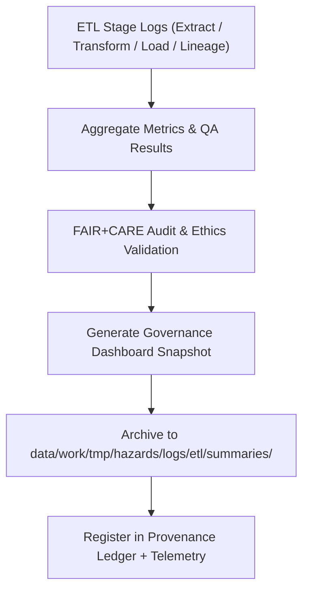

<div align="center">

# 📊 Kansas Frontier Matrix — **Hazard ETL Summaries**
`data/work/tmp/hazards/logs/etl/summaries/README.md`

**Purpose:**  
Consolidated workspace for **ETL audit digests, FAIR+CARE governance dashboards, and performance analytics** for all hazard ETL processes within the Kansas Frontier Matrix (KFM).  
Summaries generated here provide a unified record of data lineage, reproducibility, and compliance metrics across all hazard domains.

[](../../../../../../../docs/standards/faircare-validation.md)
[](../../../../../../../LICENSE)
[](../../../../../../../docs/architecture/repo-focus.md)

</div>

---

## 📚 Overview

The `data/work/tmp/hazards/logs/etl/summaries/` directory acts as the **governance reporting hub** for hazard ETL operations.  
It aggregates and summarizes **ETL throughput, FAIR+CARE validation scores, AI audit summaries, and schema compliance rates** for every ETL run executed in KFM’s reproducible data environment.

### Key Responsibilities
- Aggregate ETL stage metrics (Extract, Transform, Load, Lineage).  
- Summarize FAIR+CARE governance and reproducibility performance.  
- Generate audit dashboards for governance council review.  
- Publish checksummed, ledger-verified ETL reports for open traceability.

---

## 🗂️ Directory Layout

```plaintext
data/work/tmp/hazards/logs/etl/summaries/
├── README.md                                # This file — overview of ETL summaries
│
├── etl_summary_2025Q4.json                  # Quarterly ETL summary report with FAIR+CARE metrics
├── etl_performance_overview_2025Q4.csv      # Tabular ETL runtime and data throughput metrics
├── governance_dashboard_snapshot_2025Q4.md  # Governance dashboard summarizing audit & ethics validation
├── etl_audit_findings_matrix_2025Q4.json    # Cross-stage QA & compliance audit summary
└── metadata.json                            # Provenance, checksum, and governance metadata
```

---

## ⚙️ ETL Summary Workflow



### Workflow Description
1. **Aggregation:** Collect all ETL stage logs (extract, transform, load, lineage).  
2. **Audit:** Compute FAIR+CARE ethics score and schema validation pass rates.  
3. **Dashboard:** Compile results into JSON, CSV, and Markdown governance summaries.  
4. **Ledger Sync:** Register summary hashes to `ai_hazards_ledger.json`.  
5. **Telemetry Update:** Report metrics to `focus-telemetry.json` for system tracking.

---

## 🧩 Example ETL Summary Metadata

```json
{
  "id": "etl_summary_hazards_v9.5.0_2025Q4",
  "etl_cycle": "Q4 2025",
  "stages_included": ["extract", "transform", "load", "lineage"],
  "records_processed": 389214,
  "schema_pass_rate": 99.6,
  "fairstatus": "certified",
  "governance_score": 98.9,
  "checksum_verified": true,
  "runtime_minutes": 142.3,
  "audit_events": 212,
  "validator": "@kfm-etl-ops",
  "checksum": "sha256:b45c96f3a9fcbfd8134a47e8dfb9a8910df182c9...",
  "telemetry_ref": "releases/v9.5.0/focus-telemetry.json",
  "governance_ref": "reports/audit/ai_hazards_ledger.json",
  "created": "2025-11-02T18:40:00Z"
}
```

---

## 🧠 FAIR+CARE Governance Matrix

| Principle | Implementation |
|------------|----------------|
| **Findable** | ETL summaries indexed by quarterly cycle, version, and checksum. |
| **Accessible** | Stored in open formats (JSON, CSV, Markdown) with clear metadata. |
| **Interoperable** | Schema aligned with FAIR+CARE, ISO 19115, and MCP-DL governance. |
| **Reusable** | Each report includes validation metrics, provenance, and checksums. |
| **Collective Benefit** | Supports transparent data lifecycle and reproducibility. |
| **Authority to Control** | FAIR+CARE Council validates quarterly summary dashboards. |
| **Responsibility** | ETL teams document results and governance ledger registration. |
| **Ethics** | Reports highlight ethical compliance and open science conformance. |

All governance events recorded in:  
`reports/audit/ai_hazards_ledger.json` • `reports/fair/hazards_etl_summaries_summary.json`

---

## ⚙️ ETL Summary Artifacts

| File | Description | Format |
|------|--------------|--------|
| `etl_summary_*.json` | Aggregated ETL results and FAIR+CARE audits per quarter. | JSON |
| `etl_performance_overview_*.csv` | Performance summary for ETL throughput metrics. | CSV |
| `governance_dashboard_snapshot_*.md` | FAIR+CARE governance dashboard summary. | Markdown |
| `etl_audit_findings_matrix_*.json` | QA findings and compliance cross-analysis. | JSON |
| `metadata.json` | Provenance record with checksum, validator, and governance link. | JSON |

Automation managed through `etl_summaries_sync.yml`.

---

## ⚖️ Governance & Provenance Integration

| Record | Description |
|---------|-------------|
| `metadata.json` | Tracks ETL summary provenance and checksum verification. |
| `data/reports/audit/data_provenance_ledger.json` | Logs ETL publication and FAIR+CARE certification. |
| `data/reports/fair/data_care_assessment.json` | Contains governance and ethical review outcomes. |
| `releases/v9.5.0/manifest.zip` | Archives all checksum verifications for reproducibility. |

Governance synchronization handled automatically by CI/CD automation pipelines.

---

## 🧾 Retention & Audit Policy

| Summary Type | Retention Duration | Policy |
|---------------|--------------------|--------|
| ETL Summaries | 365 days | Archived for governance and audit review. |
| Audit Findings | Permanent | Retained for compliance continuity. |
| Performance Reports | 180 days | Stored for FAIR+CARE Council oversight. |
| Metadata | Permanent | Preserved for provenance and checksum verification. |

Retention handled through `etl_summaries_cleanup.yml`.

---

## 🧾 Internal Use Citation

```text
Kansas Frontier Matrix (2025). Hazard ETL Summaries (v9.5.0).
Comprehensive FAIR+CARE and governance-certified reports aggregating ETL lifecycle metrics, schema validation, and ethics compliance for multi-domain hazard data.
Maintained under MCP-DL v6.3 standards for reproducibility and transparency.
```

---

## 🧾 Version Notes

| Version | Date | Notes |
|----------|------|--------|
| v9.5.0 | 2025-11-02 | Upgraded telemetry v2, added governance dashboard auto-generation, checksum integration. |
| v9.3.2 | 2025-10-28 | FAIR+CARE validation integration and performance tracking enhancements. |
| v9.2.0 | 2024-07-15 | Added cross-stage QA matrix and lineage reporting. |
| v9.0.0 | 2023-01-10 | Established ETL summary reporting structure for hazard data governance. |

---

<div align="center">

**Kansas Frontier Matrix** · *ETL Analytics × FAIR+CARE Governance × Provenance Transparency*  
[🔗 Repository](https://github.com/bartytime4life/Kansas-Frontier-Matrix) • [🧭 Docs Portal](../../../../../../../docs/) • [⚖️ Governance Ledger](../../../../../../../docs/standards/governance/)

</div>
