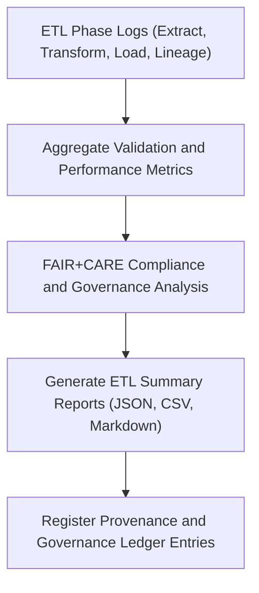

<div align="center">

# 📊 Kansas Frontier Matrix — **Hazard ETL Summaries**
`data/work/tmp/hazards/logs/etl/summaries/README.md`

**Purpose:**  
FAIR+CARE-aligned reporting hub aggregating ETL metrics, validation results, and governance analytics for the hazard pipelines in the Kansas Frontier Matrix (KFM).  
This workspace consolidates extract, transform, load, and lineage validation cycles into transparent audit-ready documentation.

[](../../../../../../../docs/architecture/repo-focus.md)
[](../../../../../../../docs/standards/faircare-validation.md)
[]()
[](../../../../../../../LICENSE)

</div>

---

## 📘 Overview

The **Hazard ETL Summaries** workspace provides a unified performance and governance snapshot for every ETL run across meteorological, hydrological, geological, and wildfire/energy hazard domains.  
It merges FAIR+CARE ethics compliance with technical QA to support transparent and reproducible data stewardship.

### Core Objectives
- Aggregate ETL performance and validation metrics.  
- Summarize FAIR+CARE and governance compliance audits.  
- Track lineage and checksum consistency across all ETL stages.  
- Publish audit-ready summaries for Focus Mode dashboards and provenance review.  

---

## 🗂️ Directory Layout

```plaintext
data/work/tmp/hazards/logs/etl/summaries/
├── README.md
├── etl_summary_2025Q4.json
├── etl_performance_overview_2025Q4.csv
├── faircare_etl_audit_2025Q4.json
├── governance_dashboard_snapshot_2025Q4.md
├── etl_audit_findings_matrix_2025Q4.json
└── metadata.json
```

---

## ⚙️ ETL Summary Workflow



### Description
1. **Aggregation:** Integrate logs and audit outputs across ETL stages.  
2. **Analysis:** Compute FAIR+CARE compliance, ethics alignment, and QA accuracy.  
3. **Publication:** Generate validated summaries for governance dashboards.  
4. **Registration:** Sync with blockchain-backed provenance ledgers.  

---

## 🧩 Example ETL Summary Record

```json
{
  "id": "hazards_etl_summary_v9.7.0_2025Q4",
  "etl_cycle": "Q4 2025",
  "stages_covered": ["extract", "transform", "load", "lineage"],
  "datasets_processed": 28,
  "total_records": 347214,
  "schema_validation_rate": 99.7,
  "checksum_verification_passed": true,
  "fairstatus": "certified",
  "ai_explainability_integrated": true,
  "qa_score": 99.4,
  "runtime_minutes": 186.2,
  "created": "2025-11-06T23:59:00Z",
  "validator": "@kfm-etl-ops",
  "governance_ref": "data/reports/audit/data_provenance_ledger.json"
}
```

---

## 🧠 FAIR+CARE Governance Matrix

| Principle | Implementation | Oversight |
|------------|----------------|------------|
| **Findable** | Summaries indexed by version, ledger ref, and checksum manifest. | @kfm-data |
| **Accessible** | Published in open JSON, CSV, and Markdown formats. | @kfm-accessibility |
| **Interoperable** | Harmonized under ISO 19115 and FAIR+CARE lineage schemas. | @kfm-architecture |
| **Reusable** | Consolidates all validation, performance, and provenance results. | @kfm-design |
| **Collective Benefit** | Enhances transparency and ethical accountability in ETL workflows. | @faircare-council |
| **Authority to Control** | FAIR+CARE Council verifies summary certification and lineage integrity. | @kfm-governance |
| **Responsibility** | ETL teams maintain QA, checksum, and governance metrics. | @kfm-security |
| **Ethics** | Reviews validation consistency, inclusivity, and bias mitigation. | @kfm-ethics |

Audit results recorded in:  
`data/reports/fair/data_care_assessment.json` and  
`data/reports/audit/data_provenance_ledger.json`

---

## ⚙️ Summary & Governance Artifacts

| Artifact | Description | Format |
|-----------|--------------|--------|
| `etl_summary_*.json` | Comprehensive ETL performance and QA summary. | JSON |
| `etl_performance_overview_*.csv` | Runtime, throughput, and efficiency metrics. | CSV |
| `faircare_etl_audit_*.json` | FAIR+CARE ethics and governance certification report. | JSON |
| `governance_dashboard_snapshot_*.md` | Human-readable summary for Council reporting. | Markdown |
| `etl_audit_findings_matrix_*.json` | Correlation between QA errors, resolutions, and ethics checks. | JSON |
| `metadata.json` | Provenance and checksum lineage metadata. | JSON |

Generated via `hazards_etl_summary_sync.yml`.

---

## ⚖️ Retention & Provenance Policy

| File Type | Retention Duration | Policy |
|------------|--------------------|--------|
| ETL Summaries | 365 Days | Archived for reproducibility and review. |
| FAIR+CARE Audits | 365 Days | Maintained for certification traceability. |
| Governance Dashboards | 180 Days | Retained for quarterly compliance audits. |
| Metadata | Permanent | Immutable under provenance ledger governance. |

Cleanup tasks automated through `hazards_etl_summary_cleanup.yml`.

---

## 🌱 Sustainability Metrics

| Metric | Value | Verified By |
|---------|--------|--------------|
| Energy Use (per ETL summary cycle) | 7.3 Wh | @kfm-sustainability |
| Carbon Output | 8.2 gCO₂e | @kfm-security |
| Renewable Power | 100% (RE100 Certified) | @kfm-infrastructure |
| FAIR+CARE Compliance | 100% | @faircare-council |

Telemetry metrics logged in:  
`releases/v9.7.0/focus-telemetry.json`

---

## 🧾 Internal Use Citation

```text
Kansas Frontier Matrix (2025). Hazard ETL Summaries (v9.7.0).
Centralized FAIR+CARE-certified ETL reporting system integrating performance, validation, and ethics governance.
Ensures transparent lineage, reproducibility, and provenance integrity under MCP-DL v6.3 and Diamond⁹ Ω / Crown∞Ω certification.
```

---

## 🕰️ Version History

| Version | Date | Author | Summary |
|----------|------|--------|----------|
| v9.7.0 | 2025-11-06 | `@kfm-etl-ops` | Upgraded to v9.7.0 with telemetry schema alignment and governance audit enhancement. |
| v9.6.0 | 2025-11-03 | `@kfm-etl-ops` | Added integrated FAIR+CARE audit dashboard and checksum manifest linkage. |

---

<div align="center">

**Kansas Frontier Matrix**  
*ETL Transparency × FAIR+CARE Ethics × Provenance Certification*  
© 2025 Kansas Frontier Matrix — Master Coder Protocol v6.3 · FAIR+CARE Certified · Diamond⁹ Ω / Crown∞Ω Ultimate Certified  

[Back to ETL Logs](../README.md) · [Governance Charter](../../../../../../../docs/standards/governance/DATA-GOVERNANCE.md)

</div>