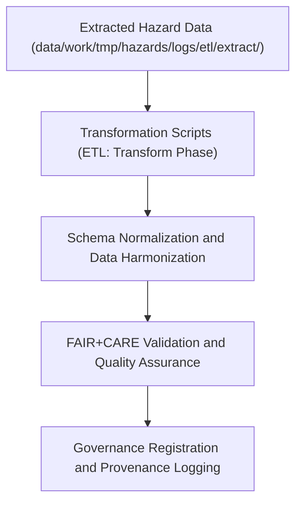

<div align="center">

# 🔄 Kansas Frontier Matrix — **Hazard ETL Transform Logs**
`data/work/tmp/hazards/logs/etl/transform/README.md`

**Purpose:** Repository for transformation-phase ETL logs that document schema normalization, data harmonization, and FAIR+CARE validation activities for hazard datasets within the Kansas Frontier Matrix (KFM).  
These logs preserve transformation metadata, QA results, and governance lineage for every processing cycle, ensuring transparency, reproducibility, and ethical data management.

[](../../../../../../../docs/standards/faircare-validation.md)
[](../../../../../../../LICENSE)
[](../../../../../../../docs/architecture/repo-focus.md)

</div>

---

## 📚 Overview

The `data/work/tmp/hazards/logs/etl/transform/` directory captures **ETL transformation-phase operations**, recording data standardization, schema validation, and FAIR+CARE governance checks.  
Each transformation log documents how extracted hazard data is cleaned, structured, and harmonized into standardized KFM schema formats.

### Core Functions:
- Log field-level transformations and schema normalization processes.  
- Document data quality improvements and transformation metrics.  
- Record FAIR+CARE compliance audits for ethical transformation governance.  
- Provide lineage links between raw inputs and processed hazard datasets.  

All transformation records are checksum-verified, governance-synced, and linked to the **Provenance Ledger** for long-term auditability.

---

## 🗂️ Directory Layout

```plaintext
data/work/tmp/hazards/logs/etl/transform/
├── README.md                                   # This file — overview of ETL transformation logs
│
├── transform_run_log_2024Q4.log                # Transformation execution log (Q4 2024)
├── schema_normalization_report_2024Q4.json     # Report detailing schema harmonization and field mappings
├── data_quality_summary_2024Q4.csv             # Summary of nulls, anomalies, and data consistency metrics
├── faircare_transform_audit_2024Q4.json        # FAIR+CARE ethics validation for transformation processes
└── metadata.json                               # Provenance, checksum, and governance linkage metadata
```

---

## ⚙️ Transformation Workflow



### Workflow Description:
1. **Input:** Ingest raw hazard datasets from extract-phase logs.  
2. **Transformation:** Apply field normalization, value mapping, and schema harmonization.  
3. **Quality Assurance:** Validate completeness, consistency, and referential integrity.  
4. **FAIR+CARE Review:** Verify that transformation logic aligns with ethical data principles.  
5. **Governance Sync:** Record transformations in provenance ledger for traceability.

---

## 🧩 Example Metadata Record

```json
{
  "id": "etl_transform_hazards_v9.3.2_2024Q4",
  "etl_cycle": "Q4 2024",
  "source_files": [
    "data/work/tmp/hazards/logs/etl/extract/extract_run_log_2024Q4.log"
  ],
  "transform_scripts": [
    "src/pipelines/etl/hazards_transform_pipeline.py"
  ],
  "records_processed": 21873,
  "fields_transformed": 146,
  "validation_accuracy": 99.2,
  "fairstatus": "certified",
  "archived": false,
  "validator": "@kfm-etl-transform",
  "created": "2025-10-28T17:10:00Z",
  "checksum": "sha256:d83f4b98fa72d274a1f29f3cc94b08aa1ef47a8f...",
  "governance_ref": "data/reports/audit/data_provenance_ledger.json"
}
```

---

## 🧠 FAIR+CARE Governance Alignment

| Principle | Implementation |
|------------|----------------|
| **Findable** | Transformation logs indexed by ETL cycle and dataset lineage. |
| **Accessible** | Stored in open JSON, CSV, and text formats for governance use. |
| **Interoperable** | Aligned with KFM schema contracts and STAC/DCAT standards. |
| **Reusable** | Logs include provenance, schema validation, and transformation metrics. |
| **Collective Benefit** | Promotes transparency and open reproducibility of hazard data transformations. |
| **Authority to Control** | FAIR+CARE Council validates ethical transformation workflows. |
| **Responsibility** | ETL engineers document all transformation logic and QA results. |
| **Ethics** | Ensures transformations uphold ethical representation and data integrity. |

Governance and validation references stored in:  
`data/reports/audit/data_provenance_ledger.json`  
and `data/reports/fair/data_care_assessment.json`.

---

## ⚙️ Transformation Artifacts

| File | Description | Format |
|------|--------------|--------|
| `transform_run_log_*.log` | Logs of executed transformation tasks. | Text |
| `schema_normalization_report_*.json` | Detailed schema harmonization and mapping summary. | JSON |
| `data_quality_summary_*.csv` | Field-level QA metrics and anomaly detection summary. | CSV |
| `faircare_transform_audit_*.json` | FAIR+CARE audit results for transformation compliance. | JSON |
| `metadata.json` | Captures lineage, checksums, and governance linkage. | JSON |

Transformation workflows automated by `etl_transform_sync.yml`.

---

## ⚖️ Governance & Provenance Integration

| Record | Description |
|---------|-------------|
| `metadata.json` | Tracks transformation lineage, governance linkage, and checksum registry. |
| `data/reports/audit/data_provenance_ledger.json` | Logs transformation lineage and FAIR+CARE certification results. |
| `data/reports/fair/data_care_assessment.json` | FAIR+CARE compliance audit record for transformation ethics. |
| `releases/v9.3.2/manifest.zip` | Includes transformation artifact checksums for reproducibility. |

Governance synchronization performed automatically through CI/CD pipelines under FAIR+CARE compliance rules.

---

## 🧾 Retention & Certification Policy

| Record Type | Retention Duration | Policy |
|--------------|--------------------|--------|
| Transformation Logs | 365 days | Archived annually for governance audits. |
| FAIR+CARE Audits | Permanent | Retained indefinitely for ethics traceability. |
| Schema Reports | Permanent | Maintained for schema evolution documentation. |
| Metadata | Permanent | Stored for lineage continuity and certification record. |

Retention governed by `etl_transform_cleanup.yml`.

---

## 🧾 Internal Use Citation

```text
Kansas Frontier Matrix (2025). Hazard ETL Transform Logs (v9.3.2).
Documentation of schema normalization, transformation logic, and governance-certified QA results for hazard data pipelines.
Maintained under FAIR+CARE compliance and MCP-DL v6.3 governance for reproducible data workflows.
```

---

## 🧾 Version Notes

| Version | Date | Notes |
|----------|------|--------|
| v9.3.2 | 2025-10-28 | Added FAIR+CARE ethics validation and schema harmonization records. |
| v9.2.0 | 2024-07-15 | Enhanced data quality summaries and provenance linkage. |
| v9.0.0 | 2023-01-10 | Established ETL transformation logging structure for hazard workflows. |

---

<div align="center">

**Kansas Frontier Matrix** · *Data Transformation × FAIR+CARE Governance × Provenance Integrity*  
[🔗 Repository](https://github.com/bartytime4life/Kansas-Frontier-Matrix) • [🧭 Docs Portal](../../../../../../../docs/) • [⚖️ Governance Ledger](../../../../../../../docs/standards/governance/)

</div>