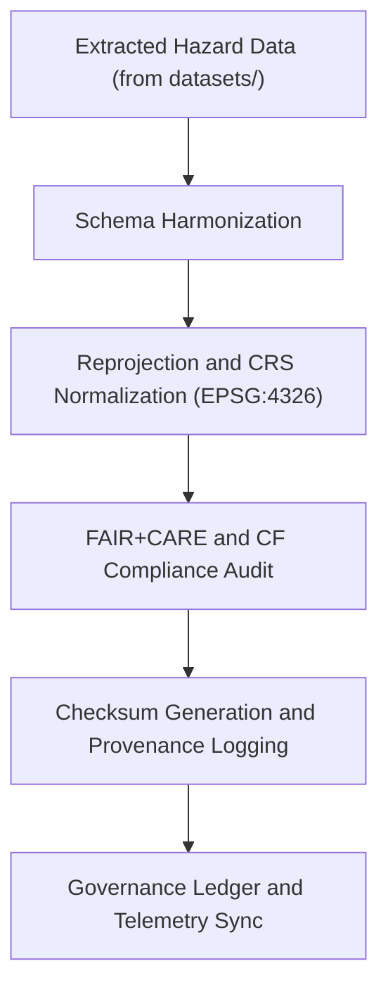

<div align="center">

# 🔄 Kansas Frontier Matrix — **Hazards ETL Transform Logs**
`data/work/tmp/hazards/logs/etl/transform/README.md`

**Purpose:**  
Detailed logging environment for **hazard dataset transformation processes** within the ETL pipeline.  
Captures schema harmonization, reprojection, normalization, and checksum operations for all hazard domains in the Kansas Frontier Matrix (KFM).

[](../../../../../../../docs/standards/faircare-validation.md)
[](../../../../../../../LICENSE)
[](../../../../../../../docs/architecture/repo-focus.md)

</div>

---

## 📚 Overview

The `data/work/tmp/hazards/logs/etl/transform/` directory records all activities involved in **transforming hazard datasets** across KFM’s temporary workspace.  
Each transformation step is **checksum-verified, FAIR+CARE-audited, and blockchain-registered** to maintain complete provenance of data harmonization.

### Core Functions
- Log reprojection, resampling, and field normalization events.  
- Record schema alignment to CF/ISO metadata standards.  
- Capture checksum and integrity verification of outputs.  
- Synchronize transformation metadata with AI governance and FAIR+CARE ledgers.

---

## 🗂️ Directory Layout

```plaintext
data/work/tmp/hazards/logs/etl/transform/
├── README.md                                # This file — ETL transformation logs documentation
│
├── reprojection_log.txt                     # Log of coordinate transformations and CRS normalization
├── harmonization_trace.log                  # Field and schema alignment operations
├── transformation_audit.json                # Summary of normalization and metadata enrichment
├── checksum_verification.json               # Integrity hashes for all transformed outputs
├── cf_compliance_report.json                # CF convention compliance results
└── metadata.json                            # Provenance and FAIR+CARE audit metadata
```

---

## ⚙️ Transformation Logging Workflow



### Workflow Description
1. **Harmonization:** Align hazard dataset fields to common schema and KFM data contracts.  
2. **Reprojection:** Normalize all datasets to EPSG:4326 (WGS84).  
3. **Validation:** Perform CF convention and FAIR+CARE governance checks.  
4. **Checksum:** Register hashes to ensure reproducibility and tamper detection.  
5. **Governance:** Record all transformations in AI Hazards Ledger and telemetry reports.

---

## 🧩 Example Transformation Log Record

```json
{
  "id": "hazards_etl_transform_v9.5.0",
  "input_file": "fema_flood_zones_2025.geojson",
  "output_file": "fema_flood_zones_cf.geojson",
  "process_type": "reprojection + schema_harmonization",
  "crs_source": "EPSG:3857",
  "crs_target": "EPSG:4326",
  "fields_modified": 12,
  "checksum": "sha256:b74a83c82e7a1c2d3e2a7c64f212de93a1f03b7d...",
  "cf_compliance": true,
  "ai_audit_score": 0.986,
  "validator": "@kfm-etl-ops",
  "telemetry_ref": "releases/v9.5.0/focus-telemetry.json",
  "governance_ref": "reports/audit/ai_hazards_ledger.json",
  "timestamp": "2025-11-02T18:30:00Z"
}
```

---

## 🧠 FAIR+CARE & CF Governance Integration

| Principle | Implementation |
|------------|----------------|
| **Findable** | Transformation logs are indexed with dataset IDs and process timestamps. |
| **Accessible** | Stored as open text and JSON with FAIR licensing. |
| **Interoperable** | CF conventions and ISO 19115 metadata applied across datasets. |
| **Reusable** | Provenance, checksums, and schema mappings archived for reuse. |
| **Collective Benefit** | Promotes transparent, ethical transformation workflows. |
| **Authority to Control** | FAIR+CARE Council validates compliance and audit reports. |
| **Responsibility** | Validators log every normalization and reprojection event. |
| **Ethics** | Ensures accuracy of transformations, removing data bias. |

Governance audits stored under:  
`reports/audit/ai_hazards_ledger.json` • `reports/fair/hazards_etl_transform_summary.json`

---

## ⚙️ QA & Provenance Artifacts

| File | Description | Format |
|------|--------------|--------|
| `reprojection_log.txt` | Coordinate reprojection and CRS change record. | Text |
| `harmonization_trace.log` | Field-level harmonization and normalization trace. | Text |
| `transformation_audit.json` | Summary of all ETL transformations. | JSON |
| `checksum_verification.json` | Integrity verification of transformation outputs. | JSON |
| `cf_compliance_report.json` | CF convention compliance results and metrics. | JSON |
| `metadata.json` | Provenance and FAIR+CARE metadata linkage. | JSON |

Automation managed by `hazards_etl_transform_sync.yml`.

---

## 🧾 Retention Policy

| Log Type | Retention Duration | Policy |
|-----------|--------------------|--------|
| Transformation Logs | 30 days | Archived post-validation. |
| Checksum & CF Reports | 90 days | Retained for compliance audits. |
| Harmonization Traces | 180 days | Stored for provenance verification. |
| Metadata | 365 days | Retained permanently for reproducibility. |

Cleanup handled by `hazards_etl_transform_cleanup.yml`.

---

## 🧾 Internal Use Citation

```text
Kansas Frontier Matrix (2025). Hazards ETL Transform Logs (v9.5.0).
Detailed FAIR+CARE-governed logging workspace for all hazard data transformations.
Documents reprojection, harmonization, checksum validation, and CF compliance under KFM governance.
Restricted to internal ETL, QA, and provenance workflows.
```

---

## 🧾 Version Notes

| Version | Date | Notes |
|----------|------|--------|
| v9.5.0 | 2025-11-02 | Introduced CF convention compliance tracking, AI audit integration, and telemetry v2 schema. |
| v9.3.2 | 2025-10-28 | Added harmonization tracing and governance ledger synchronization. |
| v9.3.0 | 2025-10-26 | Established ETL transform log directory for hazard reprojection. |

---

<div align="center">

**Kansas Frontier Matrix** · *Hazard Transformation × FAIR+CARE Governance × Provenance Integrity*  
[🔗 Repository](https://github.com/bartytime4life/Kansas-Frontier-Matrix) • [🧭 Docs Portal](../../../../../../../docs/) • [⚖️ Governance Ledger](../../../../../../../docs/standards/governance/)

</div>
