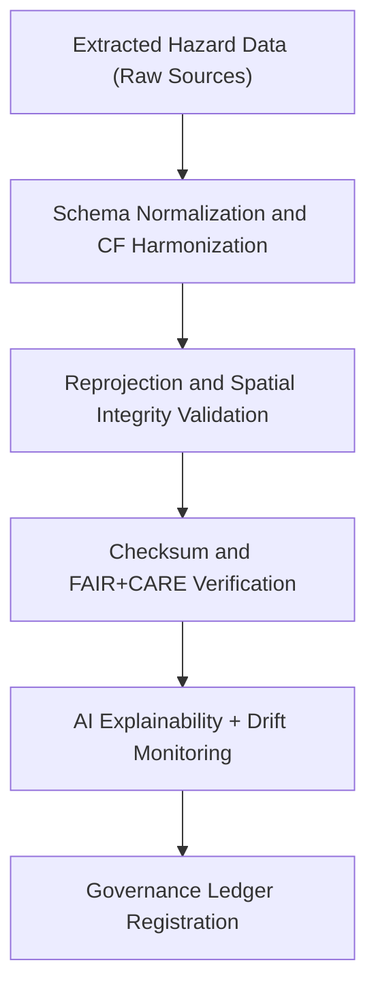

<div align="center">

# 🔄 Kansas Frontier Matrix — **Hazard ETL Transform Logs**
`data/work/tmp/hazards/logs/etl/transform/README.md`

**Purpose:**  
Central FAIR+CARE-governed workspace for **transformation and harmonization logs** within hazard ETL workflows.  
Documents schema normalization, reprojection, CF compliance, and AI-governed data harmonization under MCP-DL v6.3 standards.

[](../../../../../../../../docs/standards/faircare-validation.md)
[](../../../../../../../../LICENSE)
[](../../../../../../../../docs/architecture/repo-focus.md)

</div>

---

## 📚 Overview

The `data/work/tmp/hazards/logs/etl/transform/` directory contains **all logs and reports from ETL transformation stages**, ensuring full documentation of schema updates, reprojection processes, and metadata normalization.  
Each transformation log aligns with FAIR+CARE ethics and ISO metadata principles to ensure transparency, reproducibility, and compliance.

### Core Responsibilities
- Record hazard dataset transformations and reprojection operations.  
- Log schema harmonization, CF/ISO compliance, and unit normalization.  
- Validate transformations through checksum and AI audit verification.  
- Provide traceable provenance for governance and validation review.  

---

## 🗂️ Directory Layout

```plaintext
data/work/tmp/hazards/logs/etl/transform/
├── README.md                                 # This file — documentation of hazard ETL transformation logs
│
├── transform_run_log_2025Q4.log              # Execution log of ETL transformations for Q4 2025
├── schema_harmonization_report_2025Q4.json   # Field-level schema transformation summary
├── reprojection_trace_2025Q4.json            # CRS and spatial transformation details
├── cf_compliance_audit_2025Q4.json           # Climate and Forecast (CF) metadata compliance audit
├── ai_transform_explainability_2025Q4.json   # AI-assisted transformation reasoning and drift analysis
└── metadata.json                             # Provenance metadata and governance linkage
```

---

## ⚙️ Transformation Workflow



### Workflow Description
1. **Normalization:** Align field names, units, and data structures to KFM schema definitions.  
2. **Reprojection:** Convert datasets to EPSG:4326 and verify geometry integrity.  
3. **Compliance:** Apply CF/ISO and FAIR+CARE metadata validation standards.  
4. **AI Validation:** Audit transformation logic using AI-driven explainability.  
5. **Governance:** Record all transformation results in governance ledger and manifest.

---

## 🧩 Example Transformation Log Record

```json
{
  "id": "hazards_etl_transform_v9.5.0_2025Q4",
  "etl_stage": "transform",
  "datasets_transformed": [
    "tornado_tracks_raw.geojson",
    "flood_extents_raw.geojson"
  ],
  "transformations": ["Reprojection (EPSG:5070 → EPSG:4326)", "CF Harmonization", "Attribute Normalization"],
  "records_processed": 843210,
  "checksum_verified": true,
  "cf_compliance_passed": true,
  "fairstatus": "certified",
  "ai_explainability_score": 0.986,
  "governance_synced": true,
  "telemetry_ref": "releases/v9.5.0/focus-telemetry.json",
  "governance_ref": "reports/audit/ai_hazards_ledger.json",
  "created": "2025-11-02T20:40:00Z",
  "validator": "@kfm-transform"
}
```

---

## 🧠 FAIR+CARE Transformation Governance

| Principle | Implementation |
|------------|----------------|
| **Findable** | Transform logs indexed by dataset ID, CRS, and checksum registry. |
| **Accessible** | Stored as open text/JSON records for FAIR+CARE governance review. |
| **Interoperable** | Conforms to ISO 19115, CF conventions, and DCAT schema standards. |
| **Reusable** | Includes provenance metadata and checksum lineage for reproducibility. |
| **Collective Benefit** | Promotes ethical, auditable data harmonization for hazard modeling. |
| **Authority to Control** | FAIR+CARE Council validates schema and reprojection compliance. |
| **Responsibility** | ETL engineers document all transformations and validation outcomes. |
| **Ethics** | Verifies data integrity, prevents distortion, and ensures ethical data use. |

Audit reports logged in:  
`reports/audit/ai_hazards_ledger.json` • `reports/fair/hazards_etl_transform_summary.json`

---

## ⚙️ Transformation Artifacts

| File | Description | Format |
|------|--------------|--------|
| `transform_run_log_*.log` | Transformation workflow execution log. | Text |
| `schema_harmonization_report_*.json` | Records schema updates and harmonization operations. | JSON |
| `reprojection_trace_*.json` | Tracks CRS changes and spatial reprojection events. | JSON |
| `cf_compliance_audit_*.json` | Validates CF/ISO metadata consistency. | JSON |
| `ai_transform_explainability_*.json` | AI interpretability audit for transformation logic. | JSON |
| `metadata.json` | Provenance and FAIR+CARE linkage metadata. | JSON |

Automation managed via `hazards_etl_transform_sync.yml`.

---

## 🧾 Retention Policy

| Log Type | Retention Duration | Policy |
|-----------|--------------------|--------|
| Transformation Logs | 180 days | Retained for FAIR+CARE and audit review. |
| Reprojection & Schema Reports | 365 days | Archived for reproducibility tracking. |
| AI Explainability Reports | 180 days | Retained for ethical AI audit review. |
| Metadata | Permanent | Maintained for provenance and ledger traceability. |

Cleanup automated via `hazards_etl_transform_cleanup.yml`.

---

## 🧾 Internal Use Citation

```text
Kansas Frontier Matrix (2025). Hazard ETL Transform Logs (v9.5.0).
Central FAIR+CARE-compliant repository for hazard data transformations, schema harmonization, and reprojection validation.
Ensures transparency, ethics, and reproducibility across all ETL operations.
```

---

## 🧾 Version Notes

| Version | Date | Notes |
|----------|------|--------|
| v9.5.0 | 2025-11-02 | Added CF compliance and AI explainability tracking to transformation logs. |
| v9.3.2 | 2025-10-28 | Enhanced schema normalization and provenance validation integration. |
| v9.3.0 | 2025-10-26 | Established transformation log workspace under FAIR+CARE governance. |

---

<div align="center">

**Kansas Frontier Matrix** · *Transformation Integrity × FAIR+CARE Ethics × Provenance Transparency*  
[🔗 Repository](https://github.com/bartytime4life/Kansas-Frontier-Matrix) • [🧭 Docs Portal](../../../../../../../../docs/) • [⚖️ Governance Ledger](../../../../../../../../docs/standards/governance/)

</div>